# Daedalus Solution Architecture Diagrams

## 1. System Context

Daedalus is a .NET agent framework for software work (tasks, projects, executions, scheduled runs,
repositories). It is the first consumer of **Thalos.NET**, a separate nuget.org package that supplies the
agent runtime, sessions, memory and skills machinery. Thalos.NET in turn integrates two other in-house
packages: **AI.Sentinel** (security monitoring and approval workflows at the model boundary) and a small
slice of **Rag.NET** (a ~75-project retrieval-augmented-generation suite) for the agent memory vector
store. The LLM backend is **Anthropic Claude**, reached through `Thalos.NET.Anthropic` — there is no
OpenAI or GitHub Copilot integration anywhere in this codebase.

**What Daedalus actually uses from Rag.NET:** exactly 2 of its ~75 projects — `Rag.NET.Abstractions` and
`Rag.NET.VectorStores.PgVector` — pulled in transitively through `Thalos.NET.Memory.RagNet`. That is the
vector store for agent memory and nothing else; Rag.NET's data providers, parsers, chunking, reranking,
evaluation and hosting projects are not referenced. See `docs/planning/parked-ideas.md` for the fuller
inventory and why a broader Rag.NET-based product is deliberately out of scope here.

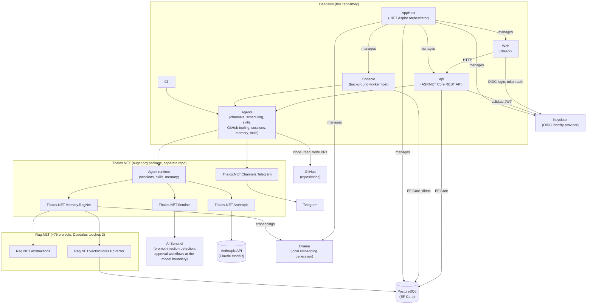

---

## 2. Solution Layout

All 11 projects under `src/`, enumerated directly rather than carried forward from any earlier diagram.
`Daedalus.Agents` is the one most likely to be missed: it holds channels (`Channels/`), scheduling
(`Scheduling/`), skills (`Skills/`), GitHub tooling (`GitHub/`), sessions (`Sessions/`), memory (`Memory/`)
and tools (`Tools/`), and every host project (`Api`, `Console`, `Cli`) depends on it directly.

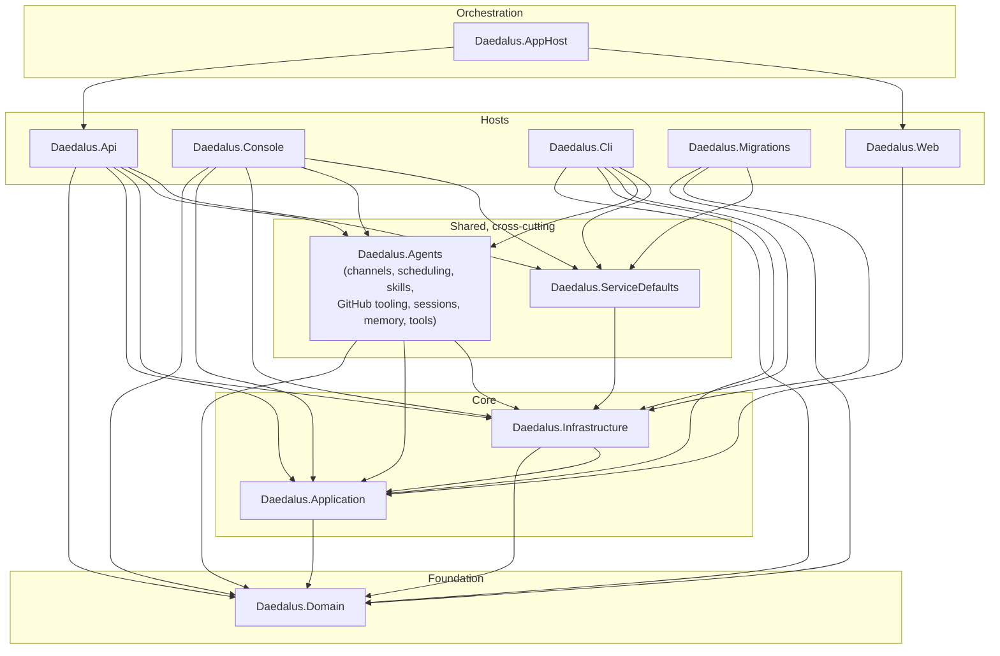

`Daedalus.Web` depends only on `Daedalus.Application` (it talks to the API over HTTP, not to the database
directly). `Daedalus.AppHost` is the .NET Aspire orchestrator: it launches `Api`, `Web`, `Console` and
`Migrations` as managed processes (via `AddProject`, not a compile-time `ProjectReference`), alongside the
PostgreSQL, Keycloak and Ollama containers — that relationship is orchestration, shown here for
completeness, not a project dependency.

---

## 3. Domain Model (Entity Relationship)

Enumerated directly from `src/Daedalus.Domain/Entities/`, cross-checked against the EF Core configurations
in `src/Daedalus.Infrastructure/Persistence/Configurations/` rather than inferred from property names.
Fourteen persisted entities exist today (excluding enums, the `Entity`/`AggregateRoot` base classes, and
the `PromptSection` value object, none of which are separate tables).

**Dropped from the previous diagram:** `GitOperation`, `GitDiff` and `GitBranch`. They are not persisted
domain entities — `GitDiff` and `GitOperationContext` exist only as transient DTOs under
`Daedalus.Domain/CodeAnalysis/` with no EF mapping, and no `GitBranch` type exists anywhere in `src/`. The
old diagram's `TASK ||--o| GIT_OPERATION` relationship and `EXECUTION_SESSION ||--o{ TASK : claims` /
`PROJECT ||--o{ EXECUTION_SESSION : tracks` relationships do not exist as database foreign keys either —
see the note below the diagram.

```mermaid
erDiagram
    PROJECT ||--o{ TASK : contains
    TASK ||--o{ TASK_EXECUTION : has
    AGENT_SESSION ||--o{ AGENT_MESSAGE : contains
    BRAINSTORM_SESSION ||--o{ BRAINSTORM_MESSAGE : contains

    PROJECT {
        guid id PK
        string project_name
        string description
        string version
        string repository_url
        string default_branch
        datetime created_at
        datetime modified_at
    }

    TASK {
        guid id PK
        guid project_id FK
        string task_id
        string title
        string description
        enum priority
        enum status
        string phase
        int parallel_group
        enum estimated_complexity
        string prompt
        string completion_promise
        int max_iterations
        guid current_session_id "not FK-enforced"
        string result
        int iteration_count
        string learnings
        datetime learnings_updated_at
        datetime created_at
        datetime completed_at
    }

    TASK_EXECUTION {
        guid id PK
        guid task_id FK
        guid session_id
        int iteration_number
        string prompt
        string llm_response
        bool completion_promise_found
        datetime executed_at
        string error
        int input_tokens
        int output_tokens
        string model_id
    }

    EXECUTION_SESSION {
        guid id PK
        string worker_name
        datetime started_at
        datetime last_heartbeat
        bool is_active
        int tasks_completed
    }

    SCHEDULED_RUN {
        guid id PK
        string name
        string cron
        string trigger
        string channel_id
        string conversation_id
        string principal_id
        string roles "array"
        string repository
        enum origin
        datetime next_run_at
        datetime last_run_at
        bool enabled
        int missed_occurrences
    }

    SCHEDULED_RUN_EXECUTION {
        guid id PK
        guid schedule_id "not FK-enforced"
        datetime occurrence_at
        enum step
        enum failed_at_step
        string findings
        string digest
        string channel_id
        string conversation_id
        string principal_id
        string roles "array"
        int attempts
        string last_error
        datetime created_at
        datetime updated_at
    }

    AGENT_SESSION {
        guid id PK
        guid agent_id "external Thalos identity"
        string owner_id
        enum state
        datetime created_at
        datetime last_activity_at
        int turn_count
        long total_input_tokens
        long total_output_tokens
    }

    AGENT_MESSAGE {
        guid id PK
        guid session_id FK
        int sequence
        string role
        string content_json
        int input_tokens
        int output_tokens
        string model_id
        datetime created_at
    }

    AGENT_MEMORY {
        guid id PK
        string owner_id
        guid agent_id "external Thalos identity, nullable"
        string kind
        string text
        string tags "array"
        string source
        double importance
        datetime created_at
        datetime updated_at
        datetime last_recalled_at
        int recall_count
        bool is_archived
        bool index_pending
    }

    CHANNEL_CONVERSATION {
        guid id PK
        string channel_id
        string conversation_id
        guid session_id "external Thalos identity"
        guid agent_id "external Thalos identity"
        datetime created_at
        datetime last_activity_at
    }

    SKILL {
        string id PK "the skill name"
        string description
        string body
        string tags "array"
        string source_path
        string content_hash
        bool is_active
        datetime updated_at
    }

    REPOSITORY_CONFIGURATION {
        guid id PK
        string name
        string url
        string platform
        string default_branch
        string authentication_method
        string credential_identifier
        bool is_active
        string description
        datetime created_at
        datetime modified_at
        datetime last_used_at
    }

    BRAINSTORM_SESSION {
        guid id PK
        guid project_id "not FK-enforced"
        enum phase
        string design_document
        string implementation_plan
        bool phase_complete_signaled
        datetime created_at
        datetime completed_at
    }

    BRAINSTORM_MESSAGE {
        guid id PK
        guid brainstorm_session_id FK
        enum role
        string content
        enum phase
        datetime created_at
    }
```

**Only four relationships are enforced as database foreign keys** (verified against
`ApplicationDbContextModelSnapshot.cs`, all `OnDelete(DeleteBehavior.Cascade)`): `Project → Task`,
`Task → TaskExecution`, `AgentSession → AgentMessage`, and `BrainstormSession → BrainstormMessage`. Several
other Guid-typed properties look like foreign keys by name but are not configured as one anywhere — the
same trap the previous diagram fell into with `GitOperation`. Marked `"not FK-enforced"` above:
`Task.CurrentSessionId` (no relationship to `ExecutionSession`), `ScheduledRunExecution.ScheduleId` (only a
unique index on `(ScheduleId, OccurrenceAt)`, no `HasOne`/`HasForeignKey`), and `BrainstormSession.ProjectId`
(indexed, but never wired to `Project` the way `Task.ProjectId` is). `AgentMemory.AgentId` and
`ChannelConversation.SessionId`/`AgentId` are marked `"external Thalos identity"` because they hold the
`Guid` backing a Thalos.NET typed id (an agent definition or session living in Thalos's own runtime, not a
row in any table in this diagram) — there is nothing local for them to be a foreign key to.

Two projects outside `src/Daedalus.Domain/Entities/` are out of this diagram's scope by the same
enumeration rule that dropped `GitOperation`/`GitDiff`: `AnalysisIteration` and `CodeAnalysisRequest` live
under `Daedalus.Domain/CodeAnalysis/` and have their own EF configurations, but they are not part of the
`Entities/` folder this section enumerates.

---

## 4. Application Layer - Mediator Dispatch and the Public Facade

Phase 1.7 deleted the hand-rolled `ICommandHandlerFactory` layer this section used to describe. Dispatch today
goes through **ZeroAlloc.Mediator**'s source generator, and the single most surprising fact about it is a
visibility boundary that every newcomer trips over at least once:

**The generated `IMediator` and its registration method `AddMediator()` are `internal` to `Daedalus.Application`.**
`IMediator` cannot appear in a public method signature anywhere else — the compiler refuses it with CS0051
(inconsistent accessibility) — and `AddMediator()` cannot be called from `Program.cs` in `Daedalus.Api` or
`Daedalus.Console`, which is what every upstream ZeroAlloc.Mediator example shows, because `Program.cs` is
compiled into a different assembly. `Daedalus.Api` has 14 public MVC controllers, and they must be public to be
discovered by ASP.NET Core's controller convention — so the assembly boundary is real, not incidental.

The bridge is `IApplicationCommands` (`Daedalus.Application/Abstractions/IApplicationCommands.cs`), a small
public interface with an `internal sealed class ApplicationCommands(IMediator mediator)` implementation. Its own
XML doc comment states the trade-off plainly and this document repeats it rather than overselling the design:

> The public dispatch surface for callers outside this assembly. The generated ZeroAlloc.Mediator `IMediator` is
> internal to `Daedalus.Application` and cannot appear in a public signature (CS0051), so the two MVC controllers
> that dispatch commands depend on this instead. This is a thinner version of the deleted
> `ICommandHandlerFactory` - it buys compile-time dispatch and build-time diagnostics for these 8 commands, not
> less abstraction overall.

**Confirmed by reading the interface: `IApplicationCommands` has exactly 8 members**, each forwarding straight
to `mediator.Send(command, cancellationToken)`:

| Method | Command | Returns |
|---|---|---|
| `CreateProjectAsync` | `CreateProjectCommand` | `ValueTask<Result<ProjectDto>>` |
| `UpdateProjectAsync` | `UpdateProjectCommand` | `ValueTask<Result<ProjectDto>>` |
| `DeleteProjectAsync` | `DeleteProjectCommand` | `ValueTask<Result>` |
| `CreateTaskAsync` | `CreateTaskCommand` | `ValueTask<Result<TaskDto>>` |
| `UpdateTaskAsync` | `UpdateTaskCommand` | `ValueTask<Result<TaskDto>>` |
| `DeleteTaskAsync` | `DeleteTaskCommand` | `ValueTask<Result>` |
| `AbandonTaskAsync` | `AbandonTaskCommand` | `ValueTask<Result<TaskDto>>` |
| `ResumeTaskAsync` | `ResumeTaskCommand` | `ValueTask<Result<TaskDto>>` |

**Confirmed by grepping `src/Daedalus.Api/Controllers`: exactly 2 of the 14 public controllers reference
`IApplicationCommands`** — `ProjectsController` and `TasksController`. The other 12 (`AgentsController`,
`AgentSessionsController`, `AgentMemoriesController`, `BrainstormController`, `CodeAnalysisController`,
`CostAnalyticsController`, `ExecutionSessionsController`, `PrdController`, `RalphConfigController`,
`RepositoriesController`, `SchedulesController`, `TaskExecutionsController`) never dispatch a command through
this path at all.

`Daedalus.Application` has 12 command types in total (`Commands/*`), not 8 — `ConvertPrdToTasksCommand`,
`ExecuteTaskCommand`, `GeneratePrdCommand` and `RegeneratePlanCommand` are the other 4. They are never added to
`IApplicationCommands`, because nothing outside the assembly needs to send them: `PrdService` and
`McpConfigurationParser` are themselves compiled into `Daedalus.Application`, so they call `mediator.Send(...)`
on the internal `IMediator` directly. The facade exists only for the assembly-crossing case, and it is sized to
exactly the commands that cross.

**Requests are `readonly record struct`, not classes.** The ZeroAlloc.Mediator generator enforces this with its
own diagnostic — `ZAM003`, "Request type is a class; use 'readonly record struct' for zero-allocation dispatch" —
confirmed by inspecting the generator assembly's diagnostic strings directly. Every command and query in the
codebase follows this:

```csharp
public readonly record struct CreateTaskCommand(
    Guid ProjectId, string TaskId, string Title, /* … */ int MaxIterations)
    : IRequest<Result<TaskDto>>;
```

**Handlers return `ValueTask<T>`, not `Task<T>`.** For example, `CreateTaskCommandHandler` implements
`IRequestHandler<CreateTaskCommand, Result<TaskDto>>` with `public async ValueTask<Result<TaskDto>> Handle(CreateTaskCommand command, CancellationToken ct)`.
`Result<T>` and the non-generic `Result` are from **ZeroAlloc.Results** (`Result<T>.Success(x)` /
`Result<T>.Failure(msg)` / `Result.Success()` / `Result.Failure(msg)`) — **not** CSharpFunctionalExtensions,
which is not referenced anywhere in this solution.

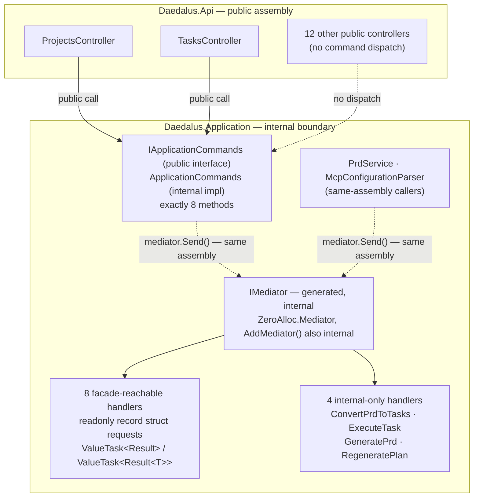

A gap worth being honest about: `GetAllTasksQuery` and `GetTaskByIdQuery` still exist under
`Daedalus.Application/Queries/`, implement `IRequest<Result<T>>`, and have registered handlers — but nothing in
the codebase calls `mediator.Send` for either one today. `TasksController`'s read endpoints go through
`ITaskQueryService` (`Daedalus.Api.Services.TaskQueryService`) instead, which queries `ApplicationDbContext`
directly with EF Core. The CQRS write side is wired through the mediator; the read side, in practice, is not.

---

## 5. Legacy: Git-Driven Task Execution (Ralph Loop)

> **Status: legacy, not deleted.** Sections 5, 5A, 5B and 6 describe the original git-integrated
> execution path, built before Thalos.NET (sections 15-20) existed. Nothing below is wrong — it was
> verified directly against current source — it is marked legacy because Milestone 2 plans to redesign
> it as **phase 2.5** (see `docs/planning/ROADMAP.md`), not because it is broken. It stays switched on
> until that redesign demonstrably does the job. `RalphLoopWorker` is a real, currently-running
> `BackgroundService` in `Daedalus.Console`, so a reader who finds it in the codebase still needs this
> section.

Two independent features share the git plumbing (`IGitRepositoryManager`, section 5A) but are otherwise
unconnected — conflating them was the previous diagram's core error:

1. **Per-task execution** (this section and section 6): `RalphLoopWorker` polls for pending `Task` rows,
   optionally prepares a git workspace, and runs the task's prompt through an LLM iteration loop.
2. **Code analysis** (section 5A/5B): `RalphLoopOrchestrator` (`IRalphLoopOrchestrator`), driven by
   `CodeAnalysisController`, runs a single-file review-and-patch workflow against an existing
   branch/commit. It is a separate request type (`CodeAnalysisRequest`, under
   `Daedalus.Domain/CodeAnalysis/` — outside section 3's entity enumeration, see its note on scope) and
   is never invoked by `RalphLoopWorker`.

Verified end to end by reading `RalphLoopWorker.cs` and `WorkspaceOrchestrator.cs` directly:

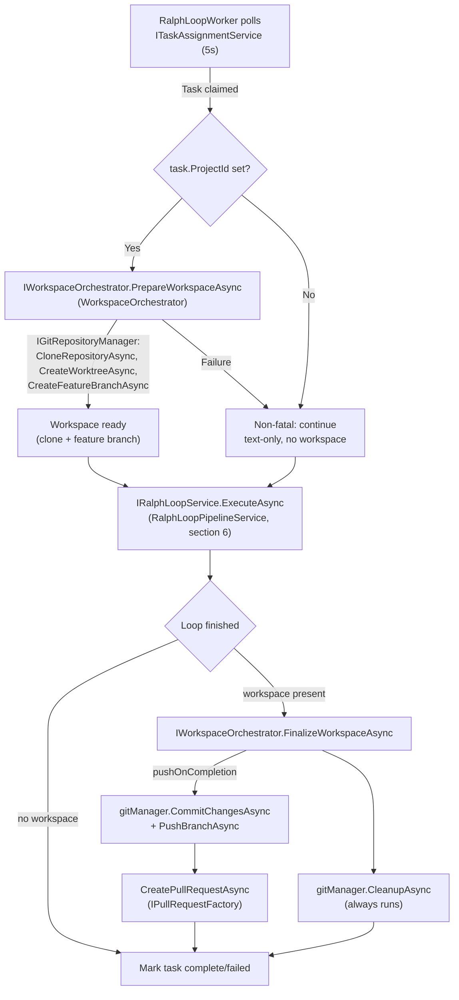

`WorkspaceOrchestrator` (`Daedalus.Infrastructure.Services`) is the only place `RalphLoopWorker` touches
git, and even there it delegates every operation to `IGitRepositoryManager` (section 5A). There is no
`RalphLoopService` class — that god-object was deleted; `RalphLoopPipelineService` (section 6) replaced
it — and there is no `McpEnhancedPromptBuilder` anywhere in `src/`.

---

## 5A. Git Service Architecture

`IGitRepositoryManager` (`Daedalus.Application/Services/CodeAnalysis/IGitRepositoryManager.cs`,
implemented by `GitRepositoryManager` in `Daedalus.Infrastructure` over LibGit2Sharp) has **12 members**,
read directly from the interface rather than carried forward from the previous diagram's fictional set:

```csharp
public interface IGitRepositoryManager
{
    Task<Result<GitOperationContext>> CloneRepositoryAsync(
        string repoUrl, string? branch = null, string? targetPath = null, CancellationToken ct = default);
    Task<Result<GitOperationContext>> FetchLatestAsync(string workTreePath, CancellationToken ct = default);

    Task<Result<string>> CreateFeatureBranchAsync(
        string workTreePath, string branchName, string? fromBranch = null, CancellationToken ct = default);
    Task<Result> SwitchBranchAsync(string workTreePath, string branchName, CancellationToken ct = default);
    Task<Result> DeleteBranchAsync(
        string workTreePath, string branchName, bool force = false, CancellationToken ct = default);

    Task<Result<string>> CreateWorktreeAsync(
        string baseRepoPath, string worktreeName, string branchName, CancellationToken ct = default);
    Task<Result> DeleteWorktreeAsync(string worktreePath, CancellationToken ct = default);

    Task<Result<IReadOnlyList<GitDiff>>> GetDiffsAsync(
        string workTreePath, string baseBranch, CancellationToken ct = default);
    Task<Result> ApplyPatchAsync(string workTreePath, string patchContent, CancellationToken ct = default);
    Task<Result> CommitChangesAsync(
        string workTreePath, string message, string? author = null, CancellationToken ct = default);
    Task<Result> PushBranchAsync(
        string workTreePath, string branchName, bool force = false, CancellationToken ct = default);

    Task<Result> CleanupAsync(string workTreePath, CancellationToken ct = default);
}
```

Two unrelated callers, both real:

| Caller | Uses it for |
|---|---|
| `WorkspaceOrchestrator` (section 5) | Clone + feature branch + worktree before a task runs; commit/push/cleanup after |
| `RalphLoopOrchestrator` (`IRalphLoopOrchestrator`, driven by `CodeAnalysisController`) | The same clone/branch/diff/patch/commit primitives, for the unrelated code-analysis workflow |

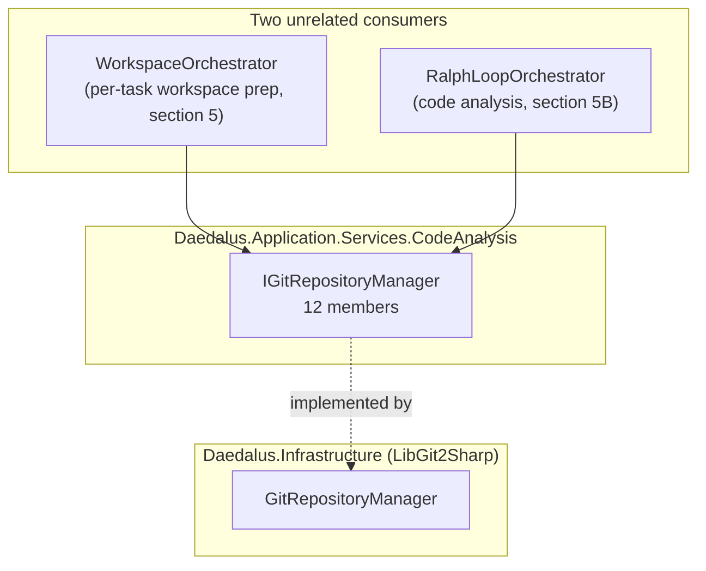

---

## 5B. Code Extraction & LLM Context

`IRepositoryCodeExtractor` (`Daedalus.Application/Services/CodeAnalysis/IRepositoryCodeExtractor.cs`,
implemented by `RepositoryCodeExtractor`) has **5 members** — an entirely different method set from the
previous diagram, which named `GetFileContentsAsync`/`GetFilesAsync`/`GetDirectoryStructureAsync`/
`SearchFilesAsync`; none of those exist:

```csharp
public interface IRepositoryCodeExtractor
{
    Task<Result<RepositoryFile>> GetFileAsync(
        string repoUrl, string filePath, string? branch = null, string? commitSha = null,
        CancellationToken ct = default);

    Task<Result<string>> GetCodeSnippetAsync(
        string workTreePath, string filePath, int? startLine = null, int? endLine = null,
        CancellationToken ct = default);

    Task<Result<IReadOnlyList<string>>> FindRelatedFilesAsync(
        string workTreePath, string filePath, CancellationToken ct = default);

    Task<Result<IReadOnlyList<GitCommitInfo>>> GetFileHistoryAsync(
        string workTreePath, string filePath, int? maxCommits = null, CancellationToken ct = default);

    Task<Result<AnalysisContext>> BuildAnalysisContextAsync(
        CodeAnalysisRequest request, string workTreePath, CancellationToken ct = default);
}
```

It is consumed only by the code-analysis feature (`IAnalysisPromptBuilder` / `RalphLoopOrchestrator`,
section 5A) — the per-task pipeline (section 6) builds its prompt through `IPromptBuilder` instead and
never calls this interface.

**The LLM is Anthropic Claude, not OpenAI or GitHub Copilot, in both features.** The per-task pipeline's
`LlmInvocationMiddleware` calls `IRalphAgentFactory.InvokeAsync` (implemented by `RalphAgentFactory` in
`Daedalus.Infrastructure`, wrapping `Thalos.NET.Anthropic`); the code-analysis feature's orchestrator
calls the model through the same `IRalphAgentFactory` seam. Neither path has ever gone through OpenAI or
GitHub Copilot — no such integration exists anywhere in `src/`. `McpEnhancedPromptBuilder`, named in the
previous diagram, does not exist under any name.

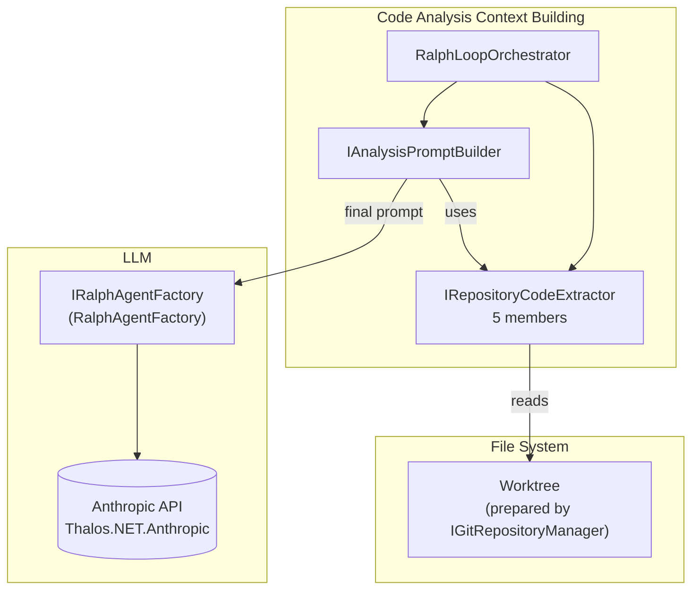

---

## 6. Legacy: Ralph Loop Worker - Task Processing Pipeline

> **Status: legacy, not deleted — see the note in section 5.** Verified accurate against
> `RalphLoopWorker.cs`: the polling/heartbeat/reclaim intervals below match the source exactly.

The console application implements a distributed Ralph Loop worker. Each iteration runs through a fixed
`IRalphLoopMiddleware` pipeline (`Daedalus.Application/Services/Middleware/`), ordered by each
middleware's own `Order` property:

| Order | Middleware | Does |
|---|---|---|
| 90 | `LearningsEnrichmentMiddleware` | Injects prior-iteration learnings into context |
| 100 | `PromptBuildingMiddleware` | Builds the iteration prompt via `IPromptBuilder` |
| 200 | `LlmInvocationMiddleware` | Calls `IRalphAgentFactory.InvokeAsync` — Anthropic Claude, MCP tools pre-attached |
| 250 | `CodeChangeApplicationMiddleware` | Applies the model's changes to the workspace |
| 300 | `CompletionDetectionMiddleware` | Checks for the task's `CompletionPromise` string |
| 350 | `InlineLearningsExtractionMiddleware` | Extracts new learnings from this iteration |
| 400 | `LoopbackEvaluationMiddleware` | Runs build/tests, records `BuildSucceeded`/`TestsPassed` |
| 500 | `GitCheckpointMiddleware` | Commits via `IGitWorkflowService.CommitAfterSuccessAsync` only when loopback passed |

`IGitWorkflowService` is a separate, lighter interface from `IGitRepositoryManager` (section 5A) — five
members (`CommitAfterSuccessAsync`, `TagOnCompletionAsync`, `ResetToLastGoodAsync`, `PushAsync`,
`GetLatestTagAsync`) built for the "commit on green, `git reset --hard` on rails-off" checkpoint pattern,
not for cloning or worktrees. `RalphLoopPipelineService` (`IRalphLoopService`) is what `RalphLoopWorker`
actually resolves and runs; there is no `RalphLoopService` class today.

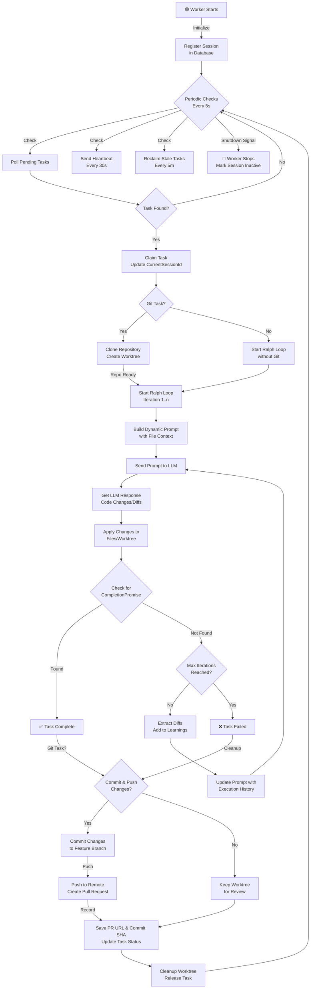

---

## 7. Project Layered Architecture

Clean architecture with clear separation of concerns:

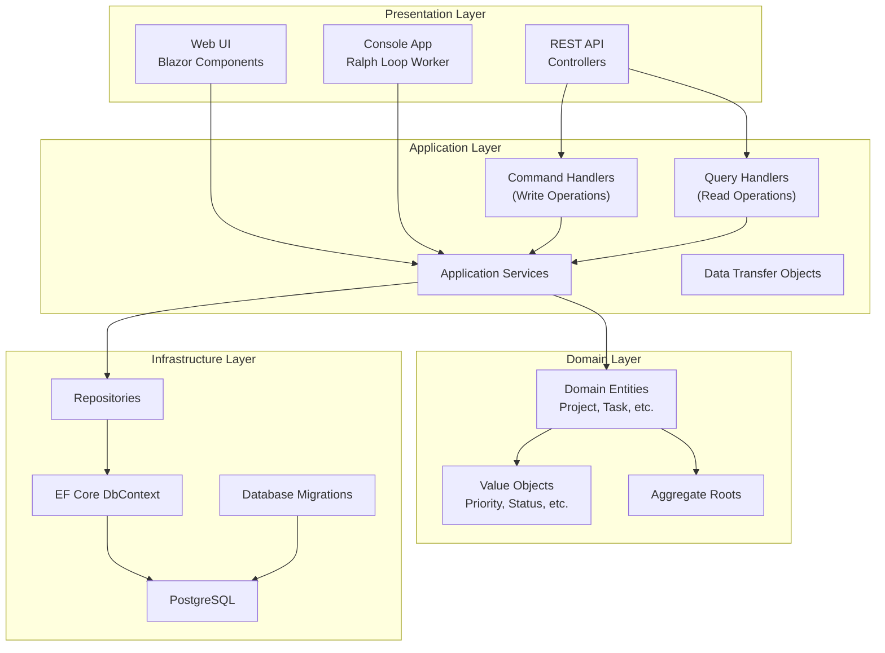

---

## 8. Complete Data Flow - Git-Based Task Execution

How data flows from creation through git operations to completion:

```mermaid
graph LR
    subgraph "Task Creation"
        A["User Creates Task<br/>Specifies Repo URL"]
        B["Task Entity<br/>Created with Git Repo"]
        C["Task Persisted<br/>Status: Pending"]
    end

    subgraph "Repository Initialization"
        D["Worker Polls<br/>Finds Task"]
        E["Clone Repository<br/>from Remote URL"]
        F["Create Feature Branch<br/>& Worktree"]
    end

    subgraph "First Iteration"
        G["Extract Code Files<br/>Build Context"]
        H["Send Full Codebase<br/>Context to LLM"]
        I["LLM Analyzes<br/>Returns Changes"]
    end

    subgraph "Change Application Loop"
        J["Apply Patch/Changes<br/>to Worktree"]
        K["Check for<br/>CompletionPromise"]
        L["Diff Generated<br/>from Changes"]
        M["Add Diff to<br/>Learnings Context"]
    end

    subgraph "Completion"
        N["✅ CompletionPromise<br/>Found"]
        O["Stage & Commit<br/>Changes in Git"]
        P["Push to Feature Branch<br/>Create PR"]
    end

    subgraph "Finalization"
        Q["Save PR URL &<br/>Commit SHA"]
        R["Mark Task Complete<br/>Set CompletedAt"]
        S["Delete Worktree<br/>Release Task"]
    end

    A --> B --> C --> D
    D --> E --> F
    F --> G --> H --> I
    I --> J --> K
    K -->|No Match| L --> M --> H
    K -->|Match| N --> O --> P
    P --> Q --> R --> S
```

---

## 8A. Data Flow - Task Execution

How data flows from creation to completion using direct database access. This is the same legacy Ralph
Loop pipeline detailed in sections 5-6; see those for the verified middleware order and interfaces.

```mermaid
graph LR
    subgraph "Task Creation"
        A["User/API<br/>Creates Task"]
        B["Task Entity<br/>Created"]
        C["Task Persisted<br/>Status: Pending"]
    end

    subgraph "Task Claiming (Direct DB Access)"
        D["Ralph Loop Worker<br/>Polls DB"]
        E["Worker Claims Task<br/>Sets CurrentSessionId"]
        F["Task Status Updates<br/>In Progress"]
    end

    subgraph "Task Execution"
        G["Send Prompt to<br/>Anthropic Claude<br/>(IRalphAgentFactory)"]
        H["LLM Processes<br/>Analyzes Code"]
        I["LLM Returns<br/>Response"]
        J["Check for<br/>CompletionPromise"]
    end

    subgraph "Learning Loop"
        K["Aggregate Learnings<br/>from Previous Runs"]
        L["Enhance Prompt<br/>Add Context"]
        M["Increment Iteration<br/>Counter"]
    end

    subgraph "Task Completion"
        N["✅ CompletionPromise<br/>Found"]
        O["Save Final Result<br/>LLM Output"]
        P["Mark Task Complete<br/>Set CompletedAt"]
        Q["Release Task"]
    end

    A --> B --> C --> D
    D --> E --> F --> G
    G --> H --> I --> J
    J -->|No Match| K --> L --> M --> G
    J -->|Match Found| N --> O --> P --> Q
```

---

## 9. Multi-Instance Worker Coordination

How multiple workers coordinate on the same task queue:

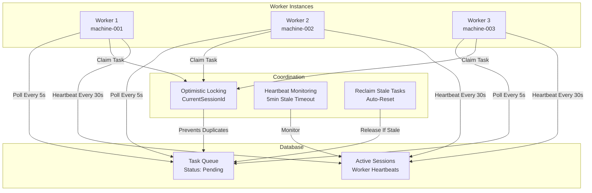

---

## 10. Dependency Injection & Service Resolution

How services are wired together:

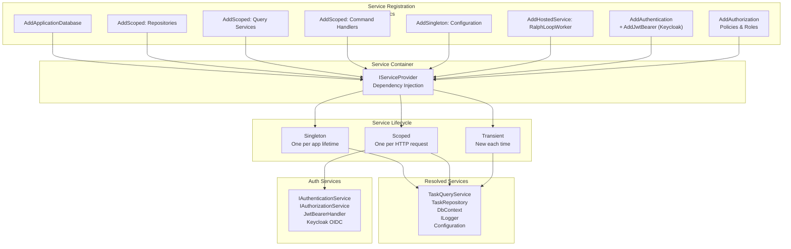

---

## 11. API Controllers & Endpoints

Enumerated directly from `src/Daedalus.Api/Controllers/` — **14 controllers**, not the 4 the previous
diagram showed (there is no `DataControllers`; that was a made-up umbrella label). Every controller
carries `[ApiVersion("1.0")]`, and `Asp.Versioning.Mvc` is referenced and configured
(`AddApiVersioning` in `Program.cs`, with `UrlSegmentApiVersionReader` among its readers) — but **no
route in this API contains a version segment**. `UrlSegmentApiVersionReader` is registered but nothing
routes through it, since every `[Route]` template below is version-free; the attribute and the reader
exist for a versioning scheme that has not been switched on yet.

| Controller | Route | Notes |
|---|---|---|
| `TasksController` | `/api/[controller]` → `/api/tasks` | CRUD + abandon/resume; reads via `ITaskQueryService`, writes via `IApplicationCommands` (section 4) |
| `ProjectsController` | `/api/[controller]` → `/api/projects` | CRUD, `+with-tasks` |
| `AgentsController` | `/api/agents` | Lists the agent catalogue |
| `AgentSessionsController` | `/api/agents` | Sessions, turns (buffered + SSE stream), see section 15 |
| `AgentMemoriesController` | `/api/agent-memories` | List/get/forget, see section 16 |
| `BrainstormController` | `/api/[controller]` → `/api/brainstorm` | Sessions, messages, phase advance, task generation |
| `CodeAnalysisController` | `/api/[controller]` → `/api/codeanalysis` | The code-analysis feature from section 5A/5B |
| `CostAnalyticsController` | `/api/cost-analytics` | Summaries, per-project/session, pricing |
| `ExecutionSessionsController` | `/api/[controller]` → `/api/executionsessions` | Worker session listing |
| `PrdController` | `/api/[controller]` → `/api/prd` | Generate PRD, convert to tasks |
| `RalphConfigController` | `/api/ralph-config` | Get/update Ralph loop configuration |
| `RepositoriesController` | `/api/[controller]` → `/api/repositories` | Repository configuration CRUD + test-connection |
| `SchedulesController` | `/api/schedules` | Overview, run history, resend — see section 19 |
| `TaskExecutionsController` | `/api/[controller]` → `/api/taskexecutions` | Execution history by task/session |

```mermaid
graph TB
    subgraph Tasks["Task & Project management"]
        Ta["TasksController<br/>/api/tasks"]
        Pr["ProjectsController<br/>/api/projects"]
        TE["TaskExecutionsController<br/>/api/taskexecutions"]
        ES["ExecutionSessionsController<br/>/api/executionsessions"]
    end

    subgraph Agent["Thalos agent surface"]
        Ag["AgentsController<br/>/api/agents"]
        AS["AgentSessionsController<br/>/api/agents"]
        AM["AgentMemoriesController<br/>/api/agent-memories"]
    end

    subgraph Automation["Ralph / legacy automation"]
        Ca["CodeAnalysisController<br/>/api/codeanalysis"]
        Rc["RalphConfigController<br/>/api/ralph-config"]
        Pd["PrdController<br/>/api/prd"]
        Br["BrainstormController<br/>/api/brainstorm"]
    end

    subgraph Ops["Repositories, schedules, cost"]
        Re["RepositoriesController<br/>/api/repositories"]
        Sc["SchedulesController<br/>/api/schedules"]
        Co["CostAnalyticsController<br/>/api/cost-analytics"]
    end

    Ta -->|IApplicationCommands / ITaskQueryService| Domain1[("PostgreSQL")]
    Pr -->|IApplicationCommands| Domain1
    AS -->|IAgentRuntime| Domain1
    AM -->|IMemoryService| Domain1
    Sc -->|IScheduleDiagnostics| Domain1
    Ca -->|RalphLoopOrchestrator| Domain1
```

---

## 12. Technology Stack & Integration Points

Rewritten directly from `Directory.Packages.props` (central package management — every version is pinned
there; `.csproj` files carry no `Version` attribute) rather than carried forward from the previous list,
which named a package (`CSharpFunctionalExtensions`) that is not referenced anywhere in the solution and
omitted the packages that actually run CQRS dispatch and the AI stack.

```mermaid
graph TB
    subgraph Frontend["Frontend"]
        BLAZOR["Blazor WebAssembly 10<br/>+ Radzen.Blazor"]
    end

    subgraph Hosts["Hosts"]
        API["ASP.NET Core 10<br/>REST API"]
        WORKER["Console<br/>Ralph Loop worker"]
        ASPIRE["🚀 .NET Aspire 13.4<br/>Orchestration"]
    end

    subgraph Identity["Identity & Security"]
        KEYCLOAK["🔐 Keycloak (OIDC)<br/>Aspire.Hosting.Keycloak"]
        JWT["Microsoft.AspNetCore.Authentication.JwtBearer"]
    end

    subgraph Runtime["Language & Runtime"]
        DotNET["🟦 .NET 10"]
        ZLINQ["ZLinq 1.5.4<br/>Zero-alloc LINQ"]
    end

    subgraph Cqrs["CQRS & Results"]
        MEDIATOR["ZeroAlloc.Mediator 5.1.1<br/>+ Generator (internal IMediator)"]
        RESULTS["ZeroAlloc.Results 1.2.2<br/>Result&lt;T&gt; / Result"]
        OUTBOX["ZeroAlloc.Outbox 2.5.2<br/>+ .EfCore"]
    end

    subgraph Ai["AI stack"]
        THALOS["Thalos.NET family 0.5.1<br/>(Abstractions, Anthropic, Sentinel,<br/>Memory, Memory.RagNet, Skills,<br/>Channels, Channels.Telegram)"]
        ANTHROPIC["Anthropic SDK 12.49.0<br/>+ Microsoft.Extensions.AI 10.10"]
        MCP["ModelContextProtocol 2.2.0"]
    end

    subgraph Data["Data & Persistence"]
        EFC["Entity Framework Core 10.0.2"]
        NPGSQL["Npgsql 10.0.3<br/>+ Npgsql.EntityFrameworkCore.PostgreSQL"]
        POSTGRES["🐘 PostgreSQL<br/>(pgvector/pgvector:pg16)"]
    end

    subgraph Resilience["HTTP & Resilience"]
        HTTPRES["Microsoft.Extensions.Http.Resilience 10.3<br/>AddStandardResilienceHandler"]
    end

    subgraph GitLibs["Git & scheduling libraries"]
        LIBGIT["LibGit2Sharp 0.31.0<br/>(IGitRepositoryManager impl)"]
        CRONOS["Cronos 0.13.0<br/>(ScheduledRun cron parsing)"]
    end

    subgraph Testing["Testing"]
        NUNIT["NUnit 4.4.0<br/>(Playwright suites)"]
        XUNIT["xUnit 2.9.3<br/>(unit/integration)"]
        CONTAINERS["TestContainers<br/>Postgres + Keycloak"]
        PLAYWRIGHT["Microsoft.Playwright 1.58"]
    end

    subgraph Quality["Code Quality"]
        SONAR["SonarAnalyzer.CSharp"]
        MEZIANTOU["Meziantou.Analyzer"]
        NETANALYZERS["Microsoft.CodeAnalysis.NetAnalyzers"]
        ZAANALYZERS["ZeroAlloc.Analyzers"]
    end

    subgraph Observability["Observability"]
        OTEL["OpenTelemetry 1.17"]
    end

    BLAZOR --> API
    BLAZOR -->|OIDC login| KEYCLOAK
    API -->|validate JWT| JWT
    API --> MEDIATOR
    API --> EFC
    WORKER --> EFC
    API --> THALOS
    WORKER --> THALOS
    THALOS --> ANTHROPIC
    THALOS --> MCP

    MEDIATOR --> RESULTS
    THALOS --> OUTBOX

    EFC --> NPGSQL
    NPGSQL --> POSTGRES
    KEYCLOAK --> POSTGRES

    ASPIRE -->|manages| API
    ASPIRE -->|manages| WORKER
    ASPIRE -->|manages| POSTGRES
    ASPIRE -->|manages| KEYCLOAK

    API --> HTTPRES
    WORKER --> LIBGIT
    WORKER --> CRONOS

    API --> ZLINQ
    DotNET --> ZLINQ

    API --> XUNIT
    WORKER --> CONTAINERS
    BLAZOR --> PLAYWRIGHT
    PLAYWRIGHT --> NUNIT

    API --> SONAR
    API --> MEZIANTOU
    API --> NETANALYZERS
    API --> ZAANALYZERS

    API --> OTEL
    WORKER --> OTEL
```

### Not in this codebase

Mirroring the equivalent note in `CLAUDE.md` — absence cannot be discovered by reading code, so it only
survives if it is written down:

- **No `Polly` package dependency.** Resilient HTTP clients (GitHub/Azure DevOps pull-request factories)
  use `Microsoft.Extensions.Http.Resilience`'s `AddStandardResilienceHandler(...)`
  (`Daedalus.Infrastructure/Extensions/InfrastructureServiceExtensions.cs`, and
  `Daedalus.Web/Program.cs`). `Polly` types appear in `using` directives only because
  `Microsoft.Extensions.Http.Resilience` re-exposes them for configuring the pipeline — there is no
  direct `PackageReference` to `Polly` anywhere in `src/`.
- **No `ZeroAlloc.Specification` package and no `Specification<T>` pattern** anywhere in the solution.
- **No generic `IRepository<T>`.** Repositories are one interface per aggregate in
  `Daedalus.Application/Abstractions/` (`ITaskRepository`, `IProjectRepository`,
  `IExecutionSessionRepository`, `IBrainstormRepository`, `IRepositoryConfigurationRepository`) plus a
  few more under `Services/CodeAnalysis/` for the code-analysis feature (`ICodeAnalysisRepository`,
  `IGitRepositoryManager`, `IRepositoryCodeExtractor`, `IRepositoryAuthenticationProvider`,
  `IRepositoryPlatformDetector`).
- **No `CSharpFunctionalExtensions`.** Replaced by **ZeroAlloc.Results** in phase 1.7; zero references
  remain in any `.csproj`.
- **No `ZeroAlloc.Saga` or `ZeroAlloc.Scheduling` — and they are not in the same status.**
  `ZeroAlloc.Saga`'s architecture ban was **lifted** in [#258](https://github.com/MarcelRoozekrans/Daedalus.NET/pull/258)
  once its upstream `Publish`/DI bug was fixed — Saga is now **allowed but unused**, a live candidate for
  phase 2.2's workflow engine, not something a project is forbidden from referencing.
  `ZeroAlloc.Scheduling` remains **excluded by design**, re-justified in the same PR: `ScheduledRun.NextRunAt`
  is the sweep's only source of truth and `ClaimAndEnqueueDueAsync` is idempotent (section 18), so a
  durable job store buys nothing over the plain `BackgroundService` sweeper already in place. Both
  absences are still enforced by the same architecture test class
  (`tests/Daedalus.Tests.Unit/Architecture/CleanArchitectureTests.cs`,
  `No_project_references_ZeroAlloc_Scheduling`), but for two different reasons — one is a lifted ban, the
  other a standing design decision.

---

## 13. Request-Response Lifecycle

Complete request flow from client to database and back:

```mermaid
sequenceDiagram
    participant Client as Client<br/>Web/API
    participant Auth as Auth Middleware<br/>JWT Bearer
    participant KC as Keycloak<br/>OIDC Provider
    participant Controller as Controller
    participant Handler as Command/Query<br/>Handler
    participant Service as Application<br/>Service
    participant Repo as Repository
    participant EF as EF Core<br/>DbContext
    participant DB as PostgreSQL

    Client->>Auth: HTTP Request<br/>+ Bearer Token
    activate Auth

    Auth->>KC: Validate JWT Token<br/>Check Signature & Claims
    activate KC
    KC-->>Auth: Token Valid<br/>User Claims
    deactivate KC

    alt Token Invalid or Expired
        Auth-->>Client: 401 Unauthorized
    end

    Auth->>Controller: Authenticated Request<br/>ClaimsPrincipal Set
    deactivate Auth
    activate Controller

    Controller->>Handler: Instantiate Handler<br/>DI Resolution
    activate Handler

    Handler->>Service: Call Application<br/>Service Method
    activate Service

    Service->>Repo: Query/Execute via<br/>Repository
    activate Repo

    Repo->>EF: DbSet Query<br/>AsNoTracking
    activate EF

    EF->>DB: Execute SQL
    activate DB

    DB-->>EF: Result Set
    deactivate DB

    EF-->>Repo: Materialized Entities
    deactivate EF

    Repo-->>Service: IReadOnlyList<T>
    deactivate Repo

    Service->>Service: Business Logic<br/>Map to DTO

    Service-->>Handler: Result&lt;T&gt;.Success(DTO)<br/>(ZeroAlloc.Results, section 4)
    deactivate Service

    Handler-->>Controller: Result Object<br/>Success or Failure
    deactivate Handler

    Controller->>Controller: Match Result<br/>Map to Response

    Controller-->>Client: 200 OK / 4xx Error<br/>JSON Response
    deactivate Controller
```

---

## 14. Performance Optimization Strategy

Key performance optimizations across the stack:

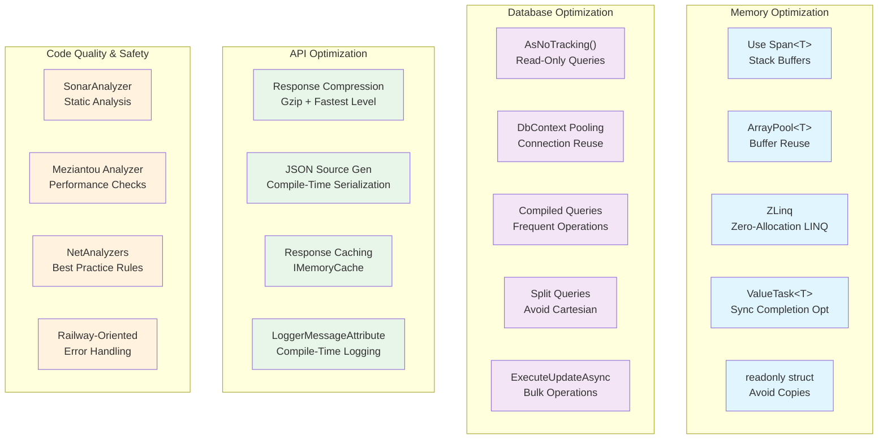

---

## 15. Agent turn (Thalos)

Phase 1.1 adds a second, general-purpose agent stack next to the Ralph Loop: **Thalos.NET** (Microsoft Agent Framework
1.17 underneath, AI.Sentinel at the model boundary, MCP + local tools with authorization at the function boundary). The
Blazor page `/agent` talks to `Daedalus.Api` over REST, and one turn is streamed back as Server-Sent Events. Sessions and
transcripts live in PostgreSQL via `PostgresAgentSessionStore` (`Daedalus.Agents`).

Phase 1.2 adds **memory** to the turn: before the model is called, Thalos' memory context provider recalls the memories
visible to the caller and injects them into the prompt; `memory__*` tools let the agent remember/recall/forget
explicitly. Records live in `AgentMemories` (`PostgresMemoryStore`), embeddings in the Rag.NET index (`rag_chunks`, same
database) — a rebuildable cache, so an unavailable index degrades to `index_pending` rows instead of a failed turn.

Phase 1.3 adds **skills** to the turn: a catalogue of the procedure documents the agent may use (names + one-line
descriptions, filtered by the agent's globs) is appended to its instructions before the model call, and `skills__load`
pulls a body in on demand. Documents live in `Skills` (`PostgresSkillStore`), synced one-way from the repo's `skills/`
folder at host start. The skill index is **in-process** — no pgvector and no `rag_chunks` involvement — so a corpus that
outgrows it swaps `ISkillIndex` for a pgvector implementation with no change above it (design §10).

```mermaid
sequenceDiagram
    autonumber
    participant Web as Daedalus.Web<br/>(Agent.razor + AgentApiClient)
    participant Api as Daedalus.Api<br/>AgentSessionsController<br/>AgentMemoriesController
    participant RT as Thalos IAgentRuntime<br/>(ThalosAgentRuntime)
    participant Store as PostgresAgentSessionStore<br/>(Daedalus.Agents → EF Core)
    participant Mem as MemoryContextProvider<br/>→ IMemoryService
    participant Skl as SkillContextProvider<br/>→ SkillCatalogue (per-glob-set cache)
    participant SklStore as PostgresSkillStore<br/>(Skills) + in-process SkillIndex
    participant MemStore as PostgresMemoryStore<br/>(AgentMemories) + Rag.NET index<br/>(rag_chunks, nomic-embed-text 768)
    participant Agent as MAF ChatClientAgent
    participant Sentinel as AI.Sentinel<br/>(SentinelChatClient decorator)
    participant Claude as Anthropic API<br/>(Thalos.NET.Anthropic)
    participant Tools as Tools<br/>(MCP roslyn/context7, local daedalus__*, memory__*, skills__*)

    Web->>Api: POST /api/agents/sessions/{id}/turns/stream<br/>Authorization: Bearer (policy AgentUse)
    Api->>Api: 200 text/event-stream, DisableBuffering,<br/>": connected" flushed before the first token
    Api->>RT: RunTurnStreamingAsync(AgentTurnRequest{session, text, caller})
    RT->>Store: Load session (owner/admin check, else SessionNotFound)<br/>Idle → Running
    Store-->>RT: session + transcript
    RT->>Mem: Recall for this turn<br/>(scope: caller + this agent's pinned + shared owner "daedalus")
    Mem->>MemStore: embed(prompt) → vector search in rag_chunks<br/>→ hydrate records from AgentMemories
    alt Recall succeeded (0..TopK hits above MinScore)
        MemStore-->>Mem: RecalledMemory[] (TopK, MaxChars budget)
        Mem->>Mem: Untrusted-content scan;<br/>quarantined memories dropped from the block
        Mem-->>RT: memory block prepended to the prompt
        RT-->>Api: memory-recalled (ids, chars)<br/>[memory-quarantined per dropped memory]
        Api-->>Web: event: memory-recalled / memory-quarantined
    else Index unavailable or failed
        MemStore-->>Mem: MemoryIndexUnavailable / MemoryIndexFailed
        RT-->>Api: memory-recall-failed (code)
        Api-->>Web: event: memory-recall-failed<br/>(turn continues without memories)
    end
    RT->>Skl: Catalogue for this agent's Skills globs
    alt Catalogue rendered (cache hit or first render)
        Skl-->>RT: <skills note="…"> block appended to the instructions<br/>(budgeted by Catalogue:MaxChars,<br/>overflow ends "… and N more")
    else Store unreachable
        Skl-->>RT: SkillCatalogueFailedEvent (code)
        RT-->>Api: skill-catalogue-failed (kind only)
        Api-->>Web: event: skill-catalogue-failed<br/>(turn continues without a catalogue)
    end
    RT->>Agent: Build from AgentDefinition<br/>(instructions, model, tool glob, history,<br/>recalled memories, skill catalogue)
    loop Model ↔ tools until the final answer
        Agent->>Sentinel: chat request (streaming)
        Sentinel->>Sentinel: input detectors (lexical; semantic when an<br/>embedding generator is configured)
        alt Critical finding → Quarantine
            Sentinel-->>RT: SentinelException → AgentError Quarantined
            RT->>Store: Running → Idle
            RT-->>Api: error (Quarantined)
            Api-->>Web: event: error
        else Clean / Log / Alert
            Sentinel->>Claude: messages + tool schemas
            Claude-->>Sentinel: text deltas / tool_use blocks
            Sentinel->>Sentinel: output detectors
            Sentinel-->>Agent: updates
            Agent-->>RT: text-delta
            RT-->>Api: text-delta
            Api-->>Web: event: text-delta (flushed immediately)
            opt Model calls a tool
                Agent->>Tools: AuthorizingAIFunction: policy check at the function boundary<br/>(roslyn__apply_* → developer/admin role)
                alt Denied
                    Tools-->>Agent: "Tool call denied: …" as tool result<br/>(ToolCallDeniedNotification published)
                else Allowed
                    Tools->>Tools: MCP call (stdio/http) or local method
                    Tools-->>Agent: tool result
                end
                RT-->>Api: tool-call / tool-result
                Api-->>Web: event: tool-call / tool-result
                opt memory__remember / memory__forget
                    Tools->>Mem: IMemoryService.RememberAsync (dedupe check)
                    Mem->>MemStore: insert AgentMemories row + upsert rag_chunks
                    alt Indexed
                        RT-->>Api: memory-stored (id, kind, deduped)
                    else No embedding generator / index down
                        RT-->>Api: memory-stored + memory-index-pending (id)<br/>ReindexPendingMemoriesHostedService retries later
                    end
                    Api-->>Web: event: memory-stored / memory-index-pending
                end
                opt skills__load / skills__search
                    Tools->>SklStore: GetAsync(name) within the agent's globs<br/>(search: in-process cosine over the same generator)
                    SklStore-->>Tools: body wrapped in <skill name="…">…</skill><br/>with </skill and </memories neutralised, name echoed sanitised
                    note over Tools: Out-of-glob, unknown and inactive all answer<br/>the same "Unknown skill" text - no probing
                end
            end
        end
    end
    RT->>Store: Append user + assistant turn, usage,<br/>Running → Idle
    RT-->>Api: usage, done
    Api-->>Web: event: usage, event: done
    Web->>Web: Render bubbles, tool cards, usage;<br/>re-enable composer
    Web->>Api: GET /api/agent-memories/{id}<br/>(AgentMemoriesController: hydrate the recalled ids<br/>for the Memories panel)
    Api-->>Web: MemoryDto per visible id
```

Notes:

- The controller flushes every SSE frame as soon as the runtime yields it (`text-delta`, `tool-call`, `tool-result`,
  `usage`, `done`, `error`, `memory-recalled`, `memory-stored`, `memory-recall-failed`, `memory-index-pending`,
  `memory-quarantined`, `skill-catalogue-failed`); the stream always ends with `done` or `error`.
- **Memory is best-effort within the turn:** a failed or unavailable index yields `memory-recall-failed` and the turn
  runs without memories; a write that could not be embedded yields `memory-index-pending` and is repaired in the
  background by `ReindexPendingMemoriesHostedService` (API host only). `AgentMemories` is the source of truth,
  `rag_chunks` is a rebuildable cache — but the sweeper runs with `PendingOnly = true`, so a full rebuild means dropping
  `rag_chunks` **and** setting `IndexPending` on the rows (see the README's operational notes).
- The `memory-recalled` event carries **ids only**, so the Blazor Memories panel hydrates them through
  `GET /api/agent-memories/{id}`, which applies the same visibility rule as the tools (`MemoryScope.Includes`).
- Tool authorization runs at the **function boundary** (`Thalos` `AuthorizingAIFunction` + `[Policy]` types such as
  `DeveloperPolicy`), so an unauthorized tool call is reported back to the model instead of failing the turn; the denial
  is also published as a `ToolCallDeniedNotification` (audit).
- AI.Sentinel is an `IChatClient` decorator: a `Quarantine` verdict surfaces as `AgentErrorCode.Quarantined` (HTTP 422 on
  the buffered endpoint, `event: error` on the stream). Its semantic detectors need the Ollama embedding generator; without
  it only lexical/operational detectors run.
- **Skills are best-effort within the turn too, but trusted differently.** An unreachable store yields
  `skill-catalogue-failed` (streamed by kind only — skills have no UI) and the turn proceeds without a catalogue. Unlike
  recalled memories, skill bodies are **not** scanned as untrusted content: they come from git, so merging a `SKILL.md`
  is the trust boundary, the same as merging code. The catalogue itself is cached per glob-set, so a turn costs a
  dictionary lookup rather than a query.
- **Skill sync happens once, at host start**, beside the Rag.NET schema initializer:
  `SkillSyncService.StartingAsync` → enumerate the configured roots → parse and validate each `SKILL.md` (a malformed
  file is logged at warning and **skipped**, never fatal) → compare content hashes and skip unchanged files → upsert the
  changed ones → `DeactivateMissingAsync` for names whose files are gone. A configured root that does not exist fails
  registration before this ever runs. Note the asymmetry with memory: a bad *file* is survivable, an unreachable *store*
  is not.
- On host start `AgentSessionCrashRecovery` resets any session left in `Running` by a crashed process back to `Idle`.

### Strangler layout: Ralph and Thalos side by side

**Both stacks are still wired in today**, sharing Infrastructure (DbContext) — and, since phase 1.2, the agent
memory: Ralph's learnings are written and recalled through the Application port `ILearningsMemory` (shared owner
`daedalus`), so `StructuredLearnings` and the hand-rolled embedding service are gone. Ralph's retirement was
originally slated for phase 1.6, then explicitly rescoped on 2026-09-20 (`docs/planning/ROADMAP.md`): the loop
is the seed of the Milestone 2 software-manufacturing design, not dead weight, so it is **redesigned as phase
2.5** rather than deleted, and switched off only once that redesign demonstrably does the job — see the legacy
note in section 5. The Ralph worker runs in `Daedalus.Console` as `RalphLoopWorker`, resolving `IRalphLoopService`
(`RalphLoopPipelineService`, section 6) — not the `RalphLoopOrchestrator` class, which belongs to the unrelated
code-analysis feature (section 5A). `Daedalus.Console` registers `AddDaedalusMemory` (memory only, no agents, no
skills, creates no Rag.NET schema — it runs no Thalos agents, so there is no catalogue to build):

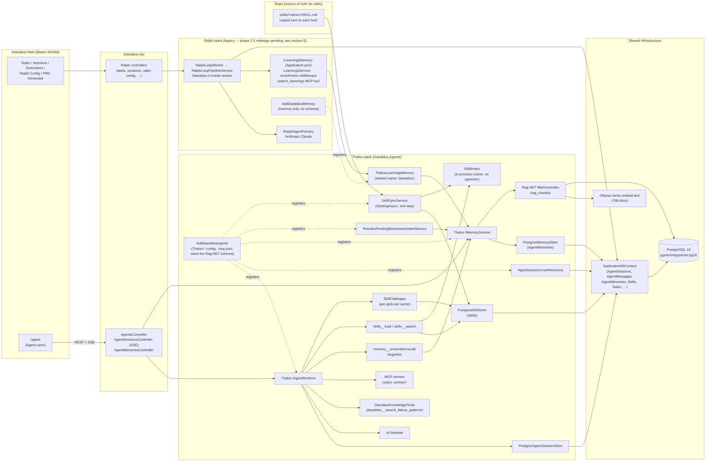

---

## 16. Agent Runtime — Sessions, Memory, Skills, and Subagents

Section 15 walks one live HTTP turn end to end. This section covers the runtime surface that turn sits on top
of — `IAgentRuntime` as a whole, session lifecycle, and one piece section 15 does not touch at all: **detached
subagent runs** via `ISubagentRunner`.

### The front door: `IAgentRuntime`

`IAgentRuntime` (`Thalos.IAgentRuntime`, `Thalos.NET.Abstractions` — external to this repo, not declared under
`src/`) is documented in its own package as "Front door of the framework. Channels (HTTP, CLI, Telegram…) only
ever talk to this." It exposes four members, confirmed against the package XML docs at the pinned version
(`Thalos.NET.Abstractions` 0.5.1):

| Member | Behavior |
|---|---|
| `CreateSessionAsync(AgentId, ISecurityContext, CancellationToken)` | Creates an `Idle` session owned by the caller. Unknown agent → `AgentErrorCode.AgentNotFound`; store failure → `StoreError`. |
| `RunTurnAsync(AgentTurnRequest, CancellationToken)` | Runs one turn, returns the buffered result. |
| `RunTurnStreamingAsync(AgentTurnRequest, CancellationToken)` | Runs one turn, streaming `AgentEvent`s — this is what section 15's sequence diagram follows. |
| `CloseSessionAsync(SessionId, ISecurityContext, CancellationToken)` | Terminal close. Only the owner or an admin may close a session; running → `SessionBusy`; already closed → `SessionClosed`. |

Daedalus does not implement `IAgentRuntime` itself — the implementation lives inside the `Thalos.NET` package —
but it does mirror the session state machine locally, for real: `Daedalus.Domain.Entities.AgentSessionState`
(`src/Daedalus.Domain/Entities/AgentSessionState.cs`) is an enum whose doc comment says it is "kept in Domain so
Domain stays framework-free; integer values must match one-to-one" with `Thalos.SessionState`, verified by an
integration test:

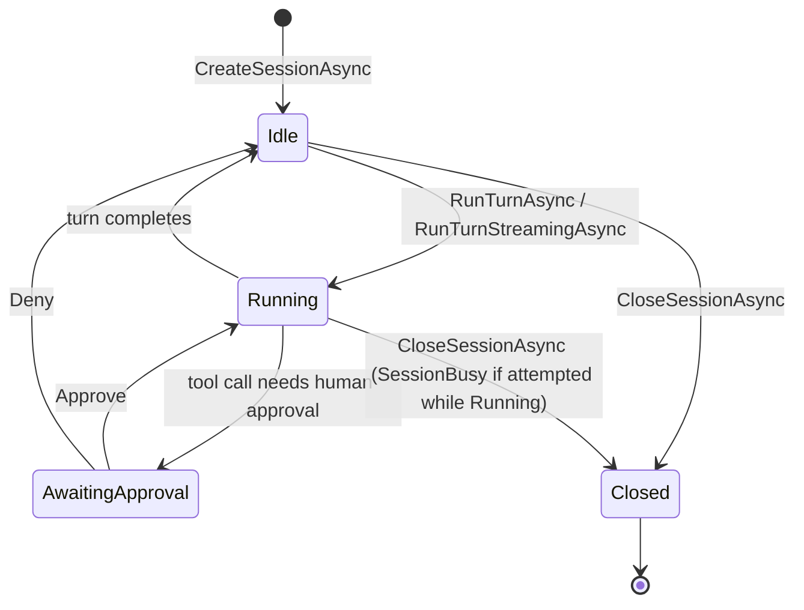

Honesty check: `AwaitingApproval` is a real state in both the Thalos enum and its Domain mirror, but grepping
`AgentSessionsController` turns up no `Approve`/`Deny` action — the approval-gate flow the state exists for is
not wired up anywhere in this repo yet.

### Memory and skills

Both are covered in depth in section 15 and are not repeated here: memory recall/remember/forget backed by
`PostgresMemoryStore` (`AgentMemories` table) with vector search over `rag_chunks` (pgvector, `nomic-embed-text`
768-dim via Ollama), and skills backed by `PostgresSkillStore` (`Skills` table) with an in-process
`ISkillIndex` cosine search — no pgvector involvement on the skills side today. Both are best-effort within a
turn: an unreachable store degrades the turn rather than failing it (see section 15's notes for the exact event
names).

### Subagents: `ISubagentRunner` and the one type in Daedalus allowed to see it

`ISubagentRunner` (`Thalos.ISubagentRunner`, `Thalos.NET.Abstractions`, confirmed in the package XML docs) is
the runtime's second front door, for turns with **no live caller** — nothing is holding a socket open for the
answer. Its own doc comment: "Used by hosts for scheduled runs and for orchestrated subagent steps; both are
the same thing triggered differently." Unlike a streamed turn, a detached run never streams — it returns a
buffered `AgentTurnResult` and the host decides how to deliver it (in Daedalus, that "how" is the scheduling
subsystem's step dispatchers — see that section for the delivery path; it is out of scope here).

`ISubagentRunner.RunAsync(SubagentRunRequest, CancellationToken)` creates a fresh session for the requested
agent, runs exactly one turn, and always closes the session — including on failure. A request carries:

| `SubagentRunRequest` member | Meaning (from the package XML docs) |
|---|---|
| `AgentId` | The agent to run, resolved through `IAgentCatalog`. |
| `Task` | The instruction, sent as the single user message of a single turn. |
| `Caller` | The identity the run executes as — never inferred, because a detached run has no inbound request to derive one from. |
| `Budget` | A `SubagentBudget` (`MaxTotalTokens`, `Deadline`); `null` defers to the host's configured default (50,000 tokens / 10 minutes when nothing else is configured). |
| `Depth` | Nesting depth; 0 for a host-started run. The package doc comment notes nothing in Thalos increments this today — "sagas are compile-time, so there is no recursion to prevent yet." |
| `ParentSessionId` | Telemetry lineage only, never authorization. |

Two failure modes are enforced independently, per the package docs: **"A deadline stops work; a budget settles
it."** The deadline cancels a linked token once wall-clock time runs out; the token budget is checked only
after the turn returns, against tokens already spent. A run that races past its deadline but still completes
successfully is reported as a *success* (with a logged warning) rather than a failure — the two checks do not
always agree by design. Failure surfaces as one of three dedicated `AgentErrorCode` values:
`SubagentBudgetExceeded`, `SubagentDeadlineExceeded`, `SubagentDepthExceeded` (plus the general `AgentNotFound`
for an unresolvable `AgentId`).

**Daedalus does not call `ISubagentRunner` from more than one place.** `SubagentRunExecutor`
(`src/Daedalus.Agents/Scheduling/SubagentRunExecutor.cs`), implementing `ISubagentRunExecutor`
(`src/Daedalus.Agents/Scheduling/ISubagentRunExecutor.cs`), says so in its own doc comment: "the only type in
Daedalus that touches `ISubagentRunner`." It resolves an agent name against `IAgentCatalog`, builds a
`SubagentRunRequest` with `Depth = 0` and `ParentSessionId = null` (no parent turn — the depth guard exists for
a future in-turn delegation tool, not for this caller), runs it as a `DetachedPrincipal`
(`src/Daedalus.Agents/Scheduling/DetachedPrincipal.cs` — an `ISecurityContext` built from configured
`PrincipalId`/`Roles`, deliberately never borrowed from an ambient `ClaimsPrincipal`, because a scheduled run
has no human behind it to borrow from), and converts every outcome — success or `AgentError` — into a
`Result<string, AgentError>` rather than a thrown exception:

```csharp
public interface ISubagentRunExecutor
{
    ValueTask<Result<string, AgentError>> RunAsync(
        string agentName, string task, string principalId, IReadOnlyList<string> roles, CancellationToken ct);
}
```

```mermaid
sequenceDiagram
    autonumber
    participant Sched as Scheduling step dispatcher<br/>(see the Scheduling section)
    participant Exec as SubagentRunExecutor<br/>(Daedalus.Agents.Scheduling)
    participant Cat as IAgentCatalog
    participant Runner as Thalos ISubagentRunner
    participant RT as IAgentRuntime<br/>(fresh session, no live caller)

    Sched->>Exec: RunAsync(agentName, task, principalId, roles, ct)
    Exec->>Cat: Resolve agentName (case-insensitive scan)
    alt Unknown agent
        Exec-->>Sched: Result.Failure(AgentError.Validation)
    else Resolved
        Exec->>Runner: RunAsync(SubagentRunRequest {<br/>AgentId, Task, Caller: DetachedPrincipal,<br/>Budget, Depth: 0, ParentSessionId: null })
        Runner->>RT: CreateSessionAsync + RunTurnAsync (buffered, never streamed)
        RT-->>Runner: AgentTurnResult or AgentError
        Runner-->>Runner: Deadline stops work; budget settles it<br/>(checked independently, may disagree)
        Runner-->>Exec: Result&lt;AgentTurnResult, AgentError&gt;
        Exec-->>Sched: Result&lt;string, AgentError&gt; (Text on success)
    end
```

---

## 17. Channels and Delivery

Sections 15 and 16 covered one live turn end to end. This section covers the other side: how a message
reaches a human, whether or not a turn is still open to answer it. Source: `src/Daedalus.Agents/Channels/`
and the `Thalos.NET.Channels` / `Thalos.NET.Channels.Telegram` packages (pinned at 0.5.1).

### `IChannelAdapter`: keyed on the conversation, not the session

`IChannelAdapter` (`Thalos.IChannelAdapter`, `Thalos.NET.Abstractions`) is a delivery channel — Telegram, the
console, a future WebSocket. It exposes a `ChannelId` property and one method, confirmed against the
package's own XML docs at 0.5.1:

```csharp
ValueTask DeliverAsync(ConversationId conversationId, AgentEvent agentEvent, CancellationToken ct);
```

**This was a breaking change.** Diffing the package XML docs across versions in the local NuGet cache shows
`DeliverAsync` took a `SessionId` through `Thalos.NET.Abstractions` 0.3.0 and a `ConversationId` from 0.4.0
onward — confirmed by grepping both versions' shipped XML for the member signature directly, not from
changelog prose. The package's own remarks explain why: much of what a channel must say belongs to a
conversation that has no session at all — `/help`, an unrecognised command, "that session had already
ended" — and a session-keyed seam can only deliver those by inventing a session id that resolves to nothing.
`AgentEvent` still carries its own `SessionId` for an adapter that wants to correlate a delivery with one.

### The two adapters actually registered

| Adapter | Package | Registered by | Condition |
|---|---|---|---|
| `TelegramChannelAdapter` / `TelegramChannelSource` | `Thalos.NET.Channels.Telegram` | `AddDaedalusChannels` (both hosts) | Only when `Thalos:Channels:Telegram:BotToken` is configured — calling `AddTelegramChannel` unconditionally would `ValidateOnStart`-crash a host with no token, since the validator rejects a blank `BotToken`, `PrincipalId`, or empty `AllowedUserIds` |
| `ConsoleChannelAdapter` / `ConsoleChannelSource` | `Thalos.NET.Channels` | `AddDaedalusChannels(..., includeConsoleChannel: true)`, called only by `Daedalus.Cli` | The "CLI adapter": reads one line per input, prints only the unprinted suffix of each turn (a terminal cannot edit what it already emitted) |

`Daedalus.Api` never passes `includeConsoleChannel: true` — an API host has no TTY, so a console channel
registered there would leave a hosted service blocked reading from a stream nobody writes to.
`DaedalusChannelsServiceCollectionExtensions.AddDaedalusChannels` is the single composition point both hosts
call; the boolean parameter, not two divergent call sites, is what keeps the console channel off the one
host that must never get it.

`PostgresConversationMap` (`IConversationMap` over the `ChannelConversations` table) replaces Thalos's
in-memory default so a conversation-to-session binding survives a restart. Binding goes through
`ChannelConversation.Create` for validation and a genuine `INSERT ... ON CONFLICT ... DO UPDATE` upsert on
`(ChannelId, ConversationId)` — not a read-then-write — because the CLI host can run concurrently against
the same database and a read-then-write has a TOCTOU window a database-level upsert closes.

### Two delivery paths, not one

A live turn's output goes straight from `ChannelPump` (the package's reader-loop/dispatch hosted service) to
`IChannelAdapter.DeliverAsync` — no outbox involved. A **detached** run — no live caller holding a socket
open, i.e. a scheduled run or a subagent step (section 18) — has nothing to stream to, so its output is
queued for durable delivery instead:

- `ChannelMessageQueued` (`ChannelId`, `ConversationId`, `Text`, `Guid? ExecutionId`) is a `[OutboxMessage]`
  record — the `ZeroAlloc.Outbox` source generator emits `IOutboxWriter<ChannelMessageQueued>` and the DI
  extension `AddChannelMessageQueuedOutbox()`. It is written inside the same transaction as whatever produced
  it, so a host crash between "decided what to say" and "actually sent it" cannot silently drop the reply —
  it survives as a `Pending` outbox row.
- `ChannelMessageQueuedDispatcher` (`IOutboxDispatcher<ChannelMessageQueued>`) resolves the adapter matching
  the message's `ChannelId` and calls `DeliverAsync` with a synthetic `TextDeltaEvent`. `SessionId` is
  `Guid.Empty` (no live turn exists by delivery time) and `TurnId` is fresh per call, so a Telegram redelivery
  after a restart renders as its own message rather than silently overwriting an earlier one. An unknown
  `ChannelId` is logged at `Error` and treated as handled, not thrown — a missing adapter registration is
  permanent, so retrying would only burn the outbox's retry budget before dead-lettering something that could
  never have succeeded.
- `AddChannelOutbox` registers one poller (2 s interval, batch 20, 8 max attempts, 1 s base retry delay — all
  explicit rather than left at the library defaults) shared by `ChannelMessageQueued` **and** the three
  scheduling message types from section 18 (`ScheduledRunDue`, `RunScoutStep`/`RunWriterStep`,
  `DeliverDigest`). A second call to `AddOutbox` would start a second poller racing the same table, so only
  `AddDaedalusAgents` calls it.

```mermaid
graph TD
    subgraph Live["Live turn — no outbox"]
        Source["IChannelSource<br/>(Telegram / Console)"] --> Pump["ChannelPump"]
        Pump --> Runtime["IAgentRuntime<br/>RunTurnStreamingAsync"]
        Runtime --> Pump
        Pump -->|"DeliverAsync(ConversationId, event)"| Adapter1["IChannelAdapter"]
    end

    subgraph Detached["Detached run — durable delivery"]
        Producer["Scheduled run / subagent step<br/>(section 18)"] -->|"same transaction"| Outbox[("OutboxMessages table<br/>ChannelMessageQueued row")]
        Poller["OutboxWorkerService<br/>(2s poll, batch 20)"] --> Outbox
        Poller --> Dispatcher["ChannelMessageQueuedDispatcher"]
        Dispatcher -->|"DeliverAsync(ConversationId, TextDeltaEvent)"| Adapter2["IChannelAdapter"]
    end

    Adapter1 -.->|"resolved by ChannelId"| Map["PostgresConversationMap<br/>(ChannelConversations table)"]
    Adapter2 -.->|"resolved by ChannelId"| Map
```

---

## 18. Scheduling

Recurring autonomous work — the daily repository digest — without a durable job framework. Source:
`src/Daedalus.Agents/Scheduling/`, `src/Daedalus.Domain/Entities/ScheduledRun.cs` and
`ScheduledRunExecution.cs`.

### `ScheduledRun`: the schedule, and `NextRunAt` as the only source of truth

`ScheduledRun` (`Daedalus.Domain.Entities`) is one configured recurring run: `Cron` (text, never parsed in
Domain), `Trigger` (a workflow identifier, e.g. `RepoDigest`), `ChannelId`/`ConversationId` (delivery
target), `PrincipalId`/`Roles` (the identity it executes as), `Origin` (`Config` or `Agent`), and —
load-bearing — `NextRunAt`. Nothing else tracks whether a schedule is due; `NextRunAt` is it.
`ScheduleReconciler` upserts `Config`-origin rows from the `ScheduledRuns` configuration array into the table
on every host start (by `Name`; a row missing from config is disabled, never deleted, so `MissedOccurrences`
survives a schedule being temporarily removed). `Agent`-origin rows — created by a tool call — are never
touched by the reconciler at all.

### The sweeper: a `BackgroundService`, not a durable job store

`ScheduleSweeperService` is a plain `BackgroundService` driving a **one-minute `PeriodicTimer`**. Each tick
opens a fresh `IServiceScope` and calls `ScheduledRunStore.ClaimAndEnqueueDueAsync`, which — inside a single
transaction per sweep, not per row — finds every enabled row with `NextRunAt <= now`, advances each to its
next Cronos-computed occurrence, and enqueues a `ScheduledRunDue` outbox message for the most recent due
occurrence. A `ScheduledRun` carries an `xmin` concurrency token, so two sweepers racing the same due row are
mutually exclusive at the database level with no explicit lock: the loser's `DbUpdateConcurrencyException` is
caught and treated as "another sweeper already claimed this tick" — the whole sweep's transaction rolls back
and every other due row in the same batch is simply found due again on the next tick, one minute late. A
tick's own exception is caught and logged, never allowed to escape: letting it escape would stop
`BackgroundService`'s loop and end every future sweep, not just the failing one.

**Why there is no durable job store, stated directly:** `ZeroAlloc.Scheduling` was evaluated for this
trigger and dropped by design, not because it is broken. `ClaimAndEnqueueDueAsync` is idempotent and
`ScheduledRuns.NextRunAt` is the sweep's only source of truth — a missed tick is simply picked up by the
next one, and there is no "the sweeper ran" row that would ever need to survive a crash. Durable jobs,
retries, dead-lettering, a dashboard: none of it buys anything over the plain `BackgroundService` this
already is. This is enforced, not merely documented: `CleanArchitectureTests.No_project_references_ZeroAlloc_Scheduling`
(`tests/Daedalus.Tests.Unit/Architecture/CleanArchitectureTests.cs`) asserts by direct `.csproj` text scan
that no project references the package — a namespace-based ArchUnitNET rule would be vacuously true here,
since the whole point of dropping the package is that nothing loads it, so the test greps `.csproj` files
directly instead. The test's own failure message records that the decision is reversible: the package now
ships a zero-setup in-memory store and a public `SchedulingDbContext` migrations could target, so it can slot
back in later if durable job state is ever genuinely needed — "if that is ever wanted, delete this fact
rather than working around it."

### From "due" to "delivered": one execution row, four outbox steps

Firing a schedule does not run a saga; it walks a persisted state machine. `ScheduledRunExecution` (one row
per firing) has a `Step` (`RunStep`: `Pending → Scout → Writer → Deliver → Done`, or `→ Failed` from any
non-terminal step) and persists each stage's output (`Findings`, then `Digest`) as it advances, so a crash
mid-run never re-pays for work already done. `ScheduledRunDue` (`ScheduleId`, `OccurrenceAtUtc`) — enqueued
by the sweep above — is picked up by `ScheduledRunDueDispatcher`, which calls
`ScheduledRunExecutionStore.TryBeginAsync`: a hand-written `INSERT ... ON CONFLICT ("ScheduleId",
"OccurrenceAt") DO NOTHING`. That `UNIQUE (ScheduleId, OccurrenceAt)` constraint is the idempotency key —
outbox delivery is at-least-once, and a redelivered `ScheduledRunDue` finds the row already present and
inserts nothing rather than starting the run twice.

Three more outbox message types drive the remaining steps, each with its own dispatcher, each calling
`ISubagentRunExecutor` (section 16) for the two that run a subagent turn:

| Message | Dispatcher | Does |
|---|---|---|
| `RunScoutStep(ExecutionId)` | `RunScoutStepDispatcher` | Runs the `scout` agent (`RepoDigestPrompts.ScoutAgent`) over the schedule's `Repository`, records `Findings`, advances to `Writer` |
| `RunWriterStep(ExecutionId)` | `RunWriterStepDispatcher` | Runs the `writer` agent over the scout's `Findings`, records `Digest`, advances to `Deliver` |
| `DeliverDigest(ExecutionId)` | `DeliverDigestDispatcher` | No subagent call — queues a `ChannelMessageQueued` (section 17) and marks the execution `Done`, **in the same transaction** |

No dispatcher in this pipeline throws on a subagent failure: every failure path ends in
`ScheduledRunExecutionStore.FailAsync`, which records `LastError`/`FailedAtStep` and queues an operator
notice. A throw would hand the message back to the outbox for eight retries with exponential backoff,
re-running the (paid) subagent turn each time with nobody told until it dead-letters. A turn cancelled by a
host shutdown is deliberately excluded from that rule and re-thrown instead, so a run interrupted by a deploy
resumes on redelivery rather than being marked `Failed`.

```mermaid
sequenceDiagram
    autonumber
    participant Sweeper as ScheduleSweeperService<br/>(BackgroundService, 1-min PeriodicTimer)
    participant Store as ScheduledRunStore
    participant Outbox as ZeroAlloc.Outbox<br/>(shared poller)
    participant ExecStore as ScheduledRunExecutionStore
    participant Sub as ISubagentRunExecutor<br/>(section 16)
    participant Chan as ChannelMessageQueued<br/>(section 17)

    Sweeper->>Store: ClaimAndEnqueueDueAsync (1 transaction / sweep)
    Store->>Store: NextRunAt <= now ? advance via Cronos
    Store->>Outbox: enqueue ScheduledRunDue
    Outbox->>ExecStore: TryBeginAsync (INSERT ... ON CONFLICT DO NOTHING)
    ExecStore->>Outbox: enqueue RunScoutStep
    Outbox->>Sub: RunAsync(scout, repo activity task)
    Sub-->>ExecStore: Findings recorded, Step=Writer
    ExecStore->>Outbox: enqueue RunWriterStep
    Outbox->>Sub: RunAsync(writer, findings task)
    Sub-->>ExecStore: Digest recorded, Step=Deliver
    ExecStore->>Outbox: enqueue DeliverDigest
    Outbox->>Chan: queue ChannelMessageQueued + Step=Done (1 transaction)
```

---

## 19. Schedule Diagnostics

Answers one question: a digest did not arrive — where did it die? Design source:
`docs/plans/2026-09-18-schedule-diagnostics-design.md`; implementation:
`src/Daedalus.Agents/Scheduling/ScheduleDiagnostics.cs` behind `IScheduleDiagnostics`
(`src/Daedalus.Application/Abstractions/`).

### `IScheduleDiagnostics`

Two read methods, shared by the `SchedulesController` page and the `daedalus__list_schedules` /
`daedalus__why_did_a_run_fail` agent tools (`DaedalusScheduleTools`) — one implementation, so a page and an
agent cannot give an operator different answers about the same run:

```csharp
ValueTask<IReadOnlyList<RunDiagnosis>> GetOverviewAsync(CancellationToken ct);
ValueTask<IReadOnlyList<RunDiagnosis>> GetRunHistoryAsync(Guid scheduleId, int take, CancellationToken ct);
```

### The five ways a digest dies

From the design doc, and still an accurate map of the tables involved:

1. **Never fired** — schedule disabled, or a cron that computes no future occurrence. `ScheduledRuns`.
2. **Sweeper not claiming** — `NextRunAt` in the past with no execution row at all.
3. **Stranded mid-flight** — a non-terminal `Step` with a stale `UpdatedAt`.
4. **Failed** — `LastError` and `FailedAtStep` say why and where.
5. **Ran fine, delivery died** — the execution reached `Done`, but its `ChannelMessageQueued` dead-lettered.

Case 5 is why diagnostics reaches into the outbox at all: a run that succeeded and never arrived is exactly
the confusing case this exists to resolve, and stopping at the execution table would show it as healthy.

### The verdict model: nine values, verified against `RunVerdict`

**Verified directly against the shipped enum** (`src/Daedalus.Application/DTOs/Scheduling/RunDiagnosis.cs`),
not copied from the design doc:

| Verdict | Meaning |
|---|---|
| `Delivered` | Completed; no dead letter found for its channel message |
| `Running` | Non-terminal step, recently updated |
| `NotYetDue` | No execution row; `NextRunAt` is in the future |
| `Overdue` | No execution row; `NextRunAt` is in the past |
| `Stranded` | Non-terminal step, `UpdatedAt` older than the configured threshold (default 15 minutes) |
| `DeliveryUnknown` | Completed, but delivery could not be confirmed — the outbox read failed, or the dead-letter scan was truncated before it reached this run |
| `Failed` | `Step == Failed`; `LastError` says why |
| `Undelivered` | Completed, but its channel message was dead-lettered |
| `Disabled` | The schedule is switched off; this occurrence will never fire |

(`Unknown = 0` is a tenth member but is a sentinel for "uninitialized," explicitly documented as "never
returned by the service" — the real verdict model is the nine above.)

**Drift found, as instructed:** the design doc's own Testing section states "the eight verdicts are the
spec" and its verdict table lists exactly eight rows — `Disabled` does not appear in the design doc at all.
The shipped enum adds `Disabled` as member 9, and its own doc comment explains why it was appended rather
than inserted alongside the other "never ran" verdicts: these values are serialized across the API boundary,
and renumbering would silently change the meaning of every value already on the wire. So this is not a
documentation error to fix by editing the design doc — it is a real post-design addition, correctly shipped
additively for exactly that reason.

### Precedence: only an alarm outranks a false "healthy"

`Classify` applies a strict precedence, verified against `ScheduleDiagnostics.Classify`/`IsAlarm`:

```text
Disabled  >  { Failed, Stranded, Undelivered }  >  Overdue  >  { Delivered, DeliveryUnknown, Running, NotYetDue }
```

The rule behind it: `Overdue` outranks another verdict only when that verdict would otherwise read as
*healthy*. `Disabled` ranks above everything because `ScheduleSweeperService` selects on `Enabled &&
NextRunAt <= now` — a disabled schedule's `NextRunAt` is simply never advanced and slides further into the
past forever, so without this rule every disabled schedule would misreport as `Overdue`. Once a row is
already an alarm (`Failed`, `Stranded`, `Undelivered`) the operator is already going to look, and a more
specific alarm should never be displaced by the vaguer "nothing ran" — `Overdue` in practice can only ever
displace `Delivered` or `DeliveryUnknown`, the two verdicts that read healthy. `DeliveryUnknown` is
deliberately not counted as an alarm for this precedence: it is applied afterward by a separate
"never claim a delivery it could not confirm" pass over the dead-letter scan, and it says only that nothing
could be determined — strictly less informative than `Overdue`, which at least names a real, observed fact.

```mermaid
flowchart TD
    Start["ScheduledRun"] --> Disabled{"Enabled?"}
    Disabled -->|No| VDisabled["Disabled"]
    Disabled -->|Yes| HasExec{"Latest execution exists?"}
    HasExec -->|No| DueCheck{"NextRunAt <= now?"}
    DueCheck -->|No| VNotYetDue["NotYetDue"]
    DueCheck -->|Yes| VOverdue1["Overdue"]
    HasExec -->|Yes| StepCheck{"Step?"}
    StepCheck -->|Failed| VFailed["Failed"]
    StepCheck -->|"Done, dead letter found"| VUndelivered["Undelivered"]
    StepCheck -->|"Done, no dead letter"| DeliveryConfirm{"Dead-letter scan<br/>covers this run?"}
    DeliveryConfirm -->|No| VUnknown["DeliveryUnknown"]
    DeliveryConfirm -->|Yes| VDelivered["Delivered"]
    StepCheck -->|"non-terminal"| StaleCheck{"UpdatedAt stale<br/>(> threshold)?"}
    StaleCheck -->|Yes| VStranded["Stranded"]
    StaleCheck -->|No| VRunning["Running"]
    VDelivered --> Overdue2{"Overrides:<br/>NextRunAt <= now?"}
    VUnknown --> Overdue2
    VRunning --> Overdue2
    Overdue2 -->|Yes| VOverdue2["Overdue"]
    Overdue2 -->|No| Keep["keep original verdict"]
```

---

## 20. The Scout and Repository Tooling

Read/write access to GitHub, split so hard that the write half is unreachable from the read half's code —
and enforced so the split cannot be bypassed by an agent's own tool list. Source:
`src/Daedalus.Agents/GitHub/` and `src/Daedalus.Agents/Tools/DaedalusRepoTools.cs` /
`DaedalusRepoActionTools.cs`.

### `IGitHubReader` and `IGitHubWriter`

Both interfaces are implemented by a single class, `GitHubApi : IGitHubReader, IGitHubWriter`, registered
once and exposed as each interface separately (`services.AddScoped<IGitHubReader>(...)` /
`AddScoped<IGitHubWriter>(...)`, both resolving the same `GitHubApi`):

```csharp
public interface IGitHubReader
{
    Task<RepoActivity> GetActivityAsync(RepoRef repo, DateTime sinceUtc, CancellationToken ct = default);
    Task<Result<string>> GetDefaultBranchAsync(RepoRef repo, CancellationToken ct = default);
}

public interface IGitHubWriter
{
    Task<Result<string>> CommentAsync(RepoRef repo, int number, string body, CancellationToken ct = default);
    Task<Result<string>> AddLabelAsync(RepoRef repo, int number, string label, CancellationToken ct = default);
    Task<Result<string>> CloseIssueAsync(RepoRef repo, int number, CancellationToken ct = default);
}
```

`RepoRef.Parse` validates an `owner/name` string before it ever reaches a URL — rejecting `?`, `#`, `\`,
spaces and `..` segments — because agents pass this straight from a model, not from a trusted caller.
`IGitHubWriter`'s own doc comment states it is "for interactive agents only" and carries no retry: a retried
comment is a visible double comment on someone's pull request.

Two tool classes each hold only one half of the seam — not by convention, but because each class's
constructor only accepts one interface:

| Tool class | Injects | Tool source | Tools |
|---|---|---|---|
| `DaedalusRepoTools` | `IGitHubReader` only | `daedalus` (same source as `DaedalusKnowledgeTools`/`DaedalusScheduleTools`) | `daedalus__repo_activity`, `daedalus__repo_default_branch` |
| `DaedalusRepoActionTools` | `IGitHubWriter` only | `repoaction` | `repoaction__comment_on_issue`, `repoaction__add_label`, `repoaction__close_issue` |

A tool class that cannot reach the writer cannot write, whatever an agent asks it to do — this is the first
layer of the boundary, not the whole of it.

### The authorization boundary: enforced by policy, not by tool naming

This is the part that is easy to state backwards. The `repoaction__*` / `daedalus__*` source split, and the
fact that the unattended scout agent's tool allow-list only names `daedalus__*`, are **defense in depth** —
real, but not the boundary that actually holds. The boundary that holds is a policy binding, verified
directly in both hosts' `appsettings.json` (`Thalos:ToolPolicies`):

```json
{ "Pattern": "repoaction__*", "Policy": "developer" }
```

`DeveloperPolicy` (`src/Daedalus.Agents/Security/DeveloperPolicy.cs`) passes only when the caller's
`ISecurityContext.Roles` contains `developer` or `admin`. A scheduled run's identity comes from
`DetachedRunOptions`, also verified in both hosts' configuration:

```json
"DetachedRuns": { "PrincipalId": "schedule:daedalus", "Roles": [ "reader" ] }
```

So a detached scheduled run authenticates as `schedule:daedalus` holding only `reader` — never `developer` or
`admin`. Thalos's `DefaultToolAuthorizer` evaluates `repoaction__*` against `DeveloperPolicy` for every call
regardless of source, so it **denies every `repoaction__*` tool to a scheduled run no matter what that run's
agent definition's `Tools` list says.** Naming a tool `repoaction__*` instead of `daedalus_write__*` makes it
harder to *accidentally* glob-match into the scout's `daedalus__*` allow-list, but removing the tool-source
split entirely would not open this hole — removing the `Thalos:ToolPolicies` binding above would. The
source's own comment on the config entry states the stakes directly: "removing this line does not merely
relax a check; it makes an unattended 07:00 run able to close a pull request a human only finds out about at
09:00."

The `scout` and `writer` agents from section 18's `RepoDigestPrompts` are exactly this scheduled, `reader`-
only caller — the scout's task prompt tells it to call `daedalus__repo_activity`, and it has no path to any
`repoaction__*` tool that would actually succeed even if its prompt were compromised into attempting one. An
interactive human session authenticated with the `developer` role is the only caller `repoaction__*` ever
lets through.

```mermaid
graph TD
    subgraph Interactive["Interactive session — developer role"]
        Human["Human via chat/CLI"] --> AgentDev["Agent with developer/admin role"]
        AgentDev -->|"repoaction__comment_on_issue"| AuthzDev{"DefaultToolAuthorizer<br/>evaluates DeveloperPolicy"}
        AuthzDev -->|"role check passes"| WriterIface["IGitHubWriter"]
    end

    subgraph Scheduled["Scheduled run — reader role only"]
        Sweep["Scout/writer subagent<br/>(section 18, DetachedPrincipal)"] -->|"PrincipalId=schedule:daedalus<br/>Roles=reader only"| AgentSched["Subagent run"]
        AgentSched -->|"even if it attempted repoaction__*"| AuthzSched{"DefaultToolAuthorizer<br/>evaluates DeveloperPolicy"}
        AuthzSched -->|"role check FAILS"| Denied["Denied — reader has no developer/admin role"]
        AgentSched -->|"daedalus__repo_activity"| ReaderIface["IGitHubReader"]
    end

    WriterIface --> Api["GitHubApi<br/>(implements both interfaces)"]
    ReaderIface --> Api
```

---

## 21. Data Access — EF Core, Concurrency, and Migrations

Source: `src/Daedalus.Infrastructure/Persistence/` (`ApplicationDbContext`, `Configurations/`) and
`src/Daedalus.Infrastructure/Migrations/` (17 migrations, `AddMissingTaskColumns` (2026-02-09, the
earliest by its `[Migration]` timestamp) through `AddScheduledRunRepository` (2026-09-19)).
`Daedalus.Migrations` is a small standalone console host
(`src/Daedalus.Migrations/Program.cs`) whose entire job is `await dbContext.Database.MigrateAsync()` on
startup; `Daedalus.AppHost` runs it as a managed Aspire project (`AddProject`, not a compile-time
reference — same pattern as section 2) so the schema is current before `Api`, `Web` or `Console` accept
traffic.

`ApplicationDbContext` exposes **17** `DbSet<T>` properties: the 14 entities from the section 3 ERD, plus
`CodeAnalysisRequests` and `AnalysisIterations` (real DbSets, but outside section 3's `Entities/`-folder
scope — see its note), plus `OutboxMessages` (`ZeroAlloc.Outbox.EfCore`, section 17/18's delivery and
scheduling messages). `AsNoTracking()` is the convention for read-only queries (section 14).

### Two concurrency-token generations — not one, despite both being called "the concurrency token"

**This is a verify-the-member finding, not a design opinion.** Seven of the nine concurrency-checked
entities carry a client-side `byte[]? RowVersion` property, mapped with plain `.IsRowVersion()` onto a
`bytea` column literally named `RowVersion` (`Task`, `Project`, `ExecutionSession`, `AgentSession`,
`BrainstormSession`, `CodeAnalysisRequest`, `RepositoryConfiguration`). **On Npgsql this column is
inert** — Postgres has no built-in auto-updating binary rowversion the way SQL Server does, and nothing
in this codebase writes a new value into it on every update. The design record for `AgentSession` says so
directly (`docs/plans/2026-08-16-thalos-net-plan-b.md`): *"`AgentSession.RowVersion` is inert on Npgsql
(byte[] rowversion is never populated) — the store relies on atomic `ExecuteUpdateAsync` statements
instead."* `PostgresAgentSessionStore.RecordTurnAsync` has the same fact as a code comment at the call
site: *"a read-modify-write would [race], because the bytea RowVersion is not DB-generated on
PostgreSQL."* Its concurrency-critical paths (`RecordTurnAsync`, `TryTransitionAsync`) bypass
`SaveChangesAsync` entirely in favor of single atomic `UPDATE ... WHERE` statements via
`ExecuteUpdateAsync`; only the lower-stakes `UpdateStateAsync` still calls `SaveChangesAsync` inside a
`try`/`catch (DbUpdateConcurrencyException)`, a catch block that in practice can only fire if some other
write path changes the row's `RowVersion` value — which nothing currently does.

The two newest aggregates — `ScheduledRun` and `ScheduledRunExecution` (added in phase 1.5, section 18) —
use the **real** mechanism instead: a shadow `uint` property mapped straight onto Postgres's own system
column, exactly as the brief for this phase describes:

```csharp
// ScheduledRunConfiguration.cs / ScheduledRunExecutionConfiguration.cs
builder.Property<uint>("xmin").IsRowVersion().HasColumnName("xmin");
```

`xmin` is populated by Postgres itself on every row version — no application code ever sets it — so two
sweepers racing the same due row (section 18) genuinely get a `DbUpdateConcurrencyException` from a stale
`xmin`, not a check that can never fail. This is the pattern any new concurrency-sensitive entity should
follow; the `byte[] RowVersion` columns on the older seven entities are a carried-forward historical
artifact, not a template to copy.

```mermaid
graph TB
    subgraph Inert["Inert byte[] RowVersion (7 entities)"]
        Old["Task, Project, ExecutionSession,<br/>AgentSession, BrainstormSession,<br/>CodeAnalysisRequest, RepositoryConfiguration"]
        Bytea[("bytea column<br/>never DB-generated")]
        Old -->|"IsRowVersion()"| Bytea
        Old -.->|"concurrency-critical paths<br/>bypass this via ExecuteUpdateAsync"| Bypass["Atomic UPDATE ... WHERE"]
    end

    subgraph Real["Real xmin (2 entities, phase 1.5+)"]
        New["ScheduledRun,<br/>ScheduledRunExecution"]
        Xmin[("Postgres xmin<br/>system column<br/>DB-generated on every write")]
        New -->|"Property&lt;uint&gt;(\"xmin\").IsRowVersion()"| Xmin
        Xmin -->|"stale xmin on UPDATE"| Conflict["DbUpdateConcurrencyException<br/>(genuinely thrown)"]
    end
```

### Migrations

17 migrations, applied in order by `Daedalus.Migrations` at Aspire startup. The two concurrency
generations above map to two migration eras: `AddRowVersionConcurrencyTokens` added the inert `bytea`
columns; `AddScheduledRuns`/`AddScheduledRunExecutions` (2026-09-17) are the first to declare `xmin`
directly (`type: "xid", rowVersion: true`), followed by `AddFailedAtStep` and
`AddScheduledRunRepository` extending the same two tables. Repository patterns for the newer aggregates
(`ScheduledRunStore`, `ScheduledRunExecutionStore`) lean on the genuine `xmin` conflict to implement
"loser backs off, winner proceeds" claim semantics (section 18) — a pattern the inert-`RowVersion`
entities cannot support without `ExecuteUpdateAsync`'s where-clause trick instead.

---

## Key Architectural Principles

### 🏗️ **Layered Architecture**

- **Presentation Layer**: Controllers, APIs, UI components
- **Application Layer**: Commands, Queries, DTOs, Services (CQRS pattern)
- **Domain Layer**: Entities, Value Objects, Business Logic
- **Infrastructure Layer**: EF Core, Repositories, Persistence

### 🚀 **Performance First**

- Zero-allocation LINQ (ZLinq) for hot paths
- Memory pooling for temporary buffers
- Compiled queries for frequent operations
- Response compression with Gzip

### 🛣️ **Railway-Oriented Programming**

- `Result<T>` type for expected failures
- Functional composition with `Bind()` and `Map()`
- No exception throwing for flow control
- Clear success/failure paths

### 🔄 **Distributed Task Processing (legacy — see section 5/6)**

- Ralph Loop worker pattern for iterative LLM execution against Anthropic Claude, via `IRalphAgentFactory`
- Optimistic locking with `CurrentSessionId` for task claiming
- Heartbeat monitoring for worker health
- Automatic stale task reclamation
- Superseded in direction by the Thalos agent runtime (sections 15-20); kept running until phase 2.5's
  redesign replaces it

### 📊 **Automatic Code Generation & Git Integration (legacy — see section 5A/5B)** ✨

- **`IGitRepositoryManager`** (12 members, section 5A) — clone, fetch, feature branches, worktrees, diff,
  patch, commit, push, cleanup. Two independent consumers: `WorkspaceOrchestrator` (per-task execution)
  and `RalphLoopOrchestrator` (the separate code-analysis feature).
- **`IRepositoryCodeExtractor`** (5 members, section 5B) — single file, code snippet by line range,
  related-file discovery, file history, and building the code-analysis feature's LLM context. Consumed
  only by the code-analysis feature, not by the per-task pipeline.
- **Fully automated workflow (per-task pipeline)**:
    - The LLM makes changes directly in an isolated worktree via the middleware pipeline (section 6)
    - Successful iterations are checkpointed via `IGitWorkflowService.CommitAfterSuccessAsync`
    - On completion, `WorkspaceOrchestrator.FinalizeWorkspaceAsync` pushes the branch and opens a PR via
      `IPullRequestFactory`
    - The workspace is always cleaned up, success or failure

### 📊 **Data-Driven Development**

- Railway-Oriented patterns eliminate null checks
- Primary constructors reduce boilerplate
- Strong typing via Value Objects (Priority, Status, Complexity)
- Immutable entities with `readonly struct`

### ✅ **Quality Assurance**

- Static analysis: SonarAnalyzer, Meziantou, NetAnalyzers
- Comprehensive test coverage (Unit, Integration, E2E)
- Compile-time logging with `[LoggerMessage]`
- Structured logging throughout application

---

## Git Integration Service APIs

Quick reference only — full narrative and consumer breakdown is in sections 5A and 5B. Both interfaces
below are read directly from `src/Daedalus.Application/Services/CodeAnalysis/`, not carried forward from
an earlier version of this document.

### IGitRepositoryManager Interface (12 members)

```csharp
Task<Result<GitOperationContext>> CloneRepositoryAsync(
    string repoUrl, string? branch = null, string? targetPath = null, CancellationToken ct = default);
Task<Result<GitOperationContext>> FetchLatestAsync(string workTreePath, CancellationToken ct = default);

Task<Result<string>> CreateFeatureBranchAsync(
    string workTreePath, string branchName, string? fromBranch = null, CancellationToken ct = default);
Task<Result> SwitchBranchAsync(string workTreePath, string branchName, CancellationToken ct = default);
Task<Result> DeleteBranchAsync(
    string workTreePath, string branchName, bool force = false, CancellationToken ct = default);

Task<Result<string>> CreateWorktreeAsync(
    string baseRepoPath, string worktreeName, string branchName, CancellationToken ct = default);
Task<Result> DeleteWorktreeAsync(string worktreePath, CancellationToken ct = default);

Task<Result<IReadOnlyList<GitDiff>>> GetDiffsAsync(
    string workTreePath, string baseBranch, CancellationToken ct = default);
Task<Result> ApplyPatchAsync(string workTreePath, string patchContent, CancellationToken ct = default);
Task<Result> CommitChangesAsync(
    string workTreePath, string message, string? author = null, CancellationToken ct = default);
Task<Result> PushBranchAsync(
    string workTreePath, string branchName, bool force = false, CancellationToken ct = default);

Task<Result> CleanupAsync(string workTreePath, CancellationToken ct = default);
```

### IRepositoryCodeExtractor Interface (5 members)

```csharp
Task<Result<RepositoryFile>> GetFileAsync(
    string repoUrl, string filePath, string? branch = null, string? commitSha = null,
    CancellationToken ct = default);

Task<Result<string>> GetCodeSnippetAsync(
    string workTreePath, string filePath, int? startLine = null, int? endLine = null,
    CancellationToken ct = default);

Task<Result<IReadOnlyList<string>>> FindRelatedFilesAsync(
    string workTreePath, string filePath, CancellationToken ct = default);

Task<Result<IReadOnlyList<GitCommitInfo>>> GetFileHistoryAsync(
    string workTreePath, string filePath, int? maxCommits = null, CancellationToken ct = default);

Task<Result<AnalysisContext>> BuildAnalysisContextAsync(
    CodeAnalysisRequest request, string workTreePath, CancellationToken ct = default);
```

---

## Git Integration Workflow Summary

Two independent flows share these interfaces (section 5); neither is a single unbroken pipeline the way
this table might suggest in isolation:

| Phase            | Per-task execution (section 5/6)                 | Code analysis (section 5A/5B)         |
| ---------------- | ------------------------------------------------- | -------------------------------------- |
| **Setup**        | `WorkspaceOrchestrator` clones + creates worktree  | `RalphLoopOrchestrator` clones/checks out |
| **Analysis**     | `IPromptBuilder` builds the iteration prompt       | `IRepositoryCodeExtractor` + `IAnalysisPromptBuilder` build context |
| **Iteration**    | Middleware pipeline applies changes (section 6)    | LLM proposes a patch, `IGitChangeApplier` applies it |
| **Verification** | `LoopbackEvaluationMiddleware` build/test check    | Iteration loop with its own completion check |
| **Completion**   | `GitCheckpointMiddleware` commits each green step; `WorkspaceOrchestrator.FinalizeWorkspaceAsync` pushes + opens the PR | `IPullRequestFactory` opens the PR |
| **Cleanup**      | `gitManager.CleanupAsync`, always runs             | Same `IGitRepositoryManager.CleanupAsync` |

Both flows are **legacy** (section 5) — accurate today, not the direction new work should follow.
