# Daedalus Solution Architecture Diagrams

## 1. System Context

Daedalus is a .NET agent framework for software work (tasks, projects, executions, scheduled runs,
repositories). It is the first consumer of **Thalos.NET**, a separate nuget.org package that supplies the
agent runtime, sessions, memory and skills machinery. Thalos.NET in turn integrates two other in-house
packages: **AI.Sentinel** (security monitoring and approval workflows at the model boundary) and a small
slice of **Rag.NET** (a ~75-project retrieval-augmented-generation suite) for the agent memory vector
store. The LLM backend is **Anthropic Claude**, reached through `Thalos.NET.Anthropic` — there is no
OpenAI or GitHub Copilot integration anywhere in this codebase.

**What Daedalus actually uses from Rag.NET:** exactly 2 of its ~75 projects — `Rag.NET.Abstractions` and
`Rag.NET.VectorStores.PgVector` — pulled in transitively through `Thalos.NET.Memory.RagNet`. That is the
vector store for agent memory and nothing else; Rag.NET's data providers, parsers, chunking, reranking,
evaluation and hosting projects are not referenced. See `docs/planning/parked-ideas.md` for the fuller
inventory and why a broader Rag.NET-based product is deliberately out of scope here.

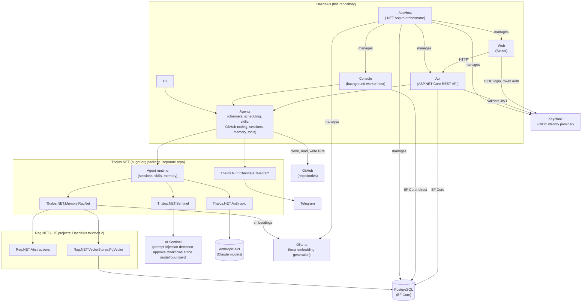

---

## 2. Solution Layout

All 11 projects under `src/`, enumerated directly rather than carried forward from any earlier diagram.
`Daedalus.Agents` is the one most likely to be missed: it holds channels (`Channels/`), scheduling
(`Scheduling/`), skills (`Skills/`), GitHub tooling (`GitHub/`), sessions (`Sessions/`), memory (`Memory/`)
and tools (`Tools/`), and every host project (`Api`, `Console`, `Cli`) depends on it directly.

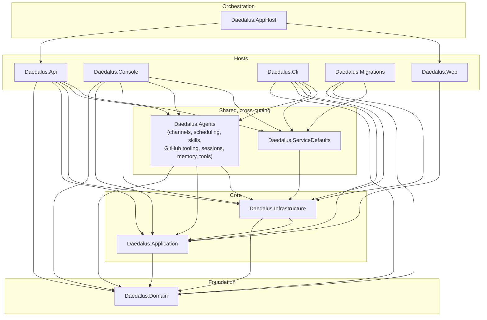

`Daedalus.Web` depends only on `Daedalus.Application` (it talks to the API over HTTP, not to the database
directly). `Daedalus.AppHost` is the .NET Aspire orchestrator: it launches `Api`, `Web`, `Console` and
`Migrations` as managed processes (via `AddProject`, not a compile-time `ProjectReference`), alongside the
PostgreSQL, Keycloak and Ollama containers — that relationship is orchestration, shown here for
completeness, not a project dependency.

---

## 3. Domain Model (Entity Relationship)

Enumerated directly from `src/Daedalus.Domain/Entities/`, cross-checked against the EF Core configurations
in `src/Daedalus.Infrastructure/Persistence/Configurations/` rather than inferred from property names.
Fourteen persisted entities exist today (excluding enums, the `Entity`/`AggregateRoot` base classes, and
the `PromptSection` value object, none of which are separate tables).

**Dropped from the previous diagram:** `GitOperation`, `GitDiff` and `GitBranch`. They are not persisted
domain entities — `GitDiff` and `GitOperationContext` exist only as transient DTOs under
`Daedalus.Domain/CodeAnalysis/` with no EF mapping, and no `GitBranch` type exists anywhere in `src/`. The
old diagram's `TASK ||--o| GIT_OPERATION` relationship and `EXECUTION_SESSION ||--o{ TASK : claims` /
`PROJECT ||--o{ EXECUTION_SESSION : tracks` relationships do not exist as database foreign keys either —
see the note below the diagram.


**Only four relationships are enforced as database foreign keys** (verified against
`ApplicationDbContextModelSnapshot.cs`, all `OnDelete(DeleteBehavior.Cascade)`): `Project → Task`,
`Task → TaskExecution`, `AgentSession → AgentMessage`, and `BrainstormSession → BrainstormMessage`. Several
other Guid-typed properties look like foreign keys by name but are not configured as one anywhere — the
same trap the previous diagram fell into with `GitOperation`. Marked `"not FK-enforced"` above:
`Task.CurrentSessionId` (no relationship to `ExecutionSession`), `ScheduledRunExecution.ScheduleId` (only a
unique index on `(ScheduleId, OccurrenceAt)`, no `HasOne`/`HasForeignKey`), and `BrainstormSession.ProjectId`
(indexed, but never wired to `Project` the way `Task.ProjectId` is). `AgentMemory.AgentId` and
`ChannelConversation.SessionId`/`AgentId` are marked `"external Thalos identity"` because they hold the
`Guid` backing a Thalos.NET typed id (an agent definition or session living in Thalos's own runtime, not a
row in any table in this diagram) — there is nothing local for them to be a foreign key to.

Two projects outside `src/Daedalus.Domain/Entities/` are out of this diagram's scope by the same
enumeration rule that dropped `GitOperation`/`GitDiff`: `AnalysisIteration` and `CodeAnalysisRequest` live
under `Daedalus.Domain/CodeAnalysis/` and have their own EF configurations, but they are not part of the
`Entities/` folder this section enumerates.

---

## 4. Application Layer - Command/Query Architecture

The solution uses CQRS pattern with Railway-Oriented Programming:

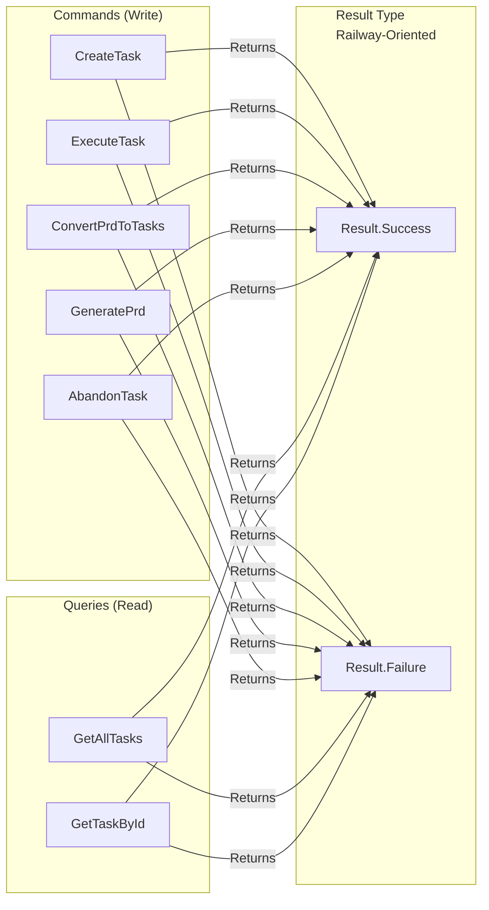

---

## 5. Git Repository Workflow - LLM-Driven Changes

Complete workflow showing how the LLM makes changes to git repositories:

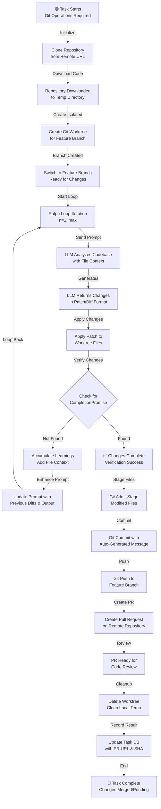

---

## 5A. Git Service Architecture

Detailed breakdown of git operations and services:

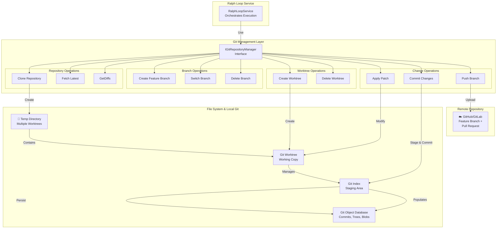

---

## 5B. Code Extraction & LLM Context

How code is extracted and provided to LLM for analysis:

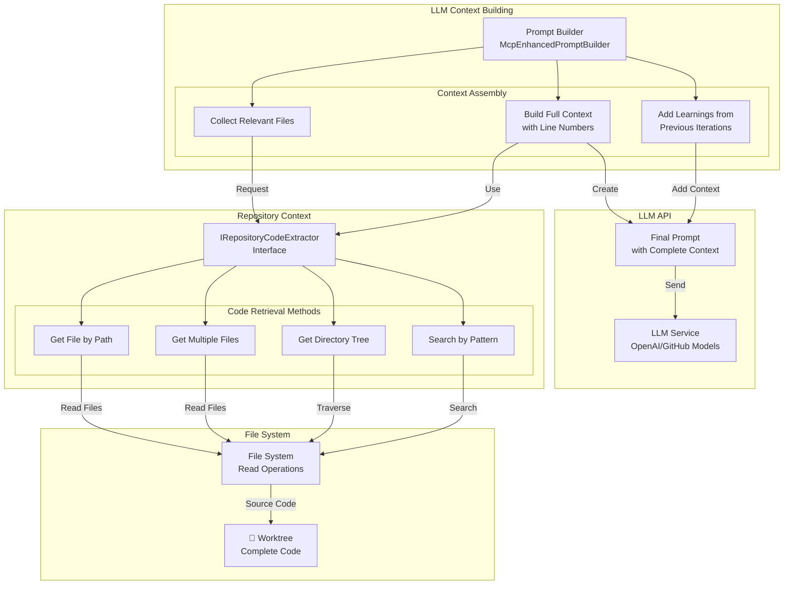

---

## 6. Ralph Loop Worker - Task Processing Pipeline

The console application implements a distributed Ralph Loop worker:

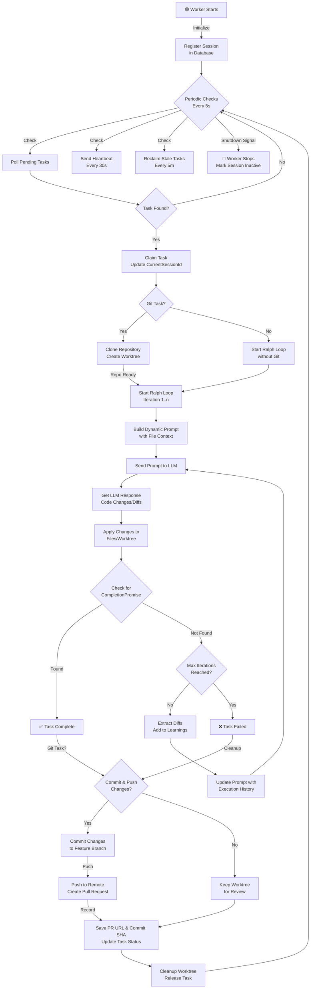

---

## 7. Project Layered Architecture

Clean architecture with clear separation of concerns:

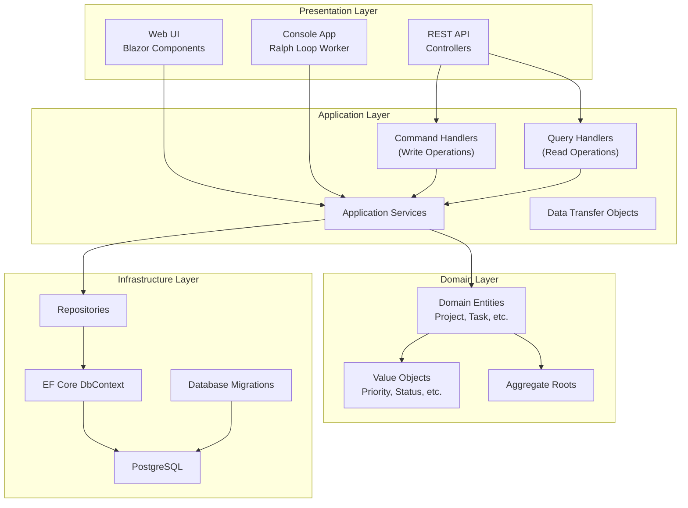

---

## 8. Complete Data Flow - Git-Based Task Execution

How data flows from creation through git operations to completion:

```mermaid
graph LR
    subgraph "Task Creation"
        A["User Creates Task<br/>Specifies Repo URL"]
        B["Task Entity<br/>Created with Git Repo"]
        C["Task Persisted<br/>Status: Pending"]
    end

    subgraph "Repository Initialization"
        D["Worker Polls<br/>Finds Task"]
        E["Clone Repository<br/>from Remote URL"]
        F["Create Feature Branch<br/>& Worktree"]
    end

    subgraph "First Iteration"
        G["Extract Code Files<br/>Build Context"]
        H["Send Full Codebase<br/>Context to LLM"]
        I["LLM Analyzes<br/>Returns Changes"]
    end

    subgraph "Change Application Loop"
        J["Apply Patch/Changes<br/>to Worktree"]
        K["Check for<br/>CompletionPromise"]
        L["Diff Generated<br/>from Changes"]
        M["Add Diff to<br/>Learnings Context"]
    end

    subgraph "Completion"
        N["✅ CompletionPromise<br/>Found"]
        O["Stage & Commit<br/>Changes in Git"]
        P["Push to Feature Branch<br/>Create PR"]
    end

    subgraph "Finalization"
        Q["Save PR URL &<br/>Commit SHA"]
        R["Mark Task Complete<br/>Set CompletedAt"]
        S["Delete Worktree<br/>Release Task"]
    end

    A --> B --> C --> D
    D --> E --> F
    F --> G --> H --> I
    I --> J --> K
    K -->|No Match| L --> M --> H
    K -->|Match| N --> O --> P
    P --> Q --> R --> S
```

---

## 8A. Data Flow - Task Execution

How data flows from creation to completion using direct database access:

```mermaid
graph LR
    subgraph "Task Creation"
        A["User/API<br/>Creates Task"]
        B["Task Entity<br/>Created"]
        C["Task Persisted<br/>Status: Pending"]
    end

    subgraph "Task Claiming (Direct DB Access)"
        D["Ralph Loop Worker<br/>Polls DB"]
        E["Worker Claims Task<br/>Sets CurrentSessionId"]
        F["Task Status Updates<br/>In Progress"]
    end

    subgraph "Task Execution"
        G["Send Prompt to<br/>GitHub Copilot LLM"]
        H["LLM Processes<br/>Analyzes Code"]
        I["LLM Returns<br/>Response"]
        J["Check for<br/>CompletionPromise"]
    end

    subgraph "Learning Loop"
        K["Aggregate Learnings<br/>from Previous Runs"]
        L["Enhance Prompt<br/>Add Context"]
        M["Increment Iteration<br/>Counter"]
    end

    subgraph "Task Completion"
        N["✅ CompletionPromise<br/>Found"]
        O["Save Final Result<br/>LLM Output"]
        P["Mark Task Complete<br/>Set CompletedAt"]
        Q["Release Task"]
    end

    A --> B --> C --> D
    D --> E --> F --> G
    G --> H --> I --> J
    J -->|No Match| K --> L --> M --> G
    J -->|Match Found| N --> O --> P --> Q
```

---

## 9. Multi-Instance Worker Coordination

How multiple workers coordinate on the same task queue:

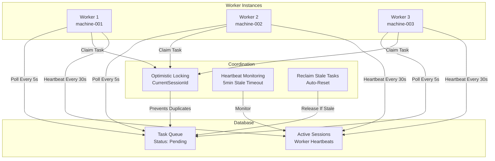

---

## 10. Dependency Injection & Service Resolution

How services are wired together:

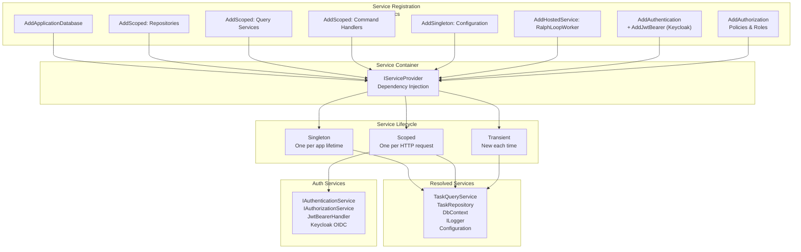

---

## 11. API Controllers & Endpoints

REST API surface and routing:

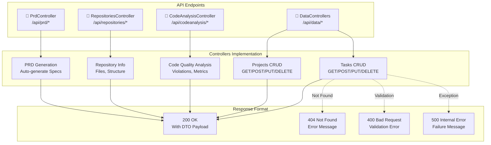

---

## 12. Technology Stack & Integration Points

Complete tech stack overview:

```mermaid
graph TB
    subgraph "Frontend"
        BLAZOR["Blazor WebAssembly<br/>Interactive UI"]
        JS["JavaScript<br/>Browser Runtime"]
    end

    subgraph "Backend Services"
        API["ASP.NET Core 10<br/>REST API"]
        WORKER["Console App<br/>Background Worker"]
        ASPIRE["🚀 .NET Aspire<br/>Orchestration"]
    end

    subgraph "Identity & Security"
        KEYCLOAK["🔐 Keycloak 26<br/>OIDC Identity Provider"]
        JWT["JWT Bearer<br/>Token Validation"]
        OIDC["OpenID Connect<br/>Authorization Code Flow"]
    end

    subgraph "Language & Framework"
        CSharp["C# 13.0<br/>Latest Language Features"]
        DotNET["🟦 .NET 10<br/>High Performance"]
    end

    subgraph "Patterns & Libraries"
        ROP["Railway-Oriented<br/>Programming"]
        CFE["CSharpFunctional<br/>Extensions"]
        ZLINQ["ZLinq<br/>Zero-Allocation LINQ"]
    end

    subgraph "Data & Persistence"
        EFC["Entity Framework<br/>Core 10"]
        NPGSQL["Npgsql<br/>PostgreSQL Driver"]
        POSTGRES["🐘 PostgreSQL 16<br/>Relational Database"]
    end

    subgraph "Git & File Operations"
        GRM["GitRepositoryManager<br/>Clone, Branch, Commit"]
        RCE["RepositoryCodeExtractor<br/>File Reading"]
        FS["System.IO<br/>File System Operations"]
        GIT["🔀 Git CLI/API<br/>Version Control"]
    end

    subgraph "Testing"
        XUNIT["xUnit<br/>Unit Testing"]
        CONTAINERS["TestContainers<br/>Integration Tests"]
        PLAYWRIGHT["Playwright<br/>E2E Testing"]
    end

    subgraph "Code Quality"
        SONAR["SonarAnalyzer<br/>Code Quality"]
        MEZIANTOU["Meziantou.Analyzer<br/>Performance Analysis"]
        NETANALYZERS["NetAnalyzers<br/>Best Practices"]
    end

    subgraph "Observability"
        OTEL["OpenTelemetry<br/>Distributed Tracing"]
        LOGGING["ILogger<br/>Structured Logging"]
    end

    BLAZOR --> API
    BLAZOR -->|OIDC Login| KEYCLOAK
    API --> ROP
    API -->|Validate Tokens| JWT
    WORKER --> ROP
    WORKER --> EFC
    WORKER -->|Service Account| KEYCLOAK
    API --> EFC

    KEYCLOAK --> OIDC
    KEYCLOAK --> JWT
    KEYCLOAK --> POSTGRES

    ROP --> CFE
    API --> ZLINQ

    EFC --> NPGSQL
    NPGSQL --> POSTGRES

    ASPIRE -->|Coordinates| API
    ASPIRE -->|Coordinates| WORKER
    ASPIRE -->|Coordinates| POSTGRES
    ASPIRE -->|Coordinates| KEYCLOAK

    WORKER -->|Clone/Commit/Push| GRM
    GRM -->|Manage| RCE
    RCE -->|Read Files| FS
    FS -->|Execute| GIT

    CSharp --> DotNET
    CFE --> DotNET

    API --> XUNIT
    WORKER --> CONTAINERS
    BLAZOR --> PLAYWRIGHT

    API --> SONAR
    API --> MEZIANTOU
    API --> NETANALYZERS

    API --> OTEL
    API --> LOGGING
    WORKER --> LOGGING
    GRM --> LOGGING
```

---

## 13. Request-Response Lifecycle

Complete request flow from client to database and back:

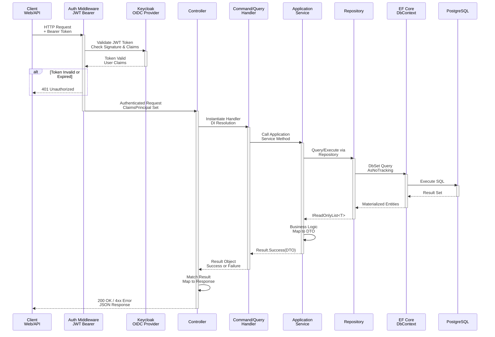

---

## 14. Performance Optimization Strategy

Key performance optimizations across the stack:

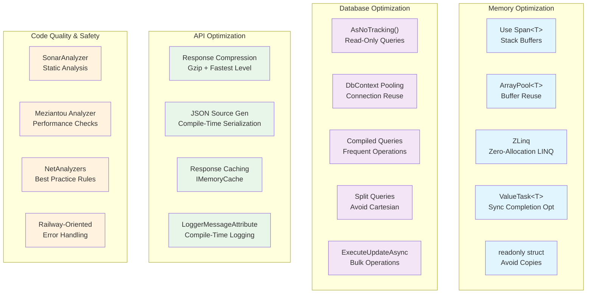

---

## 15. Agent turn (Thalos)

Phase 1.1 adds a second, general-purpose agent stack next to the Ralph Loop: **Thalos.NET** (Microsoft Agent Framework
1.17 underneath, AI.Sentinel at the model boundary, MCP + local tools with authorization at the function boundary). The
Blazor page `/agent` talks to `Daedalus.Api` over REST, and one turn is streamed back as Server-Sent Events. Sessions and
transcripts live in PostgreSQL via `PostgresAgentSessionStore` (`Daedalus.Agents`).

Phase 1.2 adds **memory** to the turn: before the model is called, Thalos' memory context provider recalls the memories
visible to the caller and injects them into the prompt; `memory__*` tools let the agent remember/recall/forget
explicitly. Records live in `AgentMemories` (`PostgresMemoryStore`), embeddings in the Rag.NET index (`rag_chunks`, same
database) — a rebuildable cache, so an unavailable index degrades to `index_pending` rows instead of a failed turn.

Phase 1.3 adds **skills** to the turn: a catalogue of the procedure documents the agent may use (names + one-line
descriptions, filtered by the agent's globs) is appended to its instructions before the model call, and `skills__load`
pulls a body in on demand. Documents live in `Skills` (`PostgresSkillStore`), synced one-way from the repo's `skills/`
folder at host start. The skill index is **in-process** — no pgvector and no `rag_chunks` involvement — so a corpus that
outgrows it swaps `ISkillIndex` for a pgvector implementation with no change above it (design §10).

```mermaid
sequenceDiagram
    autonumber
    participant Web as Daedalus.Web<br/>(Agent.razor + AgentApiClient)
    participant Api as Daedalus.Api<br/>AgentSessionsController<br/>AgentMemoriesController
    participant RT as Thalos IAgentRuntime<br/>(ThalosAgentRuntime)
    participant Store as PostgresAgentSessionStore<br/>(Daedalus.Agents → EF Core)
    participant Mem as MemoryContextProvider<br/>→ IMemoryService
    participant Skl as SkillContextProvider<br/>→ SkillCatalogue (per-glob-set cache)
    participant SklStore as PostgresSkillStore<br/>(Skills) + in-process SkillIndex
    participant MemStore as PostgresMemoryStore<br/>(AgentMemories) + Rag.NET index<br/>(rag_chunks, nomic-embed-text 768)
    participant Agent as MAF ChatClientAgent
    participant Sentinel as AI.Sentinel<br/>(SentinelChatClient decorator)
    participant Claude as Anthropic API<br/>(Thalos.NET.Anthropic)
    participant Tools as Tools<br/>(MCP roslyn/context7, local daedalus__*, memory__*, skills__*)

    Web->>Api: POST /api/agents/sessions/{id}/turns/stream<br/>Authorization: Bearer (policy AgentUse)
    Api->>Api: 200 text/event-stream, DisableBuffering,<br/>": connected" flushed before the first token
    Api->>RT: RunTurnStreamingAsync(AgentTurnRequest{session, text, caller})
    RT->>Store: Load session (owner/admin check, else SessionNotFound)<br/>Idle → Running
    Store-->>RT: session + transcript
    RT->>Mem: Recall for this turn<br/>(scope: caller + this agent's pinned + shared owner "daedalus")
    Mem->>MemStore: embed(prompt) → vector search in rag_chunks<br/>→ hydrate records from AgentMemories
    alt Recall succeeded (0..TopK hits above MinScore)
        MemStore-->>Mem: RecalledMemory[] (TopK, MaxChars budget)
        Mem->>Mem: Untrusted-content scan;<br/>quarantined memories dropped from the block
        Mem-->>RT: memory block prepended to the prompt
        RT-->>Api: memory-recalled (ids, chars)<br/>[memory-quarantined per dropped memory]
        Api-->>Web: event: memory-recalled / memory-quarantined
    else Index unavailable or failed
        MemStore-->>Mem: MemoryIndexUnavailable / MemoryIndexFailed
        RT-->>Api: memory-recall-failed (code)
        Api-->>Web: event: memory-recall-failed<br/>(turn continues without memories)
    end
    RT->>Skl: Catalogue for this agent's Skills globs
    alt Catalogue rendered (cache hit or first render)
        Skl-->>RT: <skills note="…"> block appended to the instructions<br/>(budgeted by Catalogue:MaxChars,<br/>overflow ends "… and N more")
    else Store unreachable
        Skl-->>RT: SkillCatalogueFailedEvent (code)
        RT-->>Api: skill-catalogue-failed (kind only)
        Api-->>Web: event: skill-catalogue-failed<br/>(turn continues without a catalogue)
    end
    RT->>Agent: Build from AgentDefinition<br/>(instructions, model, tool glob, history,<br/>recalled memories, skill catalogue)
    loop Model ↔ tools until the final answer
        Agent->>Sentinel: chat request (streaming)
        Sentinel->>Sentinel: input detectors (lexical; semantic when an<br/>embedding generator is configured)
        alt Critical finding → Quarantine
            Sentinel-->>RT: SentinelException → AgentError Quarantined
            RT->>Store: Running → Idle
            RT-->>Api: error (Quarantined)
            Api-->>Web: event: error
        else Clean / Log / Alert
            Sentinel->>Claude: messages + tool schemas
            Claude-->>Sentinel: text deltas / tool_use blocks
            Sentinel->>Sentinel: output detectors
            Sentinel-->>Agent: updates
            Agent-->>RT: text-delta
            RT-->>Api: text-delta
            Api-->>Web: event: text-delta (flushed immediately)
            opt Model calls a tool
                Agent->>Tools: AuthorizingAIFunction: policy check at the function boundary<br/>(roslyn__apply_* → developer/admin role)
                alt Denied
                    Tools-->>Agent: "Tool call denied: …" as tool result<br/>(ToolCallDeniedNotification published)
                else Allowed
                    Tools->>Tools: MCP call (stdio/http) or local method
                    Tools-->>Agent: tool result
                end
                RT-->>Api: tool-call / tool-result
                Api-->>Web: event: tool-call / tool-result
                opt memory__remember / memory__forget
                    Tools->>Mem: IMemoryService.RememberAsync (dedupe check)
                    Mem->>MemStore: insert AgentMemories row + upsert rag_chunks
                    alt Indexed
                        RT-->>Api: memory-stored (id, kind, deduped)
                    else No embedding generator / index down
                        RT-->>Api: memory-stored + memory-index-pending (id)<br/>ReindexPendingMemoriesHostedService retries later
                    end
                    Api-->>Web: event: memory-stored / memory-index-pending
                end
                opt skills__load / skills__search
                    Tools->>SklStore: GetAsync(name) within the agent's globs<br/>(search: in-process cosine over the same generator)
                    SklStore-->>Tools: body wrapped in <skill name="…">…</skill><br/>with </skill and </memories neutralised, name echoed sanitised
                    note over Tools: Out-of-glob, unknown and inactive all answer<br/>the same "Unknown skill" text - no probing
                end
            end
        end
    end
    RT->>Store: Append user + assistant turn, usage,<br/>Running → Idle
    RT-->>Api: usage, done
    Api-->>Web: event: usage, event: done
    Web->>Web: Render bubbles, tool cards, usage;<br/>re-enable composer
    Web->>Api: GET /api/agent-memories/{id}<br/>(AgentMemoriesController: hydrate the recalled ids<br/>for the Memories panel)
    Api-->>Web: MemoryDto per visible id
```

Notes:

- The controller flushes every SSE frame as soon as the runtime yields it (`text-delta`, `tool-call`, `tool-result`,
  `usage`, `done`, `error`, `memory-recalled`, `memory-stored`, `memory-recall-failed`, `memory-index-pending`,
  `memory-quarantined`, `skill-catalogue-failed`); the stream always ends with `done` or `error`.
- **Memory is best-effort within the turn:** a failed or unavailable index yields `memory-recall-failed` and the turn
  runs without memories; a write that could not be embedded yields `memory-index-pending` and is repaired in the
  background by `ReindexPendingMemoriesHostedService` (API host only). `AgentMemories` is the source of truth,
  `rag_chunks` is a rebuildable cache — but the sweeper runs with `PendingOnly = true`, so a full rebuild means dropping
  `rag_chunks` **and** setting `IndexPending` on the rows (see the README's operational notes).
- The `memory-recalled` event carries **ids only**, so the Blazor Memories panel hydrates them through
  `GET /api/agent-memories/{id}`, which applies the same visibility rule as the tools (`MemoryScope.Includes`).
- Tool authorization runs at the **function boundary** (`Thalos` `AuthorizingAIFunction` + `[Policy]` types such as
  `DeveloperPolicy`), so an unauthorized tool call is reported back to the model instead of failing the turn; the denial
  is also published as a `ToolCallDeniedNotification` (audit).
- AI.Sentinel is an `IChatClient` decorator: a `Quarantine` verdict surfaces as `AgentErrorCode.Quarantined` (HTTP 422 on
  the buffered endpoint, `event: error` on the stream). Its semantic detectors need the Ollama embedding generator; without
  it only lexical/operational detectors run.
- **Skills are best-effort within the turn too, but trusted differently.** An unreachable store yields
  `skill-catalogue-failed` (streamed by kind only — skills have no UI) and the turn proceeds without a catalogue. Unlike
  recalled memories, skill bodies are **not** scanned as untrusted content: they come from git, so merging a `SKILL.md`
  is the trust boundary, the same as merging code. The catalogue itself is cached per glob-set, so a turn costs a
  dictionary lookup rather than a query.
- **Skill sync happens once, at host start**, beside the Rag.NET schema initializer:
  `SkillSyncService.StartingAsync` → enumerate the configured roots → parse and validate each `SKILL.md` (a malformed
  file is logged at warning and **skipped**, never fatal) → compare content hashes and skip unchanged files → upsert the
  changed ones → `DeactivateMissingAsync` for names whose files are gone. A configured root that does not exist fails
  registration before this ever runs. Note the asymmetry with memory: a bad *file* is survivable, an unreachable *store*
  is not.
- On host start `AgentSessionCrashRecovery` resets any session left in `Running` by a crashed process back to `Idle`.

### Strangler layout: Ralph and Thalos side by side

Until phase 1.6 both stacks are wired in the API and share Infrastructure (DbContext) — and, since phase 1.2, the agent
memory: Ralph's learnings are written and recalled through the Application port `ILearningsMemory` (shared owner
`daedalus`), so `StructuredLearnings` and the hand-rolled embedding service are gone. The Ralph worker runs in
`Daedalus.Console`, which registers `AddDaedalusMemory` (memory only, no agents, no skills, creates no Rag.NET
schema — it runs no Thalos agents, so there is no catalogue to build):

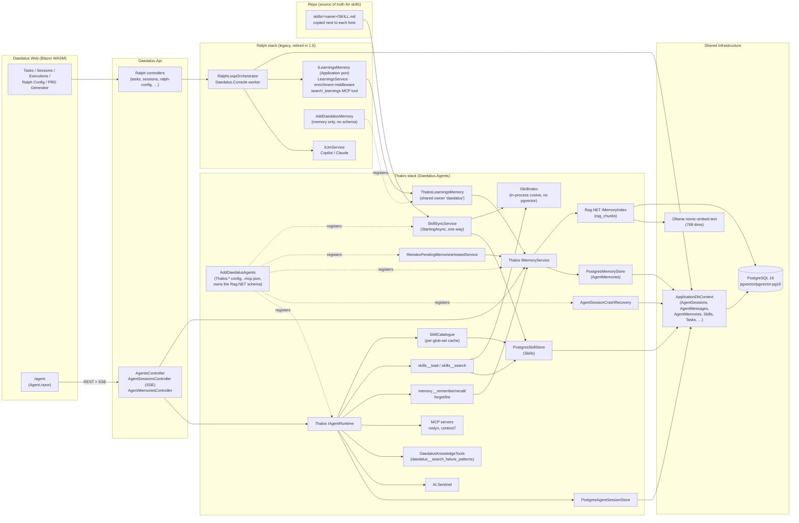

---

## Key Architectural Principles

### 🏗️ **Layered Architecture**

- **Presentation Layer**: Controllers, APIs, UI components
- **Application Layer**: Commands, Queries, DTOs, Services (CQRS pattern)
- **Domain Layer**: Entities, Value Objects, Business Logic
- **Infrastructure Layer**: EF Core, Repositories, Persistence

### 🚀 **Performance First**

- Zero-allocation LINQ (ZLinq) for hot paths
- Memory pooling for temporary buffers
- Compiled queries for frequent operations
- Response compression with Gzip

### 🛣️ **Railway-Oriented Programming**

- `Result<T>` type for expected failures
- Functional composition with `Bind()` and `Map()`
- No exception throwing for flow control
- Clear success/failure paths

### 🔄 **Distributed Task Processing**

- Ralph Loop worker pattern for iterative LLM execution
- Optimistic locking with `CurrentSessionId` for task claiming
- Heartbeat monitoring for worker health
- Automatic stale task reclamation

### 📊 **Automatic Code Generation & Git Integration** ✨

- **Git Repository Manager** (`IGitRepositoryManager`):
    - Clone repositories from remote URLs with authentication support
    - Create isolated feature branches per task for safe operations
    - Automatic git worktree management for parallel execution
    - Atomic commit/push operations with PR creation
    - Full diff tracking for learning accumulation
- **Code Context Extraction** (`IRepositoryCodeExtractor`):
    - Extract complete file contents with line numbers for LLM analysis
    - Build rich semantic context from repository structure
    - Support for pattern-based file searches
    - Accumulate learnings from previous iterations in prompt
    - Directory tree extraction for navigation context
- **Fully Automated Workflow**:
    - LLM makes code changes directly to isolated worktrees
    - Diffs are automatically captured and included in learnings
    - Changes are automatically staged, committed, and pushed
    - Pull requests created with auto-generated descriptive messages
    - Cleanup and validation ensure zero orphaned resources

### 📊 **Data-Driven Development**

- Railway-Oriented patterns eliminate null checks
- Primary constructors reduce boilerplate
- Strong typing via Value Objects (Priority, Status, Complexity)
- Immutable entities with `readonly struct`

### ✅ **Quality Assurance**

- Static analysis: SonarAnalyzer, Meziantou, NetAnalyzers
- Comprehensive test coverage (Unit, Integration, E2E)
- Compile-time logging with `[LoggerMessage]`
- Structured logging throughout application

---

## Git Integration Service APIs

### IGitRepositoryManager Interface

Core abstraction for all git operations:

```csharp
// Repository Initialization
Task<Result<GitOperationContext>> CloneRepositoryAsync(
    string repoUrl,
    string? branch = null,
    string? targetPath = null,
    CancellationToken ct = default);

// Branch Management
Task<Result<string>> CreateFeatureBranchAsync(
    string workTreePath,
    string branchName,
    string? fromBranch = null,
    CancellationToken ct = default);

// Worktree Operations (for parallel execution)
Task<Result<string>> CreateWorktreeAsync(
    string baseRepoPath,
    string worktreeName,
    string branchName,
    CancellationToken ct = default);

Task<Result> DeleteWorktreeAsync(
    string worktreePath,
    CancellationToken ct = default);

// Change Tracking
Task<Result<IReadOnlyList<GitDiff>>> GetDiffsAsync(
    string workTreePath,
    string baseBranch,
    CancellationToken ct = default);

Task<Result> ApplyPatchAsync(
    string workTreePath,
    string patchContent,
    CancellationToken ct = default);

// Commit & Push
Task<Result> CommitChangesAsync(
    string workTreePath,
    string message,
    string? author = null,
    CancellationToken ct = default);

Task<Result> PushBranchAsync(
    string workTreePath,
    string branchName,
    bool force = false,
    CancellationToken ct = default);
```

### IRepositoryCodeExtractor Interface

Code analysis and context building:

```csharp
// Single file operations
Task<Result<string>> GetFileContentsAsync(
    string repositoryPath,
    string filePath,
    CancellationToken ct = default);

// Batch file operations
Task<Result<IReadOnlyDictionary<string, string>>> GetFilesAsync(
    string repositoryPath,
    IEnumerable<string> filePaths,
    CancellationToken ct = default);

// Directory navigation
Task<Result<RepositoryStructure>> GetDirectoryStructureAsync(
    string repositoryPath,
    string? directoryPath = null,
    CancellationToken ct = default);

// Pattern-based search
Task<Result<IReadOnlyList<string>>> SearchFilesAsync(
    string repositoryPath,
    string pattern,
    CancellationToken ct = default);
```

---

## Git Integration Workflow Summary

| Phase            | Operation                           | Outcome                          |
| ---------------- | ----------------------------------- | -------------------------------- |
| **Setup**        | Clone repository → Create worktree  | Isolated working directory ready |
| **Analysis**     | Extract code → Build context        | Full codebase sent to LLM        |
| **Iteration**    | Apply changes → Generate diffs      | Changes tracked for learnings    |
| **Verification** | Check completion promise            | Success/failure decision         |
| **Completion**   | Commit → Push → Create PR           | Changes available for review     |
| **Cleanup**      | Delete worktree → Release resources | Temp files cleaned up            |

This architecture enables **fully autonomous code generation** where the LLM iteratively refines code changes until completion criteria are met, with all changes tracked in git and presented as pull requests for human review.

- Heartbeat monitoring for worker health
- Automatic stale task reclamation

### 📊 **Data-Driven Development**

- Railway-Oriented patterns eliminate null checks
- Primary constructors reduce boilerplate
- Strong typing via Value Objects (Priority, Status, Complexity)
- Immutable entities with `readonly struct`

### ✅ **Quality Assurance**

- Static analysis: SonarAnalyzer, Meziantou, NetAnalyzers
- Comprehensive test coverage (Unit, Integration, E2E)
- Compile-time logging with `[LoggerMessage]`
- Structured logging throughout application
