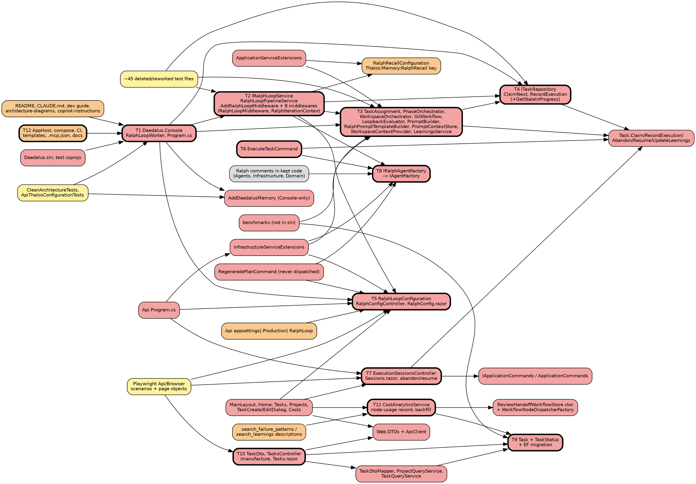

# Impact Analysis: Phase 2.8, Ralph retirement

Input: `docs/superpowers/specs/2026-10-09-phase-2.8-ralph-retirement-design.md` (D1–D6). Targets T1–T12 were confirmed
by the owner in Phase 1. Paths are repo-relative. Line numbers are from `docs/phase-2.8-design` at `5834770`.

## Summary

| Metric | Value |
|---|---|
| Date | 2026-10-09 |
| Refactor Type | Architectural: delete a host and its pipeline, change the Task interface, rename one port |
| Targets | 12 (T1–T12) |
| Directly Affected Files | 234 |
| Transitively Affected Files | 58 |
| Total Affected Files | 292 (Breaking 153, Update Required 28, Test Impact 87, Cosmetic 24) |
| Breaking Changes | 153 files; 91 of them are deletions |
| Risks Identified | 17 (5 High, 8 Medium, 4 Low) |
| Risk Level | **High**: 5 high-severity risks and more than 50 affected files |

Counts are per file. A row covering a set, such as the 8 middlewares, counts each file. The four test files that only
quote `ClaimNextAsync` in a work-intent string are not counted: they need no change.

## Dependency Graph

Edges point from a dependent to what it depends on. Red is Breaking, orange Update Required, yellow Test Impact and
gray Cosmetic. A bold border marks a target.

## Affected Files

Classification: **Breaking** fails to build or run without the change, deletions included. **Update Required**
builds but is wrong. **Test Impact** is a test file. **Cosmetic** is optional. Complexity is T (trivial), M (moderate)
or C (complex).

### Breaking

| # | File | Change Required | Caused By | Cx |
|---|---|---|---|---|
| 1 | `src/Daedalus.Console/**`: `Program.cs`, `RalphLoopWorker.cs`, `Daedalus.Console.csproj`, `appsettings.json`, `appsettings.Development.json`, `Dockerfile`, `README.md`, `.gitignore` (8 files) | Delete the project | T1 | T |
| 2 | `Daedalus.sln:10,73-84` | Remove the `Daedalus.Console` project and its configuration lines | T1 | T |
| 3 | `Dockerfile` (repo root) | Delete. It builds only `Daedalus.Console` and nothing references it. Not in the spec | T1 | T |
| 4 | `tests/Daedalus.Tests.Unit/Daedalus.Tests.Unit.csproj:62,76` | Drop the Console `ProjectReference` and the linked `Daedalus.Console.appsettings.json` | T1 | T |
| 5 | `tests/Daedalus.Tests.Integration/Daedalus.Tests.Integration.csproj:64,72` | Drop the Console `ProjectReference` and fix the comment | T1 | T |
| 6 | `src/Daedalus.AppHost/Program.cs:41,91-102` | Remove `consolePath` and the `console` resource | T1 | T |
| 7 | `src/Daedalus.Application/Services/IRalphLoopService.cs`, `RalphLoopPipelineService.cs` | Delete | T2 | T |
| 8 | `src/Daedalus.Application/Extensions/RalphLoopMiddlewareExtensions.cs` | Delete. It also binds `RalphRecallConfiguration` with `TryAddSingleton`; `AddDaedalusAgents` already binds it at `DaedalusAgentsServiceCollectionExtensions.cs:232`, so nothing is lost | T2 | T |
| 9 | `src/Daedalus.Application/Abstractions/IRalphLoopMiddleware.cs`, `RalphIterationContext.cs` | Delete | T2 | T |
| 10 | `src/Daedalus.Application/Services/Middleware/*.cs` (8 files) | Delete | T2 | T |
| 11 | `src/Daedalus.Application/Services/ITaskAssignmentService.cs`, `TaskAssignmentService.cs` | Delete | T3 | T |
| 12 | `src/Daedalus.Application/Services/IPhaseOrchestrator.cs`, `PhaseOrchestrator.cs` | Delete | T3 | T |
| 13 | `src/Daedalus.Application/Services/IWorkspaceOrchestrator.cs`, `src/Daedalus.Infrastructure/Services/WorkspaceOrchestrator.cs` | Delete, including `WorkspaceInfo` | T3 | T |
| 14 | `src/Daedalus.Application/Abstractions/IGitWorkflowService.cs`, `src/Daedalus.Infrastructure/Services/GitWorkflowService.cs`, `Services/NoOp/NoOpGitWorkflowService.cs` | Delete. The NoOp class has no registration | T3 | T |
| 15 | `src/Daedalus.Application/Abstractions/ILoopbackEvaluator.cs`, `src/Daedalus.Infrastructure/Services/LoopbackEvaluator.cs`, `Services/NoOp/NoOpLoopbackEvaluator.cs` | Delete | T3 | T |
| 16 | `src/Daedalus.Application/Abstractions/IPromptBuilder.cs`, `src/Daedalus.Application/Services/DefaultPromptBuilder.cs` | Delete | T3 | T |
| 17 | `src/Daedalus.Application/Abstractions/IRalphPromptTemplateBuilder.cs`, `RalphPromptTemplateOptions.cs`, `src/Daedalus.Application/Services/RalphPromptTemplateBuilder.cs` | Delete | T3 | T |
| 18 | `src/Daedalus.Application/Abstractions/IPromptContextStore.cs`, `PromptContext.cs`, `PromptHistoryEntry.cs`, `src/Daedalus.Infrastructure/Persistence/DatabasePromptContextStore.cs` | Delete. `PromptContext` and `PromptHistoryEntry` have no other user | T3 | T |
| 19 | `src/Daedalus.Application/Abstractions/IWorkspaceContextProvider.cs`, `src/Daedalus.Infrastructure/Services/FileSystemWorkspaceContextProvider.cs` | Delete | T3 | T |
| 20 | `src/Daedalus.Application/Abstractions/ILearningsService.cs`, `src/Daedalus.Application/Services/LearningsService.cs` | Delete. Ralph is its only user, confirmed below | T3 | T |
| 21 | `src/Daedalus.Application/Abstractions/ILlmResponseParser.cs`, `Services/LlmResponseParser.cs` | Delete. The only consumer is `InlineLearningsExtractionMiddleware`. Not in the spec | T2 transitive | T |
| 22 | `src/Daedalus.Application/Abstractions/IKnowledgeBaseToolStatus.cs`, `src/Daedalus.Infrastructure/Services/KnowledgeBaseToolStatus.cs` | Delete. The only consumer is `LearningsEnrichmentMiddleware`. Not in the spec | T2 transitive | T |
| 23 | `src/Daedalus.Domain/Entities/PromptSection.cs`, `PromptSectionCategory.cs` | Delete. Not EF entities; only the template builder and a benchmark use them | T3 transitive | T |
| 24 | `src/Daedalus.Application/Services/Prompts/PlanRegenerationPromptBuilder.cs` | Delete. It has no user today | D6 | T |
| 25 | `src/Daedalus.Application/Services/McpConfigurationParser.cs` | Delete. It has no user and carries the `RalphLoop:MCP` fallback string | D6 | T |
| 26 | `src/Daedalus.Application/Extensions/ApplicationServiceExtensions.cs:24,40-52,78-92` | Remove the `ILearningsService`, `ILlmResponseParser` and `IPhaseOrchestrator` registrations, the prompt registrations in `AddPromptBuilding` and the `RalphLoopConfiguration` comment. `AddPromptBuilding` is then left registering only `IAgentExecutor`, which nothing resolves. Delete it with `AgentExecutor`, `IAgentSelector` and `AgentMetadata`, which have no consumer either | T2, T3 | M |
| 27 | `src/Daedalus.Infrastructure/Extensions/InfrastructureServiceExtensions.cs:56-59,69-78,86-87,91-109,113` | Remove the unused `ralphLoopConfig` binding and the `IWorkspaceContextProvider`, `IGitWorkflowService`, `ILoopbackEvaluator`, `IWorkspaceOrchestrator`, `IPromptContextStore` and `IKnowledgeBaseToolStatus` registrations. Rename `IRalphAgentFactory`. Fix the `Daedalus-RalphLoop` User-Agent string at :151 | T3, T8 | M |
| 28 | `src/Daedalus.Application/Abstractions/ITaskRepository.cs:36,48,51` + `src/Daedalus.Infrastructure/Persistence/TaskRepository.cs:113-160,220-245,248` | Remove `ClaimNextAsync`, `RecordExecutionAsync` and `GetStaleInProgressAsync`. The last one's only caller is `TaskAssignmentService`; it is not in the spec. Remove `GetPendingAsync` and `GetPendingCountAsync` too if row 33 deletes the queries | T4 | M |
| 29 | `src/Daedalus.Application/Configuration/RalphLoopConfiguration.cs` | Delete | T5 | T |
| 30 | `src/Daedalus.Api/Controllers/RalphConfigController.cs`, `src/Daedalus.Application/DTOs/RalphConfigDto.cs`, `RalphPromptConfigDto.cs` | Delete | T5 | T |
| 31 | `src/Daedalus.Application/Commands/RegeneratePlan/RegeneratePlanCommand.cs`, `RegeneratePlanCommandHandler.cs` | Delete. **It is a non-Console user of `RalphLoopConfiguration`**, through `IOptions` and `WorkspacePath`, and of `IRalphAgentFactory`. Nothing dispatches it: it is not on `IApplicationCommands`. It writes Ralph's `fix_plan.md`. It must go, or `RalphLoopConfiguration` cannot be deleted. Not in the spec | T5 | T |
| 32 | `src/Daedalus.Application/Commands/ExecuteTask/ExecuteTaskCommand.cs`, `ExecuteTaskCommandHandler.cs` | Delete | T6 | T |
| 33 | `src/Daedalus.Application/Queries/GetAllTasks/*`, `Queries/GetTaskById/*` (4 files) | Nothing dispatches these; `TasksController` uses `ITaskQueryService`. Delete them, or derive status in them too. **Needs a decision.** Deletion is recommended, since a second TaskDto path left alone shows a stale status | T10 | T |
| 34 | `src/Daedalus.Api/Controllers/ExecutionSessionsController.cs`, `src/Daedalus.Api/Services/IExecutionSessionQueryService.cs`, `ExecutionSessionQueryService.cs`, `src/Daedalus.Application/DTOs/ExecutionSessionDto.cs` | Delete | T7 | T |
| 35 | `src/Daedalus.Application/Abstractions/IExecutionSessionRepository.cs`, `src/Daedalus.Infrastructure/Persistence/ExecutionSessionRepository.cs` | Delete. After the Console goes, only Ralph tests use them. The `ExecutionSessions` table and entity stay as history | T1 transitive | T |
| 36 | `src/Daedalus.Application/Commands/AbandonTask/*`, `Commands/ResumeTask/*` (4 files), `src/Daedalus.Application/DTOs/AbandonTaskDto.cs`, `ResumeTaskDto.cs` | Delete | T7 | T |
| 37 | `src/Daedalus.Application/Abstractions/IApplicationCommands.cs:35-37`, `src/Daedalus.Application/Services/ApplicationCommands.cs:42-45` | Remove `AbandonTaskAsync` and `ResumeTaskAsync`. This is an atomic change with row 36 | T7 | T |
| 38 | `src/Daedalus.Api/Controllers/TasksController.cs` | Remove `abandon`/`resume` (:159-203). Add `POST {id}/manufacture` with 404, 422, 422, 409 and 201. Inject `WorkflowRunGateway` and `IManufactureRunStarter` via `[FromServices]` on the action, not the constructor (see R2). Mark the action with `WorkflowEngineEnabled`. Drop `CompletionPromise` and `MaxIterations` from the create/update mapping | T7, T10 | C |
| 39 | `src/Daedalus.Api/Program.cs:42-44,56,92,95,101` | Remove the `RalphLoopConfiguration` binding and the `IExecutionSessionRepository` and `IExecutionSessionQueryService` registrations. Fix the "IRalphAgentFactory" and "Ralph Loop orchestration" comments. Register the task run-status reader if one is introduced (see Answers 5) | T5, T7, T8 | M |
| 40 | `src/Daedalus.Api/ApiJsonSerializerContext.cs:4,25,29` | Remove the `ExecutionSessionDto` entries | T7 | T |
| 41 | `src/Daedalus.Application/Abstractions/IRalphAgentFactory.cs` -> `IAgentFactory.cs`, `src/Daedalus.Infrastructure/Agents/RalphAgentFactory.cs` -> `AgentFactory.cs` | Rename. `InvokeSubagentAsync` and `RunParallelSubagentsAsync` have no caller anywhere; drop them with `SubagentResult` and Daedalus' own `SubagentOptions`. **Needs a decision.** Recommended | T8 | M |
| 42 | `src/Daedalus.Application/Commands/GeneratePrd/GeneratePrdCommandHandler.cs:16`, `src/Daedalus.Application/Services/Brainstorm/BrainstormService.cs:23` | Rename `IRalphAgentFactory` to `IAgentFactory`. These are the surviving non-Ralph users | T8 | T |
| 43 | `src/Daedalus.Domain/Entities/Task.cs` | Add `WorkflowRunId` and `AttachRun(Guid)`. Drop the `completionPromise`/`maxIterations` parameters and checks from `Create`, and their part of `UpdateExecutionConfig`. Delete `Claim`, `Abandon`, `Resume` and `UpdateLearnings`, whose only callers are deleted. For `RecordExecution`, the only callers left are test seeders: delete it and seed `TaskExecutions` directly. **Needs a decision**, recommended | T9 | M |
| 44 | `src/Daedalus.Domain/Entities/TaskStatus.cs` | Add `AwaitingApproval = 5` and `Cancelled = 6`, documented as computed and never stored. Rewrite the "Ralph loop task" docs | T9 | T |
| 45 | `src/Daedalus.Infrastructure/Persistence/Configurations/TaskConfiguration.cs` | Map `WorkflowRunId`: nullable uuid, optionally indexed | T9 | T |
| 46 | new `src/Daedalus.Infrastructure/Migrations/2026xxxx_AddTaskWorkflowRunId(.Designer).cs` + `ApplicationDbContextModelSnapshot.cs` | Add a nullable `Tasks.WorkflowRunId` column. Add the guarded `node-usage` backfill (see R1). The snapshot changes only on the `Task` entity; the enum values do not touch it, since `Status` is stored as an int | T9, T11 | C |
| 47 | `src/Daedalus.Application/DTOs/TaskDto.cs` | Add `Guid? WorkflowRunId`. `Status` stays an int, now derived | T10 | T |
| 48 | `src/Daedalus.Api/Services/TaskQueryService.cs`, `ITaskQueryService.cs` | Derive the status from the run (one lookup per task with a run) and map `WorkflowRunId`. The lookup must tolerate a host with workflow disabled (R2) | T10 | C |
| 49 | `src/Daedalus.Application/Mappers/TaskDtoMapper.cs` + `src/Daedalus.Infrastructure/Services/ProjectQueryService.cs:34,93` | `ProjectQueryService` emits TaskDtos with `Status` through `TaskDtoMapper`, and `Projects.razor:236` shows them. Infrastructure cannot see `WorkflowRunGateway`, which lives in Agents. Needs an Application port (R2) | T10 | C |
| 50 | `src/Daedalus.Application/DTOs/CreateTaskDto.cs`, `UpdateTaskDto.cs`, `Commands/CreateTask/CreateTaskCommand(.Handler).cs`, `Commands/UpdateTask/UpdateTaskCommand(.Handler).cs`, `Commands/ConvertPrdToTasks/ConvertPrdToTasksCommandHandler.cs:50-51,106-115` (7 files) | Remove `CompletionPromise` and `MaxIterations` from create and edit, which makes them `[Validate]` DTO changes. Both registration sites stay valid: the same 8 DTOs remain. `UpdateTaskCommandHandler:33` and `DeleteTaskCommandHandler:30` guard on the stored `Status`, which is `Pending` for a task with a live run. Guard on the run instead (R7) | T9, T10 | M |
| 51 | `src/Daedalus.Application/Commands/DeleteTask/DeleteTaskCommandHandler.cs` | Guard on the derived status (R7) | T10 | M |
| 52 | `src/Daedalus.Domain/Entities/WorkflowRunRecord.cs` | Add `NodeUsageKind = "node-usage"` (10 chars, within the varchar 32 limit) | T11 | T |
| 53 | `src/Daedalus.Agents/Workflow/ReviewHandoffWorkflowStore.cs:78,130-156` | The constructor gains `IWorkflowRunRecordStore`. Append one `node-usage` record after a successful `Inner.CompleteNodeAsync` whose `result.Usage` is set. Not on the null-run pass-through or the breach-fail paths | T11 | M |
| 54 | `src/Daedalus.Agents/Workflow/WorkflowNodeDispatcherFactory.cs:55` | Pass the record store. This is atomic with row 53 | T11 | T |
| 55 | `src/Daedalus.Application/Abstractions/ICostAnalyticsService.cs`, `src/Daedalus.Application/DTOs/CostAnalyticsDtos.cs`, `src/Daedalus.Infrastructure/Services/CostAnalyticsService.cs` | Read 3 sources and split by source, model and day; rewrite `Scope`. `by-session` and `estimate` are Ralph concepts: Ralph session ids and `maxIterations`. **Needs a decision**: delete both or relabel them as Ralph history | T11 | C |
| 56 | `src/Daedalus.Api/Controllers/CostAnalyticsController.cs` | Match the new service shape | T11 | M |
| 57 | `src/Daedalus.Web/Services/{TaskDto,CreateTaskDto,UpdateTaskDto,CostSummaryDto,ProjectCostDto,TaskCostDto,CostEstimateDto}.cs` (7 files) | Mirror the Application DTO changes. Web is not compile-linked to Application, so drift fails silently at deserialize time (R9) | T10, T11 | M |
| 58 | `src/Daedalus.Web/Services/{RalphConfigDto,RalphPromptConfigDto,ExecutionSessionDto,AbandonTaskDto,ResumeTaskDto}.cs` (5 files) | Delete | T5, T7 | T |
| 59 | `src/Daedalus.Web/Services/ApiClient.cs:64-84,221-233,245-253` | Remove the sessions, abandon/resume and ralph-config methods and, depending on row 55, by-session/estimate. Add `ManufactureTaskAsync` | T5, T7, T10, T11 | M |
| 60 | `src/Daedalus.Web/Pages/RalphConfig.razor`, `Sessions.razor` | Delete | T5, T7 | T |
| 61 | `src/Daedalus.Web/Components/MainLayout.razor:28,37` | Remove the Sessions and Ralph Config nav items | T5, T7 | T |
| 62 | `src/Daedalus.Web/Pages/Home.razor:9,35-55,86-87,102-108,116-140` | Remove the session stat cards, the "Configure Ralph Loop" button and the Ralph blurb | T5, T7 | M |
| 63 | `src/Daedalus.Web/Pages/Tasks.razor:12,92-100,179-210,246-270` | Remove abandon/resume; add the Manufacture button, the run link and labels for 5 and 6 | T7, T10 | M |
| 64 | `src/Daedalus.Web/Components/TaskCreateDialog.razor`, `TaskEditDialog.razor:178` | Remove the Ralph fields; add status labels for 5 and 6 | T10 | M |
| 65 | `src/Daedalus.Web/Pages/Costs.razor:76-136,178-231` | Split by source, model and day. Remove the estimator if row 55 removes it | T11 | M |
| 66 | `src/Daedalus.Agents/DaedalusAgentsServiceCollectionExtensions.cs:1196-1250` | Delete `AddDaedalusMemory`. Its only production caller is the Console, so it is "Console-only" by its own doc. Keep `ThrowIfMemoryAlreadyRegistered`, which `AddDaedalusAgents` still uses. Not in the spec | T1 transitive | M |
| 67 | `.github/workflows/ci.yml:235-236,301-302` | Remove `daedalus-console` from the `docker` and `publish-release` matrices (R5) | T12 | T |
| 68 | `docker-compose.full.yml:142-160` | Remove the `console` service | T12 | T |
| 69 | `benchmarks/Daedalus.Benchmarks/PromptBuildingBenchmarks.cs` | Delete; it uses deleted types | T3 | T |
| 70 | `benchmarks/Daedalus.Benchmarks/DomainEntityBenchmarks.cs`, `DtoMappingBenchmarks.cs` | Follow the `Task.Create` signature; drop the `Claim`/`RecordExecution` benches | T9 | M |

### Update Required

| # | File | Change Required | Caused By | Cx |
|---|---|---|---|---|
| 71 | `src/Daedalus.Infrastructure/Agents/Tools/DaedalusFailurePatternsTools.cs:27` | The description says the data predates Ralph's retirement on 2026-10-09 | T11, D3 | T |
| 72 | `src/Daedalus.Infrastructure/Agents/Tools/DaedalusLearningsTools.cs:13,29` | **The same staleness the spec addresses for failure patterns.** `LearningsService` was the only writer of shared learnings, so `search_learnings` becomes frozen too. Add the same note. Not in the spec | T3 | T |
| 73 | `src/Daedalus.Application/Abstractions/ILearningsMemory.cs`, `src/Daedalus.Agents/Memory/ThalosLearningsMemory.cs`, `src/Daedalus.Application/Services/LearningMemoryMapping.cs` | `RememberAsync` and `ParsedLearning` lose their only caller. **Needs a decision**: delete the write half, recommended, or keep it. The read half stays for `search_learnings` | T3 | M |
| 74 | `src/Daedalus.Application/Configuration/RalphRecallConfiguration.cs`, `src/Daedalus.Agents/DaedalusAgentsOptions.cs:134-147`, `DaedalusAgentsServiceCollectionExtensions.cs:232,1409-1448` | **Not deletable**: `search_learnings` and `ThalosLearningsMemory` use it. D6 asks for a rename to `LearningsRecallConfiguration`. The config key `Thalos:Memory:RalphRecall` in `src/Daedalus.Api/appsettings.json:129` and `src/Daedalus.Cli/appsettings.json:48,70` would change with it (R6). **Needs a decision** | D6 | M |
| 75 | `src/Daedalus.Api/appsettings.json:58-64`, `appsettings.Production.json:13-19` | Remove the `RalphLoop` section | T5 | T |
| 76 | `src/Daedalus.Web/Pages/Executions.razor`, `Projects.razor:115,236`, `PrdGeneratorSteps/TasksCreatedStep.razor:24,43`, `RepositoryConfiguration.razor:12` | Label Executions as read-only Ralph history. Add status labels 5 and 6. Show `MaxIterations` and `IterationCount` for old tasks only. Fix the "Configure execution sessions" and "Ralph Loop analysis" copy | T7, T10 | T |
| 77 | `.github/ISSUE_TEMPLATE/bug_report.yml:56`, `feature_request.yml:39` | Remove "Console Worker (Daedalus.Console)" | T12 | T |
| 78 | `.mcp.json:14` | Remove the revoked `CONTEXT7_API_KEY`. The key stays in git history but is revoked | T12 | T |
| 79 | `ralph_wiggum.html` | Delete | T12 | T |
| 80 | `CLAUDE.md:3-7,20,29-30,35` | Rewrite the two-layer sentence, the tree line, the `ClaimNextAsync` paragraph (the method no longer exists) and the AppHost line | T12 | T |
| 81 | `README.md:10,17,52,57,65-76,99,121,229,247,250,304,316,360-380,447,495,540-546,576-588,807-812,1122,1155,1165,1207,1251` | Rewrite or remove each sentence. Add "Manufacturing a task". 1122 and 1207 name the benchmark and the `daedalus-console` image | T12 | M |
| 82 | `docs/development-guide.md:17,32,44-47,63,428,501-503` | Rewrite the Console/Ralph parts | T12 | M |
| 83 | `docs/architecture-diagrams.md`: sections 1 (:24-63), 2 (:91-158), 4 (:405-436), 5 (:498-546), 6 (:678-762), 8/8A (:816-917), 9 (:918-960), 10 (:973), 11 (:1039-1097), 15 strangler (:1508-1609) | Delete sections 5, 6, 8A and 9. Redraw 1, 2, 10, 11 and 15 without the Console and the Ralph endpoints | T12 | C |
| 84 | `.github/copilot-instructions.md` | Add one line saying Ralph is retired (2.8) | T12 | T |
| 85 | `docs/ralph-wiggum-technique.md` | Add the retired-in-2.8 header pointing to the manufacture process | T12 | T |
| 86 | `benchmarks/Daedalus.Benchmarks/README.md:119-140`, `DependencyResolutionBenchmarks.cs:8,88` | Remove or relabel the Ralph benches and comments | T3 | T |

### Test Impact

| # | File | Change Required | Caused By | Cx |
|---|---|---|---|---|
| 87 | `tests/Daedalus.Tests.Integration/Services/RalphLoopWorkerTests.cs` | Delete | T1 | T |
| 88 | `tests/Daedalus.Tests.Unit/Architecture/CleanArchitectureTests.cs:82-83,133,193,204` | Drop `ConsoleAssembly`. `DaedalusOwnTypes` keeps the Cli | T1 | T |
| 89 | `tests/Daedalus.Tests.Unit/Configuration/ApiThalosConfigurationTests.cs:23,30,36,258-301` | Retarget the shared-memory agreement test from Console to Cli, since `Daedalus.Cli.appsettings.json` carries the same keys. Delete the two `AddDaedalusMemory` tests. Retarget "registering memory twice throws" to `AddDaedalusAgents` twice | T1 | M |
| 90 | `tests/Daedalus.Tests.Unit.Infrastructure/Extensions/InfrastructureServiceCollectionResolutionTests.cs` | Rewrite or delete. It mirrors the Console's composition and resolves `IWorkspaceOrchestrator`. Keep an `IPullRequestFactory` + `IRalphLoopOrchestrator` resolution guard: CodeAnalysis still uses them | T1, T3 | M |
| 91 | `tests/Daedalus.Tests.Integration/Services/CodeAnalysis/PullRequestFactoryRegistrationTests.cs:27,56` | Drop the `IWorkspaceOrchestrator` resolution and the Console wording | T3 | T |
| 92 | `tests/Daedalus.Tests.Unit.Application/Services/{CodeChangeApplicationMiddleware,LearningsEnrichmentMiddleware,LearningsServiceParsing,LearningsServicePersistence,PhaseOrchestrator,RalphPromptTemplateBuilderCodingStandards,TaskAssignmentService}Tests.cs` (7) | Delete | T2, T3 | T |
| 93 | `tests/Daedalus.Tests.Unit.Application/Services/AgentExecutorTests.cs` | Delete with `AgentExecutor` (row 26) | T3 | T |
| 94 | `tests/Daedalus.Tests.Unit.Infrastructure/Services/{FileSystemWorkspaceContextProviderCopilot,GitWorkflowService,LoopbackEvaluator,WorkspaceOrchestrator}Tests.cs` (4) | Delete | T3 | T |
| 95 | `tests/Daedalus.Tests.Integration/Services/TaskAssignmentServiceIntegrationTests.cs`, `TaskAssignmentServiceAspireIntegrationTests.cs`, `tests/Daedalus.Tests.Integration/Repositories/ExecutionSessionRepositoryTests.cs` | Delete | T3, T1 | T |
| 96 | `tests/Daedalus.Tests.Integration/Repositories/TaskRepositoryTests.cs:157,239-309,430-494` + stale-claim tests | Remove the ClaimNext, RecordExecution and GetStaleInProgress regions | T4 | M |
| 97 | `tests/Daedalus.Tests.Unit.Application/Configuration/RalphLoopConfigurationTests.cs` | Delete | T5 | T |
| 98 | `tests/Daedalus.Tests.Unit.Application/Commands/{ExecuteTaskCommandHandler,ExecuteTaskCommandValidation,AbandonTaskCommandHandler,AbandonTaskCommandValidation}Tests.cs` (4) | Delete | T6, T7 | T |
| 99 | `tests/Daedalus.Tests.Unit.Application/Queries/GetAllTasksQueryHandlerTests.cs`, `GetTaskByIdQueryHandlerTests.cs` | Delete or update, following row 33 | T10 | T |
| 100 | `tests/Daedalus.Tests.Integration/Controllers/ExecutionSessionsControllerIntegrationTests.cs`, `Services/ExecutionSessionQueryServiceIntegrationTests.cs` | Delete | T7 | T |
| 101 | `tests/Daedalus.Tests.Integration/Authentication/ApiAuthorizationTests.cs:17,21` | Remove `ExecutionSessionsController` and `RalphConfigController` from `ControllerTypes` | T5, T7 | T |
| 102 | `tests/Daedalus.Tests.Unit.Application/Services/Brainstorm/BrainstormServiceTests.cs:12`, `BrainstormServiceGenerateTasksTests.cs:13` | Rename to `IAgentFactory`; drop the Ralph fields from expectations | T8, T10 | T |
| 103 | `tests/Daedalus.Tests.Unit.Application/Agents/DaedalusAgentsRegistrationTests.cs:474-585,791-797` | Remove the `AddDaedalusMemory` cases; rename the recall type if row 74 is accepted | T1, D6 | M |
| 104 | `tests/Daedalus.Tests.Unit.Application/Agents/ThalosLearningsMemoryTests.cs`, `LearningMemoryMappingTests.cs` | Follow row 73 | T3 | M |
| 105 | `tests/Daedalus.Tests.Unit.Domain/Entities/TaskStateTransitionTests.cs`, `InvalidStateTransitionTests.cs`, `TaskLearningsTests.cs`, `Entities/TaskEntityTests.cs`, `Entities/TaskExecutionTests.cs`, `Abstractions/DomainTestFactory.cs`, `tests/Daedalus.Tests.Unit/Domain/TaskExecutionTests.cs` (7) | Delete or trim with the removed domain methods. Add `AttachRun` tests. Fix the `Create` calls | T9 | M |
| 106 | `tests/Daedalus.Tests.Integration/Builders/TaskTestBuilder.cs`, `Fixtures/IntegrationTestFactory.cs`, `Demonstration/TestHelpersIntegrationTests.cs`, `Services/TaskExecutionConcurrencyTests.cs`, `Services/TaskExecutionQueryServiceIntegrationTests.cs`, `Controllers/TaskExecutionsControllerIntegrationTests.cs`, `Controllers/TasksControllerIntegrationTests.cs`, `Controllers/ProjectsControllerIntegrationTests.cs`, `Services/ProjectQueryServiceIntegrationTests.cs`, `Services/TaskQueryServiceIntegrationTests.cs`, `Api/ValidationContractTests.cs` (11) | Follow `Task.Create`. Seed executions without `Claim`/`RecordExecution`. Remove the Ralph fields from create payloads. Add derived-status and `/manufacture` tests | T9, T10 | M |
| 107 | `tests/Daedalus.Tests.Unit.Application/Abstractions/ApplicationTestFactory.cs`, `Commands/CreateTaskCommandHandlerTests.cs`, `CreateTaskCommandValidationTests.cs`, `Validators/UpdateTaskDtoWhenGuardTests.cs` (4) | Follow the DTO, command and `Create` change | T10 | M |
| 108 | `tests/Daedalus.Tests.Unit.Infrastructure/Services/CostAnalyticsServiceTests.cs`, `tests/Daedalus.Tests.Unit/Controllers/CostAnalyticsControllerTests.cs`, `tests/Daedalus.Tests.Unit/Configuration/CostAnalyticsPricingDriftTests.cs` | Rewrite for 3 sources. An empty source is zero, not an error | T11 | M |
| 109 | `tests/Daedalus.Tests.Unit/Workflow/{HostWrittenKey,ProposalAuthorship,ReviewHandoffKeyLimit}Tests.cs` (3) | Pass a record store to the new `ReviewHandoffWorkflowStore` constructor. Add `node-usage` tests | T11 | M |
| 110 | `tests/Daedalus.Tests.Integration/Migrations/` (new `AddTaskWorkflowRunIdMigrationTests.cs`) | Prove the column, the backfill, idempotence and a fresh DB without `workflow_run_event` | T9, T11 | M |
| 111 | `tests/Daedalus.Tests.Playwright.Api/Fixtures/E2EServerFixture.cs:17,165,168,183`, `StubLlmService.cs`; `tests/Daedalus.Tests.Playwright.Browser/Fixtures/E2EServerFixture.cs:124-125,135,141,150-152`, `StubLlmService.cs` (4) | Drop the RalphLoop, ExecutionSession and query registrations; rename the stub to `StubAgentFactory` | T5, T7, T8 | T |
| 112 | `tests/Daedalus.Tests.Playwright.Api/Scenarios/{RalphConfigApi,SessionsPage}Tests.cs` (2) | Delete | T5, T7 | T |
| 113 | `tests/Daedalus.Tests.Playwright.Api/Scenarios/HomePageTests.cs:26-52,139`, `NavigationTests.cs:48-55,107,125`, `UIInteractionTests.cs:125-126`, `TasksPageTests.cs`, `ProjectsPageTests.cs` (5) | Remove `/api/executionsessions`; follow the task payload change | T7, T10 | T |
| 114 | `tests/Daedalus.Tests.Playwright.Browser/PageObjects/{RalphConfigPage,SessionsPage}.cs`, `Scenarios/{RalphConfigBrowser,SessionsPageBrowser}Tests.cs` (4) | Delete | T5, T7 | T |
| 115 | `tests/Daedalus.Tests.Playwright.Browser/PageObjects/HomePage.cs:9-15`, `MainPage.cs:21-23`, `TasksPage.cs:15,37-41`, `Scenarios/HomePageBrowserTests.cs:38-110`, `NavigationBrowserTests.cs:40-94`, `RegressionScreenshotBrowserTests.cs:15,34-55`, `TasksPageBrowserTests.cs` (7) | Remove the session and Ralph locators and tests. The abandon/resume locators have no user today. Add the Manufacture button and status test | T5, T7, T10 | M |

### Cosmetic

| # | File | Change Required | Caused By | Cx |
|---|---|---|---|---|
| 116 | `tests/Daedalus.Tests.Playwright.Api/Scenarios/RalphLoopE2ETests.cs` | Rename. It only checks health, tasks and CodeAnalysis, none of which is Ralph | D6 | T |
| 117 | `tests/Daedalus.Tests.Playwright.Api/CodeAnalysis/CodeAnalysisE2ETests.cs:7,47-49` | Relabel; refers to CodeAnalysis (#279, out of scope) | D6 | T |
| 118 | Ralph-in-comments in kept code: `src/Daedalus.Infrastructure/Persistence/ApplicationDbContext.cs:12`, `FailurePatternDatabase.cs`, `src/Daedalus.Domain/Entities/{TaskExecution,ExecutionSession,Project,RepositoryConfiguration,BrainstormSession,AgentMemory}.cs`, `src/Daedalus.Domain/CodeAnalysis/{CodeAnalysisRequest,AnalysisIteration}.cs`, `src/Daedalus.Application/DTOs/TaskDto.cs:3`, `src/Daedalus.Application/Services/McpIntegrationOptions.cs`, `src/Daedalus.Application/Abstractions/IFailurePatternDatabase.cs`, `src/Daedalus.Agents/{Tools/DaedalusKnowledgeTools,Workflow/StandingInstructionsRunner,Memory/ReindexPendingMemoriesHostedService,Git/ThalosPullRequestPublisher,Api/AgentDtoMapper}.cs`, `src/Daedalus.Infrastructure/Services/GitHub/GitHubApi.cs`, `src/Daedalus.Infrastructure/Services/CodeAnalysis/{AnalysisPromptBuilder,GitChangeApplier:188}.cs` (about 22 files) | Reword; D6 makes these required in practice | D6 | T |

No change is needed in `tests/Daedalus.Tests.Integration/Fixtures/ScriptedManufactureRuntime.cs:109`,
`Workflow/SquadHandoffEndToEndTests.cs:76`, `tests/Daedalus.Tests.Unit/Workflow/HostWrittenKeyTests.cs:160`,
`ReviewHandoffTests.cs:15,30` and `ReviewLensRunnerTests.cs:44,212`. They quote "ClaimNextAsync" only as sample
work-intent text.

## Risk Register

| # | Risk | Affected Files | Severity | Mitigation |
|---|---|---|---|---|
| R1 | **Migration order defeats a backfill inside the EF migration.** `src/Daedalus.Migrations/Program.cs:27` runs `dbContext.Database.MigrateAsync()` *before* `WorkflowEngineMigrator.ApplyAsync` (:52). On a fresh database, `workflow_run_event` and its `usage` column, from Thalos migration 1008, do not exist yet when the EF migration runs. `ApiWebApplicationFactory.cs:78` likewise applies EF migrations without the Thalos tables | row 46, `Daedalus.Migrations/Program.cs` | High | Guard the SQL with `to_regclass('workflow_run_event')` and a column-exists check (nothing to backfill on a fresh DB). Alternatively, run the backfill as an idempotent post-step after `WorkflowEngineMigrator`. Test both paths |
| R2 | **`WorkflowRunGateway` exists only when `Thalos:Workflow:Enabled` is true** (`DaedalusAgentsServiceCollectionExtensions.cs:513`, inside the `if (options.Workflow.Enabled)` block). Injecting it into `TaskQueryService` or the `TasksController` constructor breaks every task read on a disabled host. That covers the default `ApiWebApplicationFactory` (`:84`) and both Playwright fixtures (`Browser/E2EServerFixture.cs:175`) | rows 38, 48, 49 | High | Use `[FromServices]` on the manufacture action and `[WorkflowEngineEnabled]` on that action only. Introduce an Application port such as `ITaskRunStatusReader`, implemented in Agents over `IWorkflowStore.FindAsync`, with a disabled implementation that reports "unknown" so the stored status shows. The port also serves `ProjectQueryService` in Infrastructure |
| R3 | **Double counting in cost analytics.** Thalos `SubagentRunner` runs "one detached turn on a fresh session" through `IAgentRuntime` (Thalos.NET.xml). So every manufacture node turn is likely *also* persisted by `PostgresAgentSessionStore` into `AgentSessions`/`AgentMessages`, the spec's "chat" source. Summing node-usage and all AgentMessages counts manufacture twice | row 55 | High | Before the plan, verify in an integration run whether subagent sessions land in `AgentMessages`. If they do, the chat source must exclude them, by agent or owner id, or the manufacture source must come from them. `AgentSession` has no parent or run column today |
| R4 | **The JSON shape of `workflow_run_event.usage` is not Daedalus-owned.** It is a Thalos-serialized `TurnUsage` jsonb, and its property-name casing is unconfirmed. A raw-SQL backfill that guesses `inputTokens` vs `InputTokens` silently inserts zeros | row 46 | High | The integration test reads real events written by `ScratchWorkflowHost`/`ScriptedManufactureRuntime` (as `RunViewUsageTests` does) and asserts non-zero counts. Prefer reading through `IWorkflowStore.ListEventsAsync` in a C# post-step over raw SQL |
| R5 | **CI required checks and published images.** The `Docker (daedalus-console)` matrix job may be a required status check; removing it can block every PR at merge. `ghcr.io/.../daedalus-console` images stay published, and an external compose file that pulls `:latest` keeps running a frozen Ralph worker against the new schema | `ci.yml:235,301` | High | Check branch protection before merging and remove the check name. State the end of `daedalus-console` in the release notes. The worker would claim tasks through stored `Pending` |
| R6 | **Serialized config keys.** `RalphLoop` (Api appsettings and Production, `README.md:376`) and `Thalos:Memory:RalphRecall` (Api, Cli) can be set in deployed environment variables, such as `RalphLoop__WorkspacePath` or `Thalos__Memory__RalphRecall__TopK`. Renaming the recall key silently reverts to defaults | rows 74, 75 | Medium | Keep `RalphRecall` as the key, or rename it and fail the boot on the old key. Removing `RalphLoop` is safe once row 31 is gone, because nothing reads it |
| R7 | **Status guards read the stored status.** `UpdateTaskCommandHandler:33` (edit only if `Pending`) and `DeleteTaskCommandHandler:30` (no delete if `InProgress`) see `Pending` for a task whose run is live, so a task can be edited or deleted mid-run. Dependency checks in the start endpoint must also use the derived status | rows 50, 51, 38 | Medium | Route both guards through the run-status port from R2 |
| R8 | **A non-Console user of a "Ralph-only" type.** `RegeneratePlanCommandHandler` uses `RalphLoopConfiguration` and `IRalphAgentFactory`; `DaedalusLearningsTools`/`ThalosLearningsMemory` use `RalphRecallConfiguration`; `BrainstormService`/`GeneratePrdCommandHandler` use `IRalphAgentFactory` | rows 31, 41, 42, 74 | Medium | Handled as listed: delete `RegeneratePlan`, which is never dispatched; rename the others |
| R9 | **Web DTOs are hand-mirrored**, with no compile link to `Daedalus.Application`. A missed field or a removed endpoint fails at runtime as a deserialize error or a 404 in the page, not at build time | rows 57-59 | Medium | Change each Application DTO and its Web twin in the same group. The Playwright Tasks and Costs scenarios are the guard |
| R10 | **Removed endpoints are a cross-boundary contract**: `/api/executionsessions*`, `/api/ralph-config`, `/api/tasks/{id}/abandon\|resume`, and possibly `/api/cost-analytics/by-session` and `estimate`. Consumers in the repo are only Web and Playwright. Outside it, the OpenAPI/Scalar document changes and any script against the old routes breaks | rows 34, 30, 38, 56 | Medium | Note the removal in the changelog (`feat!` or a BREAKING CHANGE footer) |
| R11 | **Serialized state: `Tasks.Status` is an int column.** The new values 5 and 6 do not collide with 0–4. They are never stored, but nothing enforces that, and a stray `Status = AwaitingApproval` write would persist. The Web reads `Status` as an int, so there is no string-enum serialization risk; unknown ints fall to the default label | rows 44, 63, 64, 76 | Low | Assert in a domain test that no Task method assigns 5 or 6. Add labels in all three Web switches |
| R12 | **The node-usage append is not transactional** with `CompleteNodeAsync`. A crash between the two loses one record | row 53 | Low | Make the backfill re-runnable (idempotent on run, seq and kind). Note it in the record's docs |
| R13 | **Dynamic strings**: the AppHost resource name `"console"` and `consolePath` (string path), the compose service `console`, image `daedalus-console`, the `"sessions"` and `"ralph-config"` nav paths, `[Category("RalphLoop")]`, the `"RalphLoop:MCP"` fallback string, and the `"Daedalus-RalphLoop"` User-Agent. None is visible to the compiler | rows 6, 25, 27, 61, 62, 67, 68, 116 | Medium | Run a plan step: `git grep -n -i -E "ralph\|daedalus\.console\|\"console\"\|executionsessions\|ralph-config"` over `src tests .github docker-compose*.yml`, expecting only the allowed hits: CodeAnalysis #279, migrations and history docs |
| R14 | **Benchmarks are not in `Daedalus.sln`**, so CI never builds them and the breakage in rows 69-70 is silent | `benchmarks/**` | Low | Build `benchmarks/Daedalus.Benchmarks` explicitly at the deletion checkpoints |
| R15 | **High fan-in on `Task.Create`**: 2 production callers, about 14 test/fixture files and 2 benchmarks. `TaskDto` is produced in three places: `TaskQueryService`, `TaskDtoMapper` and `ProjectQueryService` | rows 43, 47-50 | Medium | Make the signature change one atomic group, with a compile check per test project |
| R16 | **Repository match**: `Thalos:Workflow:Repositories:N:Remote` may be a local path or a non-GitHub URL. `RepoRef.FromGitHubUrl` then fails on the config side, and no project can ever match | row 38 | Medium | Skip unparsable config entries when matching and 422 with the project URL; add a unit case for it |
| R17 | **Implicit DI coupling**: `RegisterHandlersAot` scans the Application assembly for `IRequestHandler<,>`. Deleted handlers just disappear, and the scan raises no error. `ZeroAlloc.Mediator`'s generated `IMediator` regenerates. Nothing breaks, but `ApplicationCommands` must lose its abandon/resume members in the same group, or the generator errors | rows 36, 37 | Low | Keep it atomic as stated |

## Execution Order

The spec's intent is followed: the bridge and the cost sources come first while Ralph still builds, then the Ralph
deletions, then docs. **One deviation, which follows the dependency graph:** the host must go *before* the pipeline.
`Daedalus.Console` is the leaf that consumes the pipeline, so deleting the pipeline first leaves the solution
unbuildable until the host is gone too. Every group ends green on `dotnet build Daedalus.sln` and `dotnet test`.

### Group 0: Housekeeping (independent)
- `.mcp.json`: remove the revoked key. Delete `ralph_wiggum.html`.
- **Checkpoint:** commit.

### Group 1: Task bridge, data model (additive)
- `Task.cs`: `WorkflowRunId` and `AttachRun`. `TaskStatus.cs`: +5, +6 with docs. `TaskConfiguration.cs`.
- New EF migration (column only) and snapshot. Domain tests for `AttachRun`. Migration test for the column.
- **Checkpoint:** build, unit and integration tests, commit.

### Group 2: node-usage records (ATOMIC: rows 52-54 and 109)
- `WorkflowRunRecord.NodeUsageKind`. The `ReviewHandoffWorkflowStore` constructor and append, `WorkflowNodeDispatcherFactory`, and the three unit test files that construct the store.
- **Checkpoint:** unit tests, plus `RunViewUsageTests` and the SquadHandoff end-to-end runs. Commit.

### Group 3: backfill
- Guarded backfill SQL in the Group 1 migration if it is still unreleased, else a new migration; or a `Daedalus.Migrations` post-step (R1, R4). Integration test: backfill, a second run inserts nothing, a fresh DB is a no-op.
- **Checkpoint:** integration tests, commit.

### Group 4: Cost analytics on three sources (ATOMIC within the Application DTO and its Web twin)
- Settle R3 first, with an integration probe of subagent sessions.
- `ICostAnalyticsService`, `CostAnalyticsDtos`, `CostAnalyticsService`, `CostAnalyticsController`, Web cost DTOs, `ApiClient` cost methods, `Costs.razor`. Decide on by-session and estimate. Rewrite the tests in row 108.
- Tool descriptions: `DaedalusFailurePatternsTools` and `DaedalusLearningsTools` (rows 71, 72).
- **Checkpoint:** unit tests, a manual look at the Costs page, commit.

### Group 5: Derived status and the start endpoint
- 5a: the run-status port in Application, its Agents implementation and disabled fallback, and its registration (R2).
- 5b: `TaskDto` (+`WorkflowRunId`), `TaskQueryService`, `TaskDtoMapper`/`ProjectQueryService`, the derived mapping. Decide on and apply row 33. Status guards (rows 50 guard part, 51).
- 5c: `TasksController` `POST {id}/manufacture` with the 404, 422, 422, 409 and 201 tests. The Web `TaskDto`, `ApiClient.ManufactureTaskAsync`, `Tasks.razor`, and status labels in `Tasks.razor`, `Projects.razor` and `TaskEditDialog.razor`.
- **Checkpoint:** unit, integration and Playwright Tasks; the end-to-end task -> manufacture -> status integration test. Commit.

### Group 6: Ralph fields leave create and edit (ATOMIC: the `Task.Create` signature and every caller, R15)
- `Task.Create` and `UpdateExecutionConfig`, `CreateTaskDto`/`UpdateTaskDto` (Application and Web), the Create/Update commands and handlers, `ConvertPrdToTasksCommandHandler`, `TasksController` mapping, `TaskCreateDialog`/`TaskEditDialog`/`TasksCreatedStep`, test factories and builders (rows 105-107), and the benchmarks in row 70.
- **Checkpoint:** build, including `benchmarks/`; full test suite; Playwright. Commit.

### Group 7: Delete the host (ATOMIC: rows 1-6, 66-68, 77, 87-89)
- `src/Daedalus.Console/**`, the sln entry, root `Dockerfile`, AppHost `console`, the compose `console` service, the CI matrices, the issue templates.
- Test csproj references and the linked appsettings. `RalphLoopWorkerTests`, `CleanArchitectureTests` and `ApiThalosConfigurationTests`. `AddDaedalusMemory` and its tests.
- **Checkpoint:** build, full suite, `dotnet run --project src/Daedalus.AppHost` starts without `console`. Commit. Settle R5 before merging.

### Group 8: Delete the pipeline (leaf-first: each step builds)
- 8a: `RalphLoopMiddlewareExtensions`, `IRalphLoopService`, `RalphLoopPipelineService`, the 8 middlewares, `IRalphLoopMiddleware`, `RalphIterationContext`, and their 2 test files.
- 8b: `ILearningsService`/`LearningsService`, `ILlmResponseParser`, `IKnowledgeBaseToolStatus`, `IPhaseOrchestrator`, `ITaskAssignmentService`, `IWorkspaceOrchestrator`, `IGitWorkflowService` (+NoOp), `ILoopbackEvaluator` (+NoOp), `IPromptBuilder`/`DefaultPromptBuilder`, `IRalphPromptTemplateBuilder` and its options, `PromptSection*`, `IPromptContextStore` and its store, `PromptContext`/`PromptHistoryEntry`, `IWorkspaceContextProvider` and its provider, `AgentExecutor` and friends. Remove their DI lines in `ApplicationServiceExtensions` and `InfrastructureServiceExtensions`. Delete the tests in rows 92-95 and rewrite rows 90-91. Delete benchmark row 69. Settle row 73.
- 8c: `ITaskRepository`/`TaskRepository`: `ClaimNextAsync`, `RecordExecutionAsync`, `GetStaleInProgressAsync` (+ row 96). `IExecutionSessionRepository` and its repository (+ row 95's repository test).
- 8d: the dead domain methods (row 43 remainder) and the domain tests (row 105).
- **Checkpoint:** build, including `benchmarks/`; the full suite. Commit.

### Group 9: Delete Ralph-only API and UI (ATOMIC per pair: an Application command/DTO with its controller and Web twin)
- `RalphConfigController`, its DTOs, `RalphConfig.razor`, Web DTOs. `RegeneratePlanCommand`. `RalphLoopConfiguration` and the `RalphLoop` appsettings sections. Api `Program.cs` binding. `ExecuteTaskCommand`.
- `ExecutionSessionsController`, its query service, DTO, `ApiJsonSerializerContext`, `Sessions.razor`. Abandon/resume endpoints, commands, `IApplicationCommands` members and DTOs. `ApiClient`, `MainLayout`, `Home.razor`.
- Tests in rows 97-101 and 111-115.
- **Checkpoint:** build, full suite, both Playwright projects, the regression screenshot test. Commit.

### Group 10: Rename `IRalphAgentFactory` -> `IAgentFactory` (ATOMIC: rows 41, 42, 102, 111 stub)
- **Checkpoint:** build and test, commit.

### Group 11: D6 sweep
- `RalphRecallConfiguration` decision (row 74, R6), `McpConfigurationParser`, `PlanRegenerationPromptBuilder`, the User-Agent string, `RalphLoopE2ETests` rename, the comments in row 118. Run the grep in R13.
- **Checkpoint:** build, test, grep clean, commit.

### Group 12: Docs
- `CLAUDE.md`, `README.md`, `docs/development-guide.md`, `docs/architecture-diagrams.md`, `.github/copilot-instructions.md`, `docs/ralph-wiggum-technique.md` header, benchmarks README. Add the "Manufacturing a task" section.
- **Checkpoint:** the Mechanism-lens doc pass, commit, then the owner-approved live proof.

## Answers

1. **T2/T3 references outside the Console and their own tests.**
   - **Ralph-only, so deletable:** every T2 type, `ITaskAssignmentService`, `IPhaseOrchestrator`, `IWorkspaceOrchestrator`, `IGitWorkflowService`, `ILoopbackEvaluator`, `IPromptBuilder`/`DefaultPromptBuilder`, `IRalphPromptTemplateBuilder`, `IPromptContextStore`, `IWorkspaceContextProvider`. Their only other references are DI registrations, a benchmark (`PromptBuildingBenchmarks`) and two resolution tests (rows 90, 91).
   - **`LearningsService` is Ralph-only.** It is resolved only as `ILearningsService`, by `RalphLoopPipelineService` and `LearningsEnrichmentMiddleware`. Its *dependency* `ILearningsMemory` stays: `DaedalusLearningsTools` (`search_learnings`) reads it. Its write half becomes dead (row 73), and `search_learnings` becomes frozen like failure patterns (row 72).
   - **Also Ralph-only, but not in the spec:** `ILlmResponseParser`, `IKnowledgeBaseToolStatus`, `PromptSection`/`PromptSectionCategory`, `PromptContext`, `PromptHistoryEntry`, `ITaskRepository.GetStaleInProgressAsync`, `IExecutionSessionRepository`, `AddDaedalusMemory`, `RegeneratePlanCommand`, `PlanRegenerationPromptBuilder`, `McpConfigurationParser`, `AgentExecutor`/`IAgentSelector`, and the root `Dockerfile`.
   - **Not deletable, because they have non-Ralph users:**
     - `RalphRecallConfiguration`: rename (row 74).
     - `IRalphAgentFactory`: rename. Its subagent members are dead.
     - `IGitChangeApplier` and `IPullRequestFactory`: used by `RalphLoopOrchestrator` (CodeAnalysis, out of scope).
     - `McpIntegrationOptions`.
     - `IFailurePatternDatabase`: used by the knowledge tools and the Cli.
     - `SubagentOptions` naming. `BudgetedSubagentRunner` uses Thalos' type, not Daedalus', so Daedalus' class is deletable.
2. **DI registration sites that break.**
   - `ApplicationServiceExtensions`: lines 43, 46 and 52, and `AddPromptBuilding` lines 81-89.
   - `InfrastructureServiceExtensions.AddExternalServices`: lines 57-59, 70-78 and 87. `AddExternalServices` is also called by `Daedalus.Cli/Program.cs:58`, so the Cli gets the trimmed set: harmless, since it needs only `IFailurePatternDatabase` and `IBrainstormRepository`.
   - `AddAgentFrameworkServices`: line 108 (the rename).
   - `AddCodeAnalysisServices` has no Ralph types; only the comment at line 113 changes.
   - `Daedalus.Agents.AddDaedalusMemory`: delete.
   - Api `Program.cs`: lines 42-44, 95 and 101.
   - Resolution tests that enumerate registrations: `InfrastructureServiceCollectionResolutionTests`, `PullRequestFactoryRegistrationTests`, `DaedalusAgentsRegistrationTests` (`AddDaedalusMemory` cases), `ApiThalosConfigurationTests`, `CliHostSchedulingWiringTests` (untouched), and both Playwright `E2EServerFixture`s.
3. **Dead mediator requests and validators.**
   - Dead: `ExecuteTaskCommand`, `RegeneratePlanCommand` (never dispatched), `AbandonTaskCommand`, `ResumeTaskCommand`. `GetAllTasksQuery` and `GetTaskByIdQuery` are never dispatched today; delete them, recommended.
   - No `[Validate]` DTO is deleted. `AbandonTaskDto` and `ResumeTaskDto` carry no `[Validate]`. `CreateTaskDto`/`UpdateTaskDto` lose two properties and their rules, but their `ValidatorFor<T>` (`ApplicationServiceExtensions:63-64`) and `IValidationAdapter` (Api `Program.cs:128-129`) registrations stay. The Integration `CleanArchitectureTests` scan stays at 8 DTOs.
   - The manufacture endpoint takes no body, so it needs no new validator.
4. **EF.**
   - Configs touching the history: `TaskConfiguration`, `TaskExecutionConfiguration`, `ExecutionSessionConfiguration`. Migrations touching the tables: `AddMissingTaskColumns`, `AddRowVersionConcurrencyTokens`, `20260301172140_AddTokenUsageColumns`, and the initial migration.
   - The new migration adds a nullable `Tasks.WorkflowRunId`, plus the guarded idempotent `node-usage` backfill: a NOT EXISTS on (RunId, Seq, Kind), since `IX_WorkflowRunRecords_RunId_Kind_Seq` is not unique.
   - Snapshot churn is limited to the `Task` entity. The enum additions do not touch the snapshot, because `Status` uses `HasConversion<int>`. No test pins pending model changes.
   - Migrations run from `src/Daedalus.Migrations/Program.cs`: EF `MigrateAsync` first, then the Thalos raw-SQL `WorkflowEngineMigrator`. That order is R1.
5. **Web.**
   - `MainLayout.razor:28,37`. `Home.razor`: the session cards, the Ralph button and the blurb. `Tasks.razor`: abandon/resume, status. `Projects.razor:115,236`. `TaskCreateDialog` and `TaskEditDialog`, including the `:178` status. `TasksCreatedStep.razor`. `Costs.razor`. `Executions.razor`, labelled as history. `RepositoryConfiguration.razor:12`. `RalphConfig.razor` and `Sessions.razor`, deleted.
   - DTOs and `ApiClient` per rows 57-59.
   - Playwright per rows 111-115.
   - **Contradiction:** the spec asks for "a link to the run view", but **the Web has no workflow-run page**. `GET /api/workflow-runs/{id}` is JSON only, and nothing in `src/Daedalus.Web` calls `workflow-runs`. The plan must add a minimal run page or link to something else.
6. **Benchmarks** (not in `Daedalus.sln`): `PromptBuildingBenchmarks` (delete), `DomainEntityBenchmarks` and `DtoMappingBenchmarks` (signature, `Claim`, `RecordExecution`), `DependencyResolutionBenchmarks` (comments), `README.md`.
7. **Test csproj references.** `Daedalus.Tests.Unit.csproj:76` and `Daedalus.Tests.Integration.csproj:64` reference `Daedalus.Console`. `Daedalus.Tests.Unit.csproj:62` links `Daedalus.Console.appsettings.json`, read by `ApiThalosConfigurationTests:30`. The Playwright projects do not reference it; only a comment at `Playwright.Api/Fixtures/E2EServerFixture.cs:17` names it.
8. **Where the derived status and the start endpoint plug in.**
   - Reads: `TaskQueryService.MapToDto` for `GET /api/tasks` and `/{id}`; `TaskDtoMapper`, used by the create/update/convert handlers and by `ProjectQueryService`.
   - Start: the new action in `TasksController`, which calls `IManufactureRunStarter.StartAsync(ManufactureStartRequest(intent, repoName, RunPrincipal))`. Errors map as `WorkflowRunsController.Start` (:100-116) does, and authorization uses the `WorkflowResume` policy (`WorkflowRunsController.cs:46`).
   - Run status: `WorkflowRunGateway.FindAsync` (`WorkflowRunGateway.cs:66`), which returns Thalos `WorkflowRun.Status` (`WorkflowStatus`). It is a singleton registered only on enabled hosts (R2).
   - Repository match: `RepoRef.FromGitHubUrl` (`Infrastructure/Services/GitHub/RepoRef.cs:54`) on `Project.RepositoryUrl` and on `RepositoryConfig.Remote` (`Daedalus.Agents/RepositoryConfig.cs:17`) (R16).
9. **Costs.**
   - Today `CostAnalyticsService` reads only `TaskExecutions`, with six methods: summary, by-project, by-project/{id}, by-session/{id}, estimate and pricing. The DTOs are `CostSummaryDto`, `ProjectCostDto`, `TaskCostDto`, `CostEstimateDto`, `ModelPricingDto` and `ExcludedCostDto`, each carrying a `Scope` string.
   - Pricing comes from `ModelPricingConfiguration` (`ModelPricing:Models`), which has input and output prices only. Cache-read and cache-write tokens from `node-usage` have no price. "Priced as today" means they are reported but unpriced; say so in `Scope`.
   - `AgentMessages` carries nullable `InputTokens`, `OutputTokens` and `ModelId` per message. `AgentSessions` carries totals with no model.
   - Usage on Thalos events is `workflow_run_event.usage jsonb NULL`, added by Thalos Orm migration `1008_add_workflow_run_event_usage`; its key casing is unverified (R4). The run view reads it via `WorkflowRunGateway.ListEventsAsync` -> `WorkflowRunEvent.Usage` (`TurnUsage`: `InputTokens`, `OutputTokens`, `CacheReadTokens`, `CacheWriteTokens`, `ModelId`), filtered to `Usage != null && FromNode != null` (`WorkflowRunsController.cs:160,209-215`). It is written by `WorkflowRunModeStore.CompleteNodeAsync`. The backfill should apply the same filter.
   - Double-counting risk with AgentMessages: R3.
10. **Sentences that become false.** `CLAUDE.md:3-7,20,29-30,35`. `README.md`: the lines in row 81. `docs/development-guide.md:17,32,44-47,63,428,501-503`. `docs/architecture-diagrams.md`: the sections in row 83. `.github/copilot-instructions.md:19,22,59,87-101,111,128,131,157`, which gets a one-line notice per the spec. `src/Daedalus.Console/README.md` is deleted. `docs/planning/*`, `docs/pre-push-review-*` and `docs/regression-*` are dated history and are left alone.
11. **Contradictions with the spec.**
    - **(a)** The execution order must delete the host before the pipeline.
    - **(b)** Spec-named Ralph-only items have other users, or pull more deletions with them: `RalphLoopConfiguration` (`RegeneratePlanCommandHandler`), `RalphRecall*` (`search_learnings`), `LearningsService`'s port.
    - **(c)** `search_learnings` goes stale like failure patterns, but the spec covers only the latter.
    - **(d)** The migration can only backfill guarded, because of the order R1 describes.
    - **(e)** Chat-turn usage probably includes manufacture node turns (R3).
    - **(f)** There is no Web run view to link to.
    - **(g)** About 15 extra dead types, listed in Answer 1.
