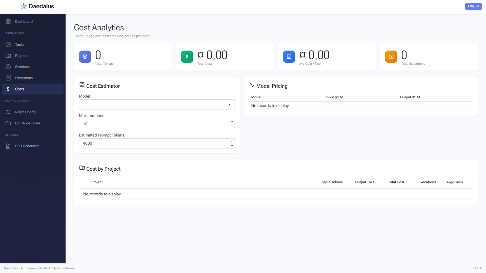
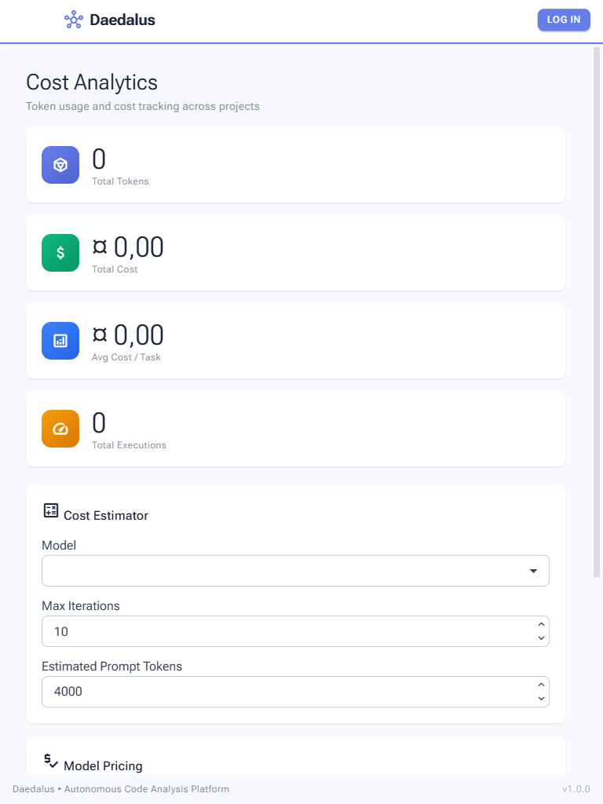
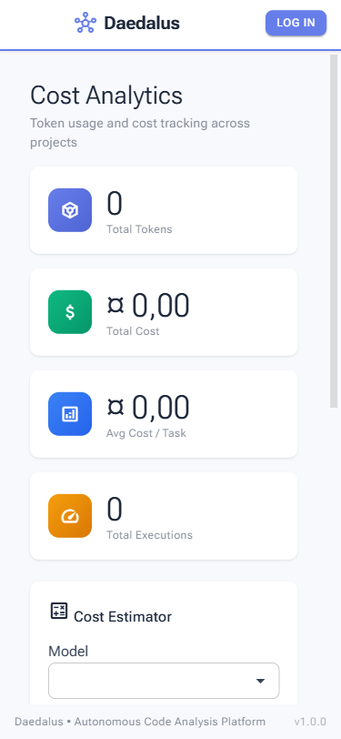

# Regression Test Report - Cost Analytics Page

## Summary Table

| Metric                 | Value                          |
|------------------------|--------------------------------|
| Date                   | 2026-03-01 18:00               |
| Application URL        | http://localhost:5290/costs     |
| Pages Tested           | 1 (Costs)                      |
| Viewports Tested       | 3 (Desktop, Tablet, Mobile)    |
| Existing Tests Passed  | 644 (full suite)               |
| Existing Tests Failed  | 0                              |
| Console Errors Found   | 0                              |
| Network Errors Found   | 0                              |
| Visual Issues Found    | 3                              |
| Overall Status         | **WARN**                       |

## Existing Test Results

- **Framework:** xUnit + NSubstitute + AwesomeAssertions
- **Command:** `dotnet test` (run prior to regression)
- **Result:** 644/644 passing, 0 failed, 0 skipped

## Page: Cost Analytics (`/costs`)

### Functional Check Results

| Check                  | Result | Notes                                                |
|------------------------|--------|------------------------------------------------------|
| Page loads             | PASS   | Page renders fully within 5 seconds                  |
| Console errors         | PASS   | 0 errors detected                                    |
| Network errors         | PASS   | All requests returned HTTP 200                       |
| OIDC config loaded     | PASS   | Keycloak OIDC discovery at port 8082 returned 200    |
| Page heading           | PASS   | "Cost Analytics" heading with subtitle visible       |
| Summary stat cards     | PASS   | 4 cards render: Total Tokens, Total Cost, Avg Cost/Task, Total Executions |
| Cost Estimator panel   | PASS   | Model dropdown, Max Iterations, Estimated Prompt Tokens fields present |
| Model Pricing table    | WARN   | Table renders but shows "No records to display"      |
| Cost by Project table  | PASS   | Table renders with correct column headers            |
| Sidebar nav link       | PASS   | "Costs" link with `attach_money` icon present and highlighted as active |
| Footer                 | PASS   | "Daedalus - Autonomous Code Analysis Platform v1.0.0" visible |

### Visual Evaluation

#### Desktop (1920x1080)

| Criterion       | Rating | Notes                                                           |
|-----------------|--------|-----------------------------------------------------------------|
| Layout          | PASS   | Clean grid: 4 stat cards in a row, estimator + pricing side-by-side, project table full-width |
| Spacing         | PASS   | Consistent padding between cards, sections, and table           |
| Typography      | PASS   | Headings properly sized, labels readable, consistent font usage |
| Color           | PASS   | Stat card icons use distinct colors (purple, green, blue, orange), consistent with app theme |
| Responsiveness  | PASS   | Desktop layout uses available width effectively                 |
| Completeness    | PASS   | All sections render: heading, stats, estimator, pricing, projects |
| Polish          | PASS   | Professional appearance, consistent with other Daedalus pages   |

**Minor observations:**
- Column headers "Output Toke..." and "Avg/Execu..." are truncated in the Cost by Project table. This is acceptable for the current column widths and expected with Radzen DataGrid.
- Currency symbol displays as "¤" (generic currency symbol) rather than "$". This is locale-dependent behavior (Dutch/European locale detected). Not a bug.
- Model dropdown visually appears empty despite containing "claude-sonnet-4-20250514" (confirmed via accessibility snapshot). The value is present but may not render visually until focused or when pricing data loads.

#### Tablet (768x1024)

| Criterion       | Rating | Notes                                                           |
|-----------------|--------|-----------------------------------------------------------------|
| Layout          | PASS   | Sidebar auto-collapsed, stat cards stack vertically, sections stack properly |
| Spacing         | PASS   | Adequate spacing between stacked cards and form fields          |
| Typography      | PASS   | Font sizes appropriate for tablet reading distance              |
| Color           | PASS   | Consistent with desktop color scheme                            |
| Responsiveness  | PASS   | Smooth transition from 4-column to single-column card layout    |
| Completeness    | PASS   | All sections present, Model Pricing visible at bottom edge      |
| Polish          | PASS   | Clean tablet experience                                        |

#### Mobile (375x812)

| Criterion       | Rating | Notes                                                           |
|-----------------|--------|-----------------------------------------------------------------|
| Layout          | PASS   | Single-column layout, header with LOG IN button                 |
| Spacing         | PASS   | Cards well-spaced, form fields use full width                   |
| Typography      | PASS   | Text readable, subtitle wraps cleanly across two lines          |
| Color           | PASS   | Consistent color scheme at mobile viewport                      |
| Responsiveness  | PASS   | No horizontal scrolling, touch targets adequately sized         |
| Completeness    | PASS   | All sections accessible by scrolling                            |
| Polish          | PASS   | Professional mobile layout                                     |

## Issues Found

### 1. Model Pricing Table Empty (Minor)

**Severity:** Minor
**Viewport:** All
**Description:** The Model Pricing table displays "No records to display." despite pricing data being configured in `appsettings.json` with 3 models (Claude Sonnet 4, Haiku 4.5, Opus 4).

**Root cause:** The user is not authenticated. The `/api/cost-analytics/pricing` endpoint requires authentication (`[Authorize(Policy = "CodeAnalysisRead")]`). The `ApiClient` catches `AccessTokenNotAvailableException` and returns `Result.Failure`, which the Blazor page handles by showing no data.

**Expected behavior with auth:** After logging in, the pricing table should display all 3 configured models with their input/output token prices.

**Recommendation:** Consider making the pricing endpoint public (no auth required) since model pricing is not sensitive data. Alternatively, display a "Please log in to view pricing" message instead of the generic "No records to display."

### 2. Cost Estimator Model Dropdown Appears Empty (Minor)

**Severity:** Minor
**Viewport:** All
**Description:** The Model dropdown in the Cost Estimator section visually appears empty, despite the accessibility tree showing "claude-sonnet-4-20250514" as the value.

**Root cause:** The dropdown options are populated from the pricing API call which returns empty due to authentication. The default value "claude-sonnet-4-20250514" is set but may not render the display text without the options list loaded.

**Recommendation:** Either load model names from a non-authenticated endpoint or hardcode a default display in the dropdown.

### 3. Currency Symbol Shows Generic "¤" (Informational)

**Severity:** Informational
**Viewport:** All
**Description:** Cost values display with the generic currency symbol "¤" (e.g., "¤ 0,00") instead of "$". This is a locale-dependent behavior where the system locale (Dutch/European) uses the generic currency symbol with C# string formatting.

**Recommendation:** If USD is the intended currency, explicitly format costs with "$" rather than using the locale-dependent currency format. Alternatively, accept the locale-dependent behavior as designed.

## Recommendations (Prioritized)

1. **Minor** -- Consider making `/api/cost-analytics/pricing` a public endpoint so model pricing is visible without authentication. This would also fix the empty model dropdown in the Cost Estimator.

2. **Minor** -- Add an explicit "Log in to view data" message when API calls fail due to missing authentication, instead of showing empty tables with "No records to display."

3. **Informational** -- Consider using explicit "$" formatting for costs if USD is the standard currency, to avoid locale-dependent "¤" symbols.

4. **Suggestion** -- Add Playwright browser tests for the `/costs` page to cover: page load, stat card rendering, cost estimator form interaction, and model pricing table population (when authenticated).
