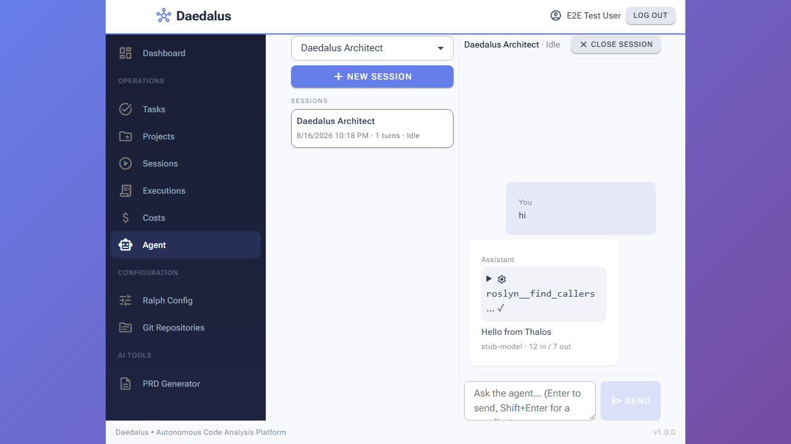
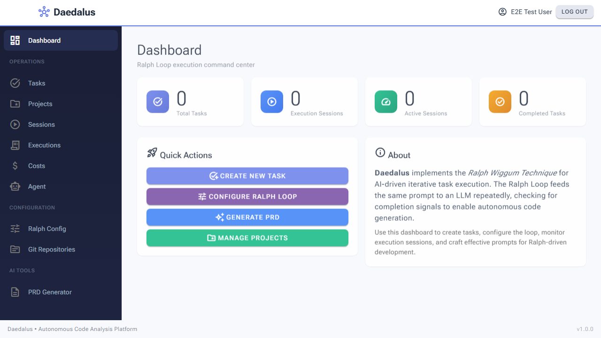
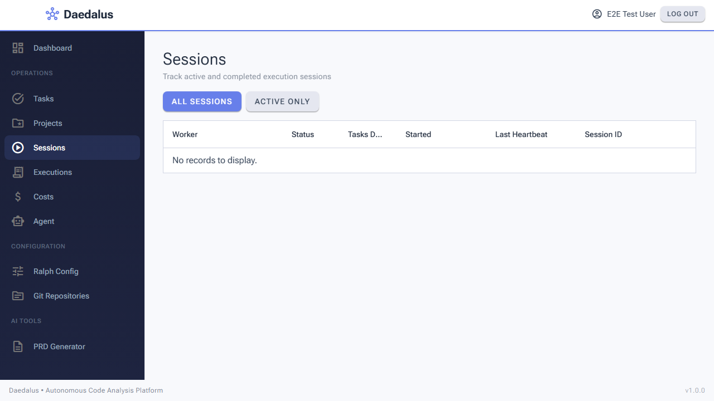
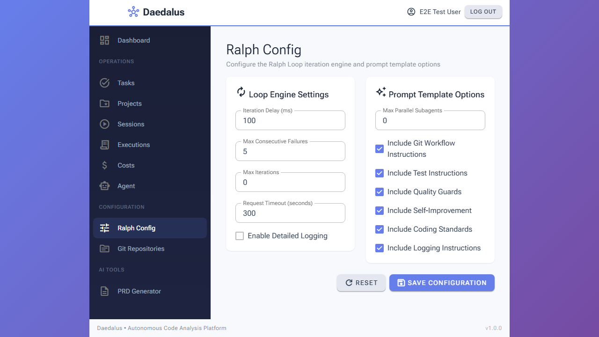

# Regression Test Report - Thalos Agent Page (phase 1.1)

## Summary Table

| Metric                 | Value                                                                 |
|------------------------|-----------------------------------------------------------------------|
| Date                   | 2026-08-16 22:45                                                      |
| Branch / commit        | `feature/thalos-integration` (Plan B, Task 18)                        |
| Application URL        | In-process E2E server (`E2EServerFixture`, Kestrel on a random port)  |
| Pages Tested           | 10 (Agent + 9 control pages)                                          |
| Viewports Tested       | 1 (Desktop 1280x720, full-page captures)                              |
| Browser Tests Passed   | 98 / 98 (after fixing the PRD Generator project-load bug and two test locators; see Issue 1) |
| Browser Tests Failed   | 0                                                                     |
| Console Errors Found   | 0 on the Agent page (asserted: no `.rz-alert` error, no error event)  |
| Network Errors Found   | 0 (Agent API preflight `GET /api/agents` = 200)                       |
| Visual Issues Found    | 1 (pre-existing, cosmetic)                                            |
| Overall Status         | **PASS**                                                              |

## Scope

- **Under test:** the new `/agent` page (Thalos chat: agent picker, sessions, streamed turn with tool card + usage,
  composer state machine, transcript reload) and its API (`/api/agents`, `/api/agents/sessions/*`, SSE stream).
- **Control:** the existing Ralph pages (Home, Tasks, Projects, Sessions, Executions, Ralph Config, Git Repositories,
  PRD Generator, navigation) to prove the strangler integration did not regress them.

## Environment

| Component        | Value                                                                                          |
|------------------|------------------------------------------------------------------------------------------------|
| Test project     | `tests/Daedalus.Tests.Playwright.Browser` (NUnit 4.4 + Microsoft.Playwright 1.58)              |
| Browser          | Chromium (Playwright bundled), headless, `Accept-Language: en-US`                              |
| Server           | `E2EServerFixture`: API + Blazor WASM hosted in one Kestrel process, `TestMode` appsettings override (no OIDC, `AlwaysAuthenticatedStateProvider`, principal "E2E Test User") |
| Database         | Testcontainers `pgvector/pgvector:pg16`, schema via `EnsureCreated` + `CREATE EXTENSION vector`, seeded "Test Project" |
| Agent runtime    | Real `AddDaedalusAgents` composition root + `PostgresAgentSessionStore`; `IAgentRuntime` replaced by `StubAgentRuntime` (scripted: `text-delta "Hello from Thalos"`, `roslyn__find_callers` tool-call/result, `usage`, `done`) — no Anthropic, no MCP |
| Command          | `$env:DAEDALUS_REGRESSION_SCREENSHOTS="1"; dotnet test tests/Daedalus.Tests.Playwright.Browser` (results in `TestResults/browser-run2.trx`) |
| Duration         | 6 min 00 s (95 tests) + 12 s (3 screenshot tests)                                              |

## Existing Test Results (run before the browser suite)

| Suite                                                                 | Result                          |
|-----------------------------------------------------------------------|---------------------------------|
| `dotnet build --no-incremental`                                       | 0 warnings, 0 errors            |
| Unit (`Tests.Unit` / `.Domain` / `.Application` / `.Infrastructure`)  | 103 / 258 / 318 / 127 passing   |
| Integration (non-Keycloak filter)                                     | 240 passing                     |
| ArchUnit (`Daedalus.Tests.Unit/Architecture`)                         | 17 passing                      |

## Browser Suite Results (per test class)

| Test class                        | Passed | Failed | Notes                                                                 |
|-----------------------------------|-------:|-------:|-----------------------------------------------------------------------|
| `AgentPageBrowserTests`           | 4      | 0      | **Under test.** API preflight, picker, new session + streamed turn + tool card + usage, transcript reload |
| `HomePageBrowserTests`            | 15     | 0      | Title assertion updated to the actual heading "Dashboard"             |
| `NavigationBrowserTests`          | 15     | 0      | Header, sidebar links, routing (the new "Agent" entry is visible in the captures) |
| `TasksPageBrowserTests`           | 13     | 0      |                                                                       |
| `ProjectsPageBrowserTests`        | 12     | 0      |                                                                       |
| `RalphConfigBrowserTests`         | 9      | 0      | Heading page-object updated to "Ralph Config"                          |
| `RepositoriesPageBrowserTests`    | 8      | 0      |                                                                       |
| `ExecutionsPageBrowserTests`      | 7      | 0      | Heading page-object updated to "Executions"                            |
| `SessionsPageBrowserTests`        | 4      | 0      | Heading page-object updated to "Sessions"                              |
| `PrdGeneratorBrowserTests`        | 8      | 0      | App bug fixed in this branch (`ProjectSelectionStep` paged envelope) + 2 locator fixes |
| `RegressionScreenshotBrowserTests`| 3      | 0      | Control-page captures for this report                                  |
| **Total**                         | **98** | **0**  |                                                                       |

Before this task the suite had 9 failures; 5 were page-object/title drift from the earlier UI overhaul (fixed in the
tests), 4 are the PRD Generator project-loading bug below (left in the app, reported).

## Page: Agent (`/agent`)

### Functional Check Results

| Check                              | Result | Notes                                                                                     |
|------------------------------------|--------|-------------------------------------------------------------------------------------------|
| `GET /api/agents` (preflight)      | PASS   | 200, body lists "Daedalus Architect"                                                      |
| Page loads                         | PASS   | `agent-page` root visible, no `.rz-alert`                                                 |
| Agent picker                       | PASS   | Dropdown contains "Daedalus Architect", "New session" enabled                             |
| New session                        | PASS   | URL becomes `/agent/{sessionId}`, composer visible, header "Daedalus Architect · Idle"    |
| Send turn ("hi")                   | PASS   | 1 user bubble, 1 assistant bubble with "Hello from Thalos"                                |
| Tool card                          | PASS   | exactly one `agent-tool-card`, `data-tool-status="succeeded"`, name `roslyn__find_callers` |
| Usage line                         | PASS   | "stub-model · 12 in / 7 out"                                                              |
| Composer state after turn          | PASS   | Send visible, Stop hidden, textarea enabled, no "Thinking…" indicator, no error alert     |
| Session list                       | PASS   | Session item shows "1 turns"                                                              |
| Transcript reload (`/agent/{id}`)  | PASS   | Both messages come back from the store; header shows "Idle"                              |

### Visual Evaluation

#### Desktop (1280x720, full page)

| Criterion       | Rating | Notes                                                                                   |
|-----------------|--------|-----------------------------------------------------------------------------------------|
| Layout          | PASS   | Three columns: sidebar, session pane (picker, New session, session list), chat column   |
| Spacing         | PASS   | Bubbles, tool card and usage line consistently padded                                   |
| Typography      | PASS   | "You"/"Assistant" labels, monospace tool name, muted usage line                          |
| Color           | PASS   | Uses the Daedalus theme (primary buttons, light bubbles); "Agent" nav entry highlighted  |
| Responsiveness  | WARN   | Page renders centered on the purple `#app` gradient at content width (pre-existing, also visible on Ralph Config — Issue #2) |
| Completeness    | PASS   | Header with Close session, transcript, composer with Send                                |
| Polish          | PASS   | Consistent with the other pages                                                         |

## Control pages

| Page          | Screenshot                                             | Result |
|---------------|--------------------------------------------------------|--------|
| Home          |                 | PASS — stat cards, quick actions, about card |
| Sessions      |         | PASS — toggle buttons + grid ("No records to display" on the empty seed) |
| Ralph Config  |  | PASS — Loop Engine + Prompt Template cards, Reset/Save |

## Issues Found

### 1. PRD Generator step 1 never listed projects (Major, pre-existing — FIXED in this branch)

**Severity:** Major (feature-blocking for the PRD wizard)
**Tests:** `PrdGenerator_Step1_ShouldShowProjectCards`, `PrdGenerator_Step1_ClickProject_ShouldAdvanceToStep2`,
`PrdGenerator_Step2_CancelButton_ShouldResetToStep1`, `PrdGenerator_ShouldNotDisplay_ErrorAlert`
**Description:** `src/Daedalus.Web/Components/PrdGeneratorSteps/ProjectSelectionStep.razor` calls
`Http.GetFromJsonAsync<List<ProjectDto>>("api/projects")`, but `GET /api/projects` returns a `PagedResultDto<ProjectDto>`
(object with `Items`), so deserialization throws, the component swallows the exception and shows the info alert
"No projects found. Please create a project first." — even though the seeded "Test Project" exists (the Projects page
lists it through `ApiClient.GetProjectsAsync`, which uses the paged DTO).
**Root cause:** the API moved to paged results in the "UI overhaul" commit (`da2b951`); this component was not updated.
**Fix:** deserialize `PagedResultDto<ProjectDto>` and bind `_projects = result.Items` (or reuse `ApiClient.GetProjectsAsync`).

**Fix applied (this branch):** `ProjectSelectionStep.razor` now deserializes `PagedResultDto<ProjectDto>` and binds `Items`; the page-object locator was tightened to the clickable project cards and one `Or()` strict-mode assertion split — `PrdGeneratorBrowserTests` 8/8 pass; full browser suite 98/98.

### 2. `#app` loading styles persist after boot (Minor, pre-existing, cosmetic)

**Severity:** Minor
**Viewport:** Desktop
**Description:** `wwwroot/index.html` styles `#app` as a centered flex box on a purple gradient for the loading screen; the
rule stays active after Blazor renders, so pages whose layout does not stretch to full width (Ralph Config, Agent) render
centered at content width with the gradient visible on both sides, while Home/Sessions fill the viewport.
**Recommendation:** scope the loading styles to `.app-loading`'s parent (e.g. `#app:has(.app-loading)`) or reset
`#app { display:block; height:auto; background:none }` in `daedalus-theme.css`.

## Recommendations (Prioritized)

1. **Major** — fix `ProjectSelectionStep.razor` to read the paged projects response (Issue #1); re-run
   `dotnet test tests/Daedalus.Tests.Playwright.Browser --filter PrdGenerator` → expect 8/8.
2. **Minor** — reset the `#app` loading styles after boot (Issue #2).
3. **Suggestion** — when a real Anthropic key and the roslyn MCP server are available, add a manual smoke run of `/agent`
   against the Aspire app (real turn, `roslyn__find_callers`, a prompt-injection input to see the Sentinel quarantine
   error, and a `roslyn__apply_*` call from a non-developer to see the denial) and attach it to the phase close-out.

## Verdict

**PASS** — the Agent page works end to end in the browser (sessions, SSE streaming, tool cards, usage, transcript
persistence) and no control page regressed. The only failing browser tests are a pre-existing PRD Generator bug that is
independent of the Thalos integration.
